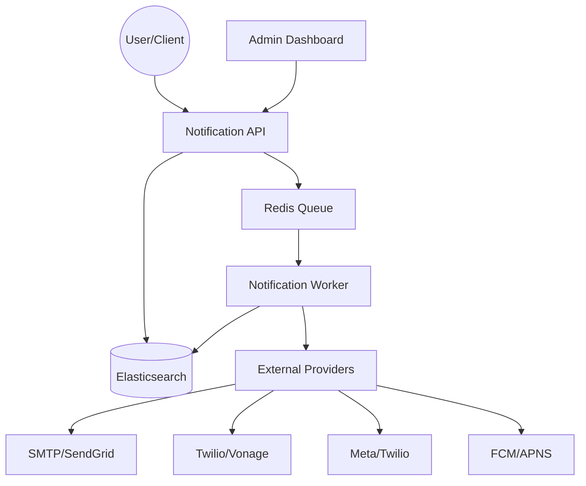

# FreeRange Notify

FreeRange Notify is a high performance service for sending notifications across many channels. It helps you manage users, templates and delivery workflows in one place. You can send messages via Email, SMS, Push, WhatsApp and Webhooks using a single API.

The system is designed to be reliable and easy to scale. It uses a worker pool to handle background delivery so your API stays fast even during high traffic.

## Core Features

*   **Multi Channel Support** - Send notifications through SMTP, SendGrid, Twilio, Meta WhatsApp, FCM and more.
*   **Template Management** - Create and manage message templates with dynamic variables.
*   **Workflow Engine** - Build complex delivery flows like waiting for events or falling back to a different channel.
*   **User Preferences** - Respect user choices for quiet hours, daily limits and preferred channels.
*   **Analytics** - Track delivery success rates and user engagement across all your apps.
*   **Self Hosted** - Complete control over your data with a simple Docker setup.

## System Architecture

The following diagram shows how data flows through the system.



## Tech Stack

We use modern and fast technologies to ensure the service runs efficiently.

*   **Language** - Go (Golang) for the backend logic.
*   **Web Framework** - Fiber for the REST API.
*   **Database** - Elasticsearch for storing notifications, users and logs.
*   **Cache and Queue** - Redis for task management and rate limiting.
*   **Frontend** - React with Tailwind CSS for the admin dashboard.
*   **Telemetry** - OpenTelemetry for tracing and monitoring.

## Local Setup

You can get the entire system running locally using Docker Compose.

1.  Clone the repository and enter the directory.
2.  Copy the example environment file.
    ```bash
    cp .env.example .env
    ```
3.  Start the services using Docker.
    ```bash
    docker-compose up -d
    ```
4.  The API will be available at `http://localhost:8080` and the UI at `http://localhost:3000`.

## Operator CLI (hosted)

The `frn` binary includes admin commands for billing rate cards and user credits. See [documents/CLI_ADMIN_REFERENCE.md](documents/CLI_ADMIN_REFERENCE.md) for setup, `frn admin billing rates` (show / set / activate / rollback), and `frn admin grant-credits`.

## Project Structure

*   `cmd/` - Main entry points for the server and background worker.
*   `internal/domain/` - Core business logic and data models.
*   `internal/usecases/` - Service layer for orchestrating logic.
*   `internal/infrastructure/` - Implementations for databases, queues and providers.
*   `internal/interfaces/http/` - API handlers and middleware.
*   `ui/` - The React based admin dashboard.

## License

This project is licensed under the MIT License. See the LICENSE file for details.