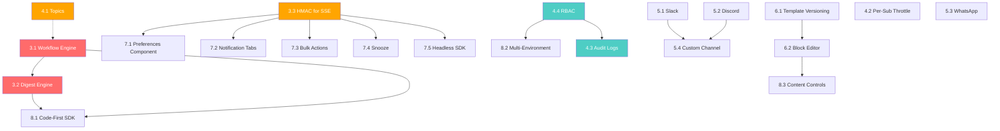

# FreeRangeNotify — Feature Implementation Plan

> **Date:** March 7, 2026
> **Scope:** All 20 missing features identified in [NOVU_FEATURE_GAP_ANALYSIS.md](./NOVU_FEATURE_GAP_ANALYSIS.md)
> **Module:** `github.com/the-monkeys/freerangenotify`

This document is the engineering blueprint for closing every feature gap between FreeRangeNotify and Novu. Each feature includes exact file paths, struct definitions, Elasticsearch index mappings, API contracts, worker integration points, and dependency ordering — all grounded in the existing codebase architecture.

---

## Table of Contents

1. [Architecture Principles](#1-architecture-principles)
2. [Phased Roadmap](#2-phased-roadmap)
3. [Phase 1 — Foundation (Weeks 1-4)](#3-phase-1--foundation)
   - 1.1 [Workflow Engine & Orchestrator](#31-workflow-engine--orchestrator)
   - 1.2 [Digest / Batching Engine](#32-digest--batching-engine)
   - 1.3 [HMAC for SSE / Inbox](#33-hmac-for-sse--inbox)
4. [Phase 2 — Core Platform (Weeks 5-8)](#4-phase-2--core-platform)
   - 2.1 [Topics / Subscriber Groups](#41-topics--subscriber-groups)
   - 2.2 [Per-Subscriber Throttle](#42-per-subscriber-throttle)
   - 2.3 [Audit Logs](#43-audit-logs)
   - 2.4 [RBAC (Role-Based Access Control)](#44-rbac-role-based-access-control)
5. [Phase 3 — Channels & Delivery (Weeks 9-12)](#5-phase-3--channels--delivery)
   - 3.1 [Chat Channels — Slack](#51-chat-channels--slack)
   - 3.2 [Chat Channels — Discord](#52-chat-channels--discord)
   - 3.3 [Chat Channels — WhatsApp (via Twilio)](#53-chat-channels--whatsapp-via-twilio)
   - 3.4 [Custom Channel Provider SDK](#54-custom-channel-provider-sdk)
6. [Phase 4 — Content & Templates (Weeks 13-16)](#6-phase-4--content--templates)
   - 4.1 [Template Versioning with Diff & Rollback](#61-template-versioning-with-diff--rollback)
   - 4.2 [Block-Based Email Editor](#62-block-based-email-editor)
7. [Phase 5 — Client SDKs & Inbox (Weeks 17-20)](#7-phase-5--client-sdks--inbox)
   - 5.1 [`<Preferences />` React Component](#71-preferences--react-component)
   - 5.2 [Notification Tabs & Categories](#72-notification-tabs--categories)
   - 5.3 [Bulk Actions (Mark Read / Archive)](#73-bulk-actions-mark-read--archive)
   - 5.4 [Snooze](#74-snooze)
   - 5.5 [Headless SDK Enhancements](#75-headless-sdk-enhancements)
8. [Phase 6 — Advanced Platform (Weeks 21-26)](#8-phase-6--advanced-platform)
   - 6.1 [Code-First Workflow SDK](#81-code-first-workflow-sdk)
   - 6.2 [Multi-Environment Product Feature](#82-multi-environment-product-feature)
   - 6.3 [Content Controls for Non-Technical Users](#83-content-controls-for-non-technical-users)
9. [Cross-Cutting Concerns](#9-cross-cutting-concerns)
10. [Dependency Graph](#10-dependency-graph)
11. [Elasticsearch Index Inventory](#11-elasticsearch-index-inventory)
12. [Migration Checklist](#12-migration-checklist)

---

## 1. Architecture Principles

Every feature in this plan follows these constraints:

1. **Domain-Driven Design** — New entities go in `internal/domain/<entity>/models.go`. Business interfaces are defined in domain, implemented in infrastructure.
2. **Dependency Injection** — All new services are wired through `internal/container/container.go`. No global state.
3. **Async by Default** — The API path stays fast. Heavy logic (workflow execution, digest aggregation, chat delivery) runs in the Worker (`cmd/worker/processor.go`).
4. **Elasticsearch as primary store** — All persistent entities are indexed in ES. Redis is ephemeral (queues, presence, digest accumulators).
5. **Provider Interface** — Every delivery channel implements `providers.Provider` (the `Send`, `GetName`, `GetSupportedChannel`, `IsHealthy`, `Close` contract in `internal/infrastructure/providers/provider.go`).
6. **Structured Logging** — `zap.Logger` with typed fields. Never `fmt.Println`.
7. **Custom Errors** — Use `pkg/errors` for consistent API responses.
8. **Routes by Access Level** — Public / protected / admin route groups in `internal/interfaces/http/routes/routes.go`.
9. **Validation** — `go-playground/validator` struct tags for all request payloads.
10. **Metrics** — Every new operation gets Prometheus counters/histograms via `internal/infrastructure/metrics/`.

---

## 2. Phased Roadmap

```
Phase 1  ██████████░░░░░░░░░░░░░░ Weeks 1-4   Foundation (Workflow, Digest, HMAC)
Phase 2  ░░░░░░░░░░██████████░░░░ Weeks 5-8   Core Platform (Topics, Throttle, Audit, RBAC)
Phase 3  ░░░░░░░░░░░░░░░░████████ Weeks 9-12  Channels (Slack, Discord, WhatsApp, Custom)
Phase 4  ░░░░░░░░░░░░░░░░░░░░████ Weeks 13-16 Content (Versioning, Block Editor)
Phase 5  ░░░░░░░░░░░░░░░░░░░░░░██ Weeks 17-20 Client SDKs (Preferences, Tabs, Snooze)
Phase 6  ░░░░░░░░░░░░░░░░░░░░░░░█ Weeks 21-26 Advanced (Code-first SDK, Environments)
```

**Critical Path:** Phase 1 (Workflow + Digest) blocks Phase 6.1 (Code-first SDK). Phase 2.1 (Topics) blocks nothing. Phase 2.4 (RBAC) blocks Phase 8.2 (Environments). Everything else is independent.

---

## 3. Phase 1 — Foundation

### 3.1 Workflow Engine & Orchestrator

**Priority:** P0 — This is the single largest missing feature. Without it, FRN is a delivery service, not a notification platform.

#### 3.1.1 Domain Model

**New file:** `internal/domain/workflow/models.go`

```go
package workflow

import (
    "context"
    "time"
)

// StepType defines the kind of action a workflow step performs
type StepType string

const (
    StepTypeChannel   StepType = "channel"   // Deliver via a channel (email, push, sms, etc.)
    StepTypeDelay     StepType = "delay"     // Wait for a duration
    StepTypeDigest    StepType = "digest"    // Aggregate events over a window
    StepTypeCondition StepType = "condition" // Branch based on a condition
    StepTypeWebhook   StepType = "webhook"   // Call an external HTTP endpoint
)

// ConditionOperator defines comparison operators for conditional steps
type ConditionOperator string

const (
    OpEquals       ConditionOperator = "eq"
    OpNotEquals    ConditionOperator = "neq"
    OpContains     ConditionOperator = "contains"
    OpGreaterThan  ConditionOperator = "gt"
    OpLessThan     ConditionOperator = "lt"
    OpExists       ConditionOperator = "exists"
    OpNotRead      ConditionOperator = "not_read" // Special: check if previous step's notification was read
)

// Workflow defines a multi-step notification pipeline
type Workflow struct {
    ID          string    `json:"id" es:"workflow_id"`
    AppID       string    `json:"app_id" es:"app_id"`
    Name        string    `json:"name" es:"name"`
    Description string    `json:"description" es:"description"`
    TriggerID   string    `json:"trigger_id" es:"trigger_id"` // External identifier clients use to invoke
    Steps       []Step    `json:"steps" es:"steps"`
    Status      string    `json:"status" es:"status"` // active, inactive, draft
    Version     int       `json:"version" es:"version"`
    CreatedBy   string    `json:"created_by" es:"created_by"`
    CreatedAt   time.Time `json:"created_at" es:"created_at"`
    UpdatedAt   time.Time `json:"updated_at" es:"updated_at"`
}

// Step is one node in the workflow DAG
type Step struct {
    ID         string          `json:"id" es:"step_id"`
    Name       string          `json:"name" es:"name"`
    Type       StepType        `json:"type" es:"type"`
    Order      int             `json:"order" es:"order"`
    Config     StepConfig      `json:"config" es:"config"`
    OnSuccess  string          `json:"on_success,omitempty" es:"on_success"`   // Next step ID
    OnFailure  string          `json:"on_failure,omitempty" es:"on_failure"`   // Fallback step ID
    SkipIf     *Condition      `json:"skip_if,omitempty" es:"skip_if"`        // Skip this step if condition is true
    Metadata   map[string]any  `json:"metadata,omitempty" es:"metadata"`
}

// StepConfig holds type-specific configuration
type StepConfig struct {
    // Channel step
    Channel    string `json:"channel,omitempty" es:"channel"`        // "email", "push", "sms", etc.
    TemplateID string `json:"template_id,omitempty" es:"template_id"`
    Provider   string `json:"provider,omitempty" es:"provider"`      // Override default provider

    // Delay step
    Duration   string `json:"duration,omitempty" es:"duration"`      // Go duration string: "1h", "30m", "24h"

    // Digest step
    DigestKey  string `json:"digest_key,omitempty" es:"digest_key"`  // Grouping key (e.g., "project_id")
    Window     string `json:"window,omitempty" es:"window"`          // Aggregation window: "1h", "24h"
    CronExpr   string `json:"cron_expr,omitempty" es:"cron_expr"`    // Cron-based digest (e.g., "0 9 * * 1" = Mon 9am)
    MaxBatch   int    `json:"max_batch,omitempty" es:"max_batch"`    // Max events per digest (0 = unlimited)

    // Condition step
    Condition  *Condition `json:"condition,omitempty" es:"condition"`

    // Webhook step
    URL        string            `json:"url,omitempty" es:"url"`
    Method     string            `json:"method,omitempty" es:"method"`
    Headers    map[string]string `json:"headers,omitempty" es:"headers"`
}

// Condition defines a conditional expression
type Condition struct {
    Field    string            `json:"field" es:"field"`       // e.g., "payload.amount", "subscriber.timezone", "steps.step1.read"
    Operator ConditionOperator `json:"operator" es:"operator"`
    Value    any               `json:"value" es:"value"`
}

// WorkflowExecution tracks a single run of a workflow for one subscriber
type WorkflowExecution struct {
    ID             string                 `json:"id" es:"execution_id"`
    WorkflowID     string                 `json:"workflow_id" es:"workflow_id"`
    AppID          string                 `json:"app_id" es:"app_id"`
    UserID         string                 `json:"user_id" es:"user_id"`
    TransactionID  string                 `json:"transaction_id" es:"transaction_id"` // Idempotency key
    CurrentStepID  string                 `json:"current_step_id" es:"current_step_id"`
    Status         string                 `json:"status" es:"status"` // running, paused, completed, failed, cancelled
    Payload        map[string]any         `json:"payload" es:"payload"`
    StepResults    map[string]StepResult  `json:"step_results" es:"step_results"`
    StartedAt      time.Time              `json:"started_at" es:"started_at"`
    CompletedAt    *time.Time             `json:"completed_at,omitempty" es:"completed_at"`
    UpdatedAt      time.Time              `json:"updated_at" es:"updated_at"`
}

// StepResult records the outcome of one step execution
type StepResult struct {
    StepID         string     `json:"step_id" es:"step_id"`
    Status         string     `json:"status" es:"status"` // pending, running, completed, failed, skipped
    NotificationID string     `json:"notification_id,omitempty" es:"notification_id"` // For channel steps
    DigestCount    int        `json:"digest_count,omitempty" es:"digest_count"`       // For digest steps
    StartedAt      *time.Time `json:"started_at,omitempty" es:"started_at"`
    CompletedAt    *time.Time `json:"completed_at,omitempty" es:"completed_at"`
    Error          string     `json:"error,omitempty" es:"error"`
}
```

**New file:** `internal/domain/workflow/repository.go`

```go
package workflow

import "context"

type Repository interface {
    CreateWorkflow(ctx context.Context, wf *Workflow) error
    GetWorkflow(ctx context.Context, id string) (*Workflow, error)
    GetWorkflowByTrigger(ctx context.Context, appID, triggerID string) (*Workflow, error)
    UpdateWorkflow(ctx context.Context, wf *Workflow) error
    DeleteWorkflow(ctx context.Context, id string) error
    ListWorkflows(ctx context.Context, appID string, limit, offset int) ([]*Workflow, error)

    CreateExecution(ctx context.Context, exec *WorkflowExecution) error
    GetExecution(ctx context.Context, id string) (*WorkflowExecution, error)
    UpdateExecution(ctx context.Context, exec *WorkflowExecution) error
    ListExecutions(ctx context.Context, workflowID string, limit, offset int) ([]*WorkflowExecution, error)
    GetActiveExecutions(ctx context.Context, userID, workflowID string) ([]*WorkflowExecution, error)
}
```

**New file:** `internal/domain/workflow/service.go`

```go
package workflow

import "context"

type Service interface {
    // CRUD
    Create(ctx context.Context, appID string, req *CreateRequest) (*Workflow, error)
    Get(ctx context.Context, id, appID string) (*Workflow, error)
    Update(ctx context.Context, id, appID string, req *UpdateRequest) (*Workflow, error)
    Delete(ctx context.Context, id, appID string) error
    List(ctx context.Context, appID string, limit, offset int) ([]*Workflow, error)

    // Execution
    Trigger(ctx context.Context, appID string, req *TriggerRequest) (*WorkflowExecution, error)
    Cancel(ctx context.Context, executionID, appID string) error
}

type CreateRequest struct {
    Name        string `json:"name" validate:"required,min=3,max=100"`
    Description string `json:"description"`
    TriggerID   string `json:"trigger_id" validate:"required,alphanum_hyphen"`
    Steps       []Step `json:"steps" validate:"required,min=1"`
}

type UpdateRequest struct {
    Name        *string `json:"name,omitempty"`
    Description *string `json:"description,omitempty"`
    Steps       []Step  `json:"steps,omitempty"`
    Status      *string `json:"status,omitempty"`
}

type TriggerRequest struct {
    TriggerID     string         `json:"trigger_id" validate:"required"`
    UserID        string         `json:"user_id" validate:"required"`
    Payload       map[string]any `json:"payload"`
    TransactionID string         `json:"transaction_id"` // Optional idempotency key
    Overrides     map[string]any `json:"overrides"`      // Per-trigger template variable overrides
}
```

#### 3.1.2 Elasticsearch Index

**New index:** `frn_workflows`

```json
{
  "mappings": {
    "properties": {
      "workflow_id":  { "type": "keyword" },
      "app_id":       { "type": "keyword" },
      "name":         { "type": "text", "fields": { "keyword": { "type": "keyword" } } },
      "trigger_id":   { "type": "keyword" },
      "description":  { "type": "text" },
      "steps":        { "type": "nested", "properties": {
        "step_id":    { "type": "keyword" },
        "name":       { "type": "text" },
        "type":       { "type": "keyword" },
        "order":      { "type": "integer" },
        "config":     { "type": "object", "enabled": false },
        "on_success": { "type": "keyword" },
        "on_failure": { "type": "keyword" },
        "skip_if":    { "type": "object", "enabled": false }
      }},
      "status":       { "type": "keyword" },
      "version":      { "type": "integer" },
      "created_by":   { "type": "keyword" },
      "created_at":   { "type": "date" },
      "updated_at":   { "type": "date" }
    }
  }
}
```

**New index:** `frn_workflow_executions`

```json
{
  "mappings": {
    "properties": {
      "execution_id":    { "type": "keyword" },
      "workflow_id":     { "type": "keyword" },
      "app_id":          { "type": "keyword" },
      "user_id":         { "type": "keyword" },
      "transaction_id":  { "type": "keyword" },
      "current_step_id": { "type": "keyword" },
      "status":          { "type": "keyword" },
      "payload":         { "type": "object", "enabled": false },
      "step_results":    { "type": "object", "enabled": false },
      "started_at":      { "type": "date" },
      "completed_at":    { "type": "date" },
      "updated_at":      { "type": "date" }
    }
  }
}
```

#### 3.1.3 Repository Implementation

**New file:** `internal/infrastructure/repository/workflow_repository.go`

Implements `workflow.Repository` using the Elasticsearch client from `internal/infrastructure/database/DatabaseManager`. Follows the exact same pattern as `notification_repository.go` — marshal to JSON, index with `esClient.Index()`, search with query DSL.

#### 3.1.4 Workflow Orchestrator (Worker Side)

**New file:** `internal/infrastructure/orchestrator/engine.go`

The orchestrator is a state machine that lives in the Worker process. It is NOT an API-side component.

**Execution flow:**
1. API receives `POST /v1/workflows/trigger` → creates `WorkflowExecution` (status: `running`, `current_step_id: steps[0].id`) → enqueues a `WorkflowQueueItem` to Redis.
2. Worker dequeues → fetches execution from ES → evaluates current step:
   - **Channel step:** Creates a `Notification` (existing flow), sends via `providers.Manager`. Records `NotificationID` in `StepResult`.
   - **Delay step:** Parses duration, computes `resumeAt = now + duration`, re-enqueues to Redis scheduled queue (`ZADD frn:workflow:delayed <timestamp> <executionID>`).
   - **Digest step:** Adds payload to Redis sorted set `frn:digest:<workflowID>:<userID>:<digestKey>` with score = timestamp. If this is the first event, schedules a digest flush at `now + window`. On flush, collects all events, renders the digest template, sends as one notification.
   - **Condition step:** Evaluates `Condition` against execution payload and step results. If true, advances to `OnSuccess` step; if false, advances to `OnFailure` step.
   - **Webhook step:** Makes HTTP request to configured URL with execution payload. Stores response in step metadata.
3. After each step completes, the engine advances `current_step_id` to the next step (via `on_success`) and re-enqueues. If there is no next step, marks execution as `completed`.

**Key design decision:** Workflow state is persisted in Elasticsearch after every step. If the worker crashes mid-execution, a recovery goroutine scans for executions in `running` status with `updated_at > 5m ago` and re-enqueues them.

```go
package orchestrator

type Engine struct {
    workflowRepo  workflow.Repository
    notifService  notification.Service
    providerMgr   *providers.Manager
    queue         queue.Queue
    redisClient   *redis.Client
    digestManager *DigestManager
    logger        *zap.Logger
    metrics       *metrics.NotificationMetrics
}

func (e *Engine) ExecuteStep(ctx context.Context, exec *workflow.WorkflowExecution) error {
    wf, err := e.workflowRepo.GetWorkflow(ctx, exec.WorkflowID)
    // ... find current step, evaluate skip_if, execute based on type, advance
}
```

#### 3.1.5 Queue Extension

Add to `internal/infrastructure/queue/queue.go`:

```go
// WorkflowQueueItem represents a workflow execution step in the queue
type WorkflowQueueItem struct {
    ExecutionID string    `json:"execution_id"`
    StepID      string    `json:"step_id"`
    EnqueuedAt  time.Time `json:"enqueued_at"`
}
```

Add to `Queue` interface:
```go
    EnqueueWorkflow(ctx context.Context, item WorkflowQueueItem) error
    DequeueWorkflow(ctx context.Context) (*WorkflowQueueItem, error)
    EnqueueWorkflowDelayed(ctx context.Context, item WorkflowQueueItem, executeAt time.Time) error
    GetDelayedWorkflowItems(ctx context.Context, limit int64) ([]WorkflowQueueItem, error)
```

Redis implementation in `redis_queue.go`:
- `EnqueueWorkflow` → `RPUSH frn:queue:workflow <json>`
- `DequeueWorkflow` → `BLPOP frn:queue:workflow 5`
- `EnqueueWorkflowDelayed` → `ZADD frn:workflow:delayed <timestamp> <json>`
- `GetDelayedWorkflowItems` → `ZRANGEBYSCORE frn:workflow:delayed -inf <now> LIMIT 0 <limit>` + `ZREM`

#### 3.1.6 API Endpoints

**New file:** `internal/interfaces/http/handlers/workflow_handler.go`

| Method | Path | Auth | Description |
|--------|------|------|-------------|
| `POST`   | `/v1/workflows` | Protected | Create a workflow |
| `GET`    | `/v1/workflows` | Protected | List workflows for app |
| `GET`    | `/v1/workflows/:id` | Protected | Get workflow by ID |
| `PUT`    | `/v1/workflows/:id` | Protected | Update workflow |
| `DELETE` | `/v1/workflows/:id` | Protected | Delete workflow |
| `POST`   | `/v1/workflows/trigger` | Protected | Trigger a workflow execution |
| `GET`    | `/v1/workflows/executions` | Protected | List executions |
| `GET`    | `/v1/workflows/executions/:id` | Protected | Get execution details |
| `POST`   | `/v1/workflows/executions/:id/cancel` | Protected | Cancel a running execution |

Register in `internal/interfaces/http/routes/routes.go` under the protected group.

#### 3.1.7 Worker Integration

In `cmd/worker/main.go`, add a second goroutine pool that polls the workflow queue alongside the existing notification queue:

```go
// Existing notification workers
processor.Start(ctx)

// New workflow workers
orchestrator := orchestrator.NewEngine(...)
go orchestrator.StartWorkers(ctx, workflowWorkerCount)
go orchestrator.StartDelayedPoller(ctx)  // Polls ZADD scheduled queue every 1s
```

#### 3.1.8 Container Wiring

Add to `internal/container/container.go`:

```go
// Container struct additions
WorkflowService    workflow.Service
WorkflowHandler    *handlers.WorkflowHandler

// In NewContainer():
workflowRepo := repository.NewWorkflowRepository(dbManager, logger)
container.WorkflowService = services.NewWorkflowService(workflowRepo, container.Queue, logger)
container.WorkflowHandler = handlers.NewWorkflowHandler(container.WorkflowService, container.Validator, logger)
```

#### 3.1.9 Files to Create/Modify

| Action | File |
|--------|------|
| **CREATE** | `internal/domain/workflow/models.go` |
| **CREATE** | `internal/domain/workflow/repository.go` |
| **CREATE** | `internal/domain/workflow/service.go` |
| **CREATE** | `internal/infrastructure/repository/workflow_repository.go` |
| **CREATE** | `internal/infrastructure/orchestrator/engine.go` |
| **CREATE** | `internal/infrastructure/orchestrator/digest.go` |
| **CREATE** | `internal/usecases/services/workflow_service_impl.go` |
| **CREATE** | `internal/interfaces/http/handlers/workflow_handler.go` |
| **MODIFY** | `internal/infrastructure/queue/queue.go` — Add workflow queue methods |
| **MODIFY** | `internal/infrastructure/queue/redis_queue.go` — Implement workflow queue |
| **MODIFY** | `internal/container/container.go` — Wire workflow service |
| **MODIFY** | `internal/interfaces/http/routes/routes.go` — Register workflow routes |
| **MODIFY** | `cmd/worker/main.go` — Start workflow workers |
| **MODIFY** | `cmd/migrate/main.go` — Create workflow ES indices |

---

### 3.2 Digest / Batching Engine

**Priority:** P0 — Novu's headline feature. Tightly coupled with the workflow engine but also usable standalone.

#### 3.2.1 Standalone Digest (Without Workflows)

Even before workflows are fully built, a standalone digest system adds massive value. It can later be integrated as a workflow step.

**New file:** `internal/infrastructure/orchestrator/digest.go`

```go
package orchestrator

// DigestManager manages notification digesting using Redis sorted sets
type DigestManager struct {
    redisClient  *redis.Client
    notifRepo    notification.Repository
    templateRepo template.Repository
    userRepo     user.Repository
    providerMgr  *providers.Manager
    logger       *zap.Logger
}

// DigestConfig defines how events are batched
type DigestConfig struct {
    Key       string        // Grouping key from notification payload (e.g., "project_id")
    Window    time.Duration // Time window to collect events
    MaxBatch  int           // Maximum events per digest (0 = unlimited)
    Channel   string        // Delivery channel for the digest summary
    TemplateID string       // Template for the digest message
}
```

**Redis data structures:**

```
# Each digest accumulator is a sorted set
# Key: frn:digest:{app_id}:{user_id}:{digest_key_value}
# Score: unix timestamp of event
# Member: JSON-serialized notification payload

ZADD frn:digest:app123:user456:project-789  1709827200  '{"title":"PR merged","body":"..."}'
ZADD frn:digest:app123:user456:project-789  1709830800  '{"title":"New commit","body":"..."}'

# Scheduled flush tracker
# Key: frn:digest:flush
# Score: unix timestamp when digest should be flushed
# Member: "app123:user456:project-789"

ZADD frn:digest:flush  1709834400  'app123:user456:project-789'
```

**Digest flow:**

1. **Accumulate:** When a notification arrives with `digest_key` in its metadata, instead of delivering immediately, the worker adds the payload to the sorted set and schedules a flush (if not already scheduled).
2. **Flush:** A background goroutine polls `frn:digest:flush` every second. When a flush is due:
   - `ZRANGEBYSCORE frn:digest:{key} -inf +inf` to get all accumulated events.
   - Render the digest template with `{{ .Events }}` (array of accumulated payloads), `{{ .Count }}`, `{{ .FirstEvent }}`, `{{ .LastEvent }}`.
   - Send the single digest notification via the configured channel.
   - `DEL frn:digest:{key}` to clear the accumulator.
   - `ZREM frn:digest:flush {key}` to remove the flush schedule.
3. **Look-back:** If a new event arrives and a digest is already pending (checked via `EXISTS frn:digest:{key}`), the event is simply appended — no new timer needed.

**API to configure digest (standalone mode):**

| Method | Path | Description |
|--------|------|-------------|
| `POST` | `/v1/digest-rules` | Create a digest rule for an app |
| `GET`  | `/v1/digest-rules` | List digest rules |
| `DELETE` | `/v1/digest-rules/:id` | Delete a digest rule |

**Domain model:** `internal/domain/digest/models.go`

```go
package digest

type DigestRule struct {
    ID         string `json:"id" es:"digest_rule_id"`
    AppID      string `json:"app_id" es:"app_id"`
    Name       string `json:"name" es:"name"`
    DigestKey  string `json:"digest_key" es:"digest_key"`   // Field from notification metadata to group by
    Window     string `json:"window" es:"window"`           // "1h", "24h", "weekly"
    CronExpr   string `json:"cron_expr,omitempty" es:"cron_expr"` // Alternative: cron-based flush
    Channel    string `json:"channel" es:"channel"`         // email, push, etc.
    TemplateID string `json:"template_id" es:"template_id"` // Template with {{.Events}} variable
    MaxBatch   int    `json:"max_batch" es:"max_batch"`
    Status     string `json:"status" es:"status"`           // active, inactive
    CreatedAt  time.Time `json:"created_at" es:"created_at"`
    UpdatedAt  time.Time `json:"updated_at" es:"updated_at"`
}
```

#### 3.2.2 Worker Modification

In `cmd/worker/processor.go`, add a digest check before standard delivery:

```go
func (p *NotificationProcessor) processNotification(ctx context.Context, notif *notification.Notification) error {
    // NEW: Check if this notification matches a digest rule
    if digestKey, ok := notif.Metadata["digest_key"]; ok {
        rule, err := p.digestManager.GetActiveRule(ctx, notif.AppID, digestKey.(string))
        if err == nil && rule != nil {
            return p.digestManager.Accumulate(ctx, notif, rule)
        }
    }

    // Existing delivery logic...
}
```

#### 3.2.3 Files to Create/Modify

| Action | File |
|--------|------|
| **CREATE** | `internal/domain/digest/models.go` |
| **CREATE** | `internal/infrastructure/orchestrator/digest.go` |
| **CREATE** | `internal/infrastructure/repository/digest_repository.go` |
| **CREATE** | `internal/usecases/digest_service.go` |
| **CREATE** | `internal/interfaces/http/handlers/digest_handler.go` |
| **MODIFY** | `cmd/worker/processor.go` — Add digest accumulation check |
| **MODIFY** | `cmd/worker/main.go` — Start digest flush goroutine |
| **MODIFY** | `internal/container/container.go` — Wire digest service |
| **MODIFY** | `internal/interfaces/http/routes/routes.go` — Register digest routes |
| **MODIFY** | `cmd/migrate/main.go` — Create `frn_digest_rules` index |

---

### 3.3 HMAC for SSE / Inbox

**Priority:** P1 — Security gap. The SSE endpoint `/v1/sse?user_id=...` can be spoofed.

#### 3.3.1 Design

The server generates an HMAC signature of the user ID using the app's API key as the secret. The client must pass this signature when connecting to SSE.

**Server-side token generation:**

```go
// pkg/utils/hmac.go (extend existing)
func GenerateSubscriberHash(userID, apiKey string) string {
    mac := hmac.New(sha256.New, []byte(apiKey))
    mac.Write([]byte(userID))
    return hex.EncodeToString(mac.Sum(nil))
}
```

**SSE endpoint change** in `internal/interfaces/http/handlers/sse_handler.go`:

```go
// Before:  /v1/sse?user_id=xxx
// After:   /v1/sse?user_id=xxx&hash=<hmac>

func (h *SSEHandler) HandleSSE(c *fiber.Ctx) error {
    userID := c.Query("user_id")
    hash := c.Query("hash")

    if hash == "" {
        return pkg_errors.NewUnauthorized("subscriber hash required")
    }

    // Look up the app's API key (from the X-API-Key header or JWT claims)
    apiKey := c.Locals("api_key").(string)
    expected := utils.GenerateSubscriberHash(userID, apiKey)

    if !hmac.Equal([]byte(hash), []byte(expected)) {
        return pkg_errors.NewUnauthorized("invalid subscriber hash")
    }

    // ... existing SSE logic
}
```

**SDK changes:**

In `sdk/js/src/index.ts` and `sdk/react/src/NotificationBell.tsx`, add `subscriberHash` parameter:

```typescript
const client = new FreeRangeNotify({
  appId: 'xxx',
  userId: 'user-123',
  subscriberHash: 'abc123...', // Server-generated HMAC
});
```

**API endpoint to get hash** (for backend-to-frontend flow):

```
GET /v1/subscribers/:user_id/hash
```

Returns `{ "hash": "<hmac>" }`. This endpoint is protected by API key auth — only the backend can call it.

#### 3.3.2 Files to Create/Modify

| Action | File |
|--------|------|
| **MODIFY** | `pkg/utils/hmac.go` or new file — Add `GenerateSubscriberHash` |
| **MODIFY** | `internal/interfaces/http/handlers/sse_handler.go` — Validate HMAC |
| **CREATE** | `internal/interfaces/http/handlers/subscriber_handler.go` — Hash generation endpoint |
| **MODIFY** | `sdk/js/src/index.ts` — Add subscriberHash param |
| **MODIFY** | `sdk/react/src/NotificationBell.tsx` — Pass hash to SSE connection |
| **MODIFY** | `internal/interfaces/http/routes/routes.go` — Register hash endpoint |

---

## 4. Phase 2 — Core Platform

### 4.1 Topics / Subscriber Groups

**Priority:** P1 — Enables targeted notifications ("send to all watchers of project X").

#### 4.1.1 Domain Model

**New file:** `internal/domain/topic/models.go`

```go
package topic

import (
    "context"
    "time"
)

type Topic struct {
    ID          string    `json:"id" es:"topic_id"`
    AppID       string    `json:"app_id" es:"app_id"`
    Name        string    `json:"name" es:"name"`
    Key         string    `json:"key" es:"key"` // Machine-readable identifier (e.g., "project-123-watchers")
    Description string    `json:"description,omitempty" es:"description"`
    CreatedAt   time.Time `json:"created_at" es:"created_at"`
    UpdatedAt   time.Time `json:"updated_at" es:"updated_at"`
}

// TopicSubscription links a user to a topic
type TopicSubscription struct {
    ID        string    `json:"id" es:"subscription_id"`
    TopicID   string    `json:"topic_id" es:"topic_id"`
    AppID     string    `json:"app_id" es:"app_id"`
    UserID    string    `json:"user_id" es:"user_id"`
    CreatedAt time.Time `json:"created_at" es:"created_at"`
}

type Repository interface {
    Create(ctx context.Context, topic *Topic) error
    GetByID(ctx context.Context, id string) (*Topic, error)
    GetByKey(ctx context.Context, appID, key string) (*Topic, error)
    List(ctx context.Context, appID string, limit, offset int) ([]*Topic, error)
    Delete(ctx context.Context, id string) error
    Update(ctx context.Context, topic *Topic) error

    AddSubscribers(ctx context.Context, topicID string, userIDs []string) error
    RemoveSubscribers(ctx context.Context, topicID string, userIDs []string) error
    GetSubscribers(ctx context.Context, topicID string, limit, offset int) ([]TopicSubscription, error)
    GetSubscriberCount(ctx context.Context, topicID string) (int64, error)
    GetUserTopics(ctx context.Context, appID, userID string) ([]*Topic, error)
}

type Service interface {
    Create(ctx context.Context, appID string, req *CreateRequest) (*Topic, error)
    Get(ctx context.Context, id, appID string) (*Topic, error)
    GetByKey(ctx context.Context, appID, key string) (*Topic, error)
    List(ctx context.Context, appID string, limit, offset int) ([]*Topic, error)
    Delete(ctx context.Context, id, appID string) error
    AddSubscribers(ctx context.Context, topicID, appID string, userIDs []string) error
    RemoveSubscribers(ctx context.Context, topicID, appID string, userIDs []string) error
    GetSubscribers(ctx context.Context, topicID, appID string, limit, offset int) ([]TopicSubscription, error)
}
```

#### 4.1.2 Notification Integration

Extend `notification.SendRequest` to accept `topic_id`:

```go
// In internal/domain/notification/models.go
type SendRequest struct {
    // ... existing fields ...
    TopicID string `json:"topic_id,omitempty"` // Send to all subscribers of a topic
}
```

When `TopicID` is set, the notification service:
1. Fetches all subscriber IDs from the topic.
2. Fans out into individual `NotificationQueueItem` entries (like `Broadcast` but scoped).
3. Sets `UserID` for each individual notification.

This is handled in `internal/usecases/notification_service.go` → `Send()`:

```go
if req.TopicID != "" {
    subs, _ := topicService.GetSubscribers(ctx, req.TopicID, req.AppID, 0, 10000)
    for _, sub := range subs {
        individualReq := req
        individualReq.UserID = sub.UserID
        individualReq.TopicID = ""
        notifications = append(notifications, individualReq)
    }
    return notifService.SendBatch(ctx, notifications)
}
```

#### 4.1.3 Elasticsearch Index

**New index:** `frn_topics`

```json
{
  "mappings": {
    "properties": {
      "topic_id":    { "type": "keyword" },
      "app_id":      { "type": "keyword" },
      "name":        { "type": "text", "fields": { "keyword": { "type": "keyword" } } },
      "key":         { "type": "keyword" },
      "description": { "type": "text" },
      "created_at":  { "type": "date" },
      "updated_at":  { "type": "date" }
    }
  }
}
```

**New index:** `frn_topic_subscriptions`

```json
{
  "mappings": {
    "properties": {
      "subscription_id": { "type": "keyword" },
      "topic_id":        { "type": "keyword" },
      "app_id":          { "type": "keyword" },
      "user_id":         { "type": "keyword" },
      "created_at":      { "type": "date" }
    }
  }
}
```

#### 4.1.4 API Endpoints

| Method | Path | Description |
|--------|------|-------------|
| `POST`   | `/v1/topics` | Create a topic |
| `GET`    | `/v1/topics` | List topics for app |
| `GET`    | `/v1/topics/:id` | Get topic by ID |
| `GET`    | `/v1/topics/key/:key` | Get topic by key |
| `DELETE` | `/v1/topics/:id` | Delete topic |
| `POST`   | `/v1/topics/:id/subscribers` | Add subscribers (`{ "user_ids": [...] }`) |
| `DELETE` | `/v1/topics/:id/subscribers` | Remove subscribers |
| `GET`    | `/v1/topics/:id/subscribers` | List subscribers |
| `POST`   | `/v1/notifications` | Extended: accepts `topic_id` field |

#### 4.1.5 Files to Create/Modify

| Action | File |
|--------|------|
| **CREATE** | `internal/domain/topic/models.go` |
| **CREATE** | `internal/infrastructure/repository/topic_repository.go` |
| **CREATE** | `internal/usecases/topic_service.go` |
| **CREATE** | `internal/usecases/services/topic_service_impl.go` |
| **CREATE** | `internal/interfaces/http/handlers/topic_handler.go` |
| **MODIFY** | `internal/domain/notification/models.go` — Add `TopicID` to `SendRequest` |
| **MODIFY** | `internal/usecases/notification_service.go` — Topic fan-out logic |
| **MODIFY** | `internal/container/container.go` — Wire topic service |
| **MODIFY** | `internal/interfaces/http/routes/routes.go` — Register topic routes |
| **MODIFY** | `cmd/migrate/main.go` — Create topic indices |

---

### 4.2 Per-Subscriber Throttle

**Priority:** P2 — Currently only app-level rate limiting exists in `internal/infrastructure/limiter/`.

#### 4.2.1 Design

Per-subscriber throttle limits how many notifications a single user receives in a time window, regardless of how many are sent by the app.

**Implementation in Redis:**

```
# Key: frn:throttle:{app_id}:{user_id}:{channel}
# Uses a sliding window counter via MULTI/INCR/EXPIRE

SET frn:throttle:app123:user456:email  7  EX 3600   # 7 emails sent in current hour
```

**Configuration:** Add to `user.Preferences`:

```go
type Preferences struct {
    // ... existing fields ...
    Throttle map[string]ThrottleConfig `json:"throttle,omitempty" es:"throttle"` // Per-channel throttle
}

type ThrottleConfig struct {
    MaxPerHour int `json:"max_per_hour" es:"max_per_hour"`
    MaxPerDay  int `json:"max_per_day" es:"max_per_day"`
}
```

Also configurable at the app level in `application.Settings`:

```go
type Settings struct {
    // ... existing fields ...
    SubscriberThrottle map[string]ThrottleConfig `json:"subscriber_throttle,omitempty" es:"subscriber_throttle"`
}
```

**Worker integration** — Check throttle before delivery in `cmd/worker/processor.go`:

```go
func (p *NotificationProcessor) checkThrottle(ctx context.Context, userID, appID string, channel notification.Channel) (bool, error) {
    key := fmt.Sprintf("frn:throttle:%s:%s:%s", appID, userID, channel)
    count, _ := p.redisClient.Get(ctx, key).Int()
    limit := p.getUserThrottleLimit(ctx, userID, appID, channel)
    if count >= limit {
        return false, nil // Throttled
    }
    p.redisClient.Incr(ctx, key)
    p.redisClient.Expire(ctx, key, time.Hour) // TTL = window size
    return true, nil
}
```

If throttled, the notification is marked as `StatusCancelled` with `error_message: "throttled: subscriber hourly limit reached"`.

#### 4.2.2 Files to Create/Modify

| Action | File |
|--------|------|
| **CREATE** | `internal/infrastructure/limiter/subscriber_throttle.go` |
| **MODIFY** | `internal/domain/user/models.go` — Add `ThrottleConfig` to `Preferences` |
| **MODIFY** | `internal/domain/application/models.go` — Add to `Settings` |
| **MODIFY** | `cmd/worker/processor.go` — Add throttle check before delivery |

---

### 4.3 Audit Logs

**Priority:** P2 — Compliance requirement. Records all mutating admin actions.

#### 4.3.1 Domain Model

**New file:** `internal/domain/audit/models.go`

```go
package audit

import (
    "context"
    "time"
)

type AuditLog struct {
    ID         string         `json:"id" es:"audit_id"`
    AppID      string         `json:"app_id" es:"app_id"`
    ActorID    string         `json:"actor_id" es:"actor_id"`     // User ID or API key ID
    ActorType  string         `json:"actor_type" es:"actor_type"` // "user", "api_key", "system"
    Action     string         `json:"action" es:"action"`         // "template.create", "user.delete", "workflow.update", etc.
    Resource   string         `json:"resource" es:"resource"`     // Resource type: "template", "user", "workflow"
    ResourceID string         `json:"resource_id" es:"resource_id"`
    Changes    map[string]any `json:"changes,omitempty" es:"changes"` // Before/after diff
    IPAddress  string         `json:"ip_address" es:"ip_address"`
    UserAgent  string         `json:"user_agent" es:"user_agent"`
    Timestamp  time.Time      `json:"timestamp" es:"timestamp"`
}

type Filter struct {
    AppID      string     `json:"app_id,omitempty"`
    ActorID    string     `json:"actor_id,omitempty"`
    Action     string     `json:"action,omitempty"`
    Resource   string     `json:"resource,omitempty"`
    ResourceID string     `json:"resource_id,omitempty"`
    FromDate   *time.Time `json:"from_date,omitempty"`
    ToDate     *time.Time `json:"to_date,omitempty"`
    Limit      int        `json:"limit,omitempty"`
    Offset     int        `json:"offset,omitempty"`
}

type Repository interface {
    Create(ctx context.Context, log *AuditLog) error
    List(ctx context.Context, filter Filter) ([]*AuditLog, error)
    Count(ctx context.Context, filter Filter) (int64, error)
}

type Service interface {
    Log(ctx context.Context, log *AuditLog) error
    List(ctx context.Context, filter Filter) ([]*AuditLog, error)
}
```

#### 4.3.2 Middleware Approach

The best approach is a Fiber middleware that automatically captures audit events for mutating requests (POST, PUT, PATCH, DELETE):

**New file:** `internal/interfaces/http/middleware/audit_middleware.go`

```go
func AuditMiddleware(auditService audit.Service, logger *zap.Logger) fiber.Handler {
    return func(c *fiber.Ctx) error {
        method := c.Method()
        if method == "GET" || method == "HEAD" || method == "OPTIONS" {
            return c.Next()
        }

        // Capture request body before handler
        bodyBefore := c.Body()

        err := c.Next()

        // After handler: if successful (2xx), log the audit event
        if c.Response().StatusCode() >= 200 && c.Response().StatusCode() < 300 {
            appID, _ := c.Locals("app_id").(string)
            actorID, _ := c.Locals("user_id").(string)

            resource, resourceID, action := parseRoute(c.Path(), method)

            auditService.Log(c.Context(), &audit.AuditLog{
                ID:         uuid.New().String(),
                AppID:      appID,
                ActorID:    actorID,
                ActorType:  "user",
                Action:     action,
                Resource:   resource,
                ResourceID: resourceID,
                IPAddress:  c.IP(),
                UserAgent:  c.Get("User-Agent"),
                Timestamp:  time.Now().UTC(),
            })
        }
        return err
    }
}
```

#### 4.3.3 Elasticsearch Index

**New index:** `frn_audit_logs`

```json
{
  "mappings": {
    "properties": {
      "audit_id":    { "type": "keyword" },
      "app_id":      { "type": "keyword" },
      "actor_id":    { "type": "keyword" },
      "actor_type":  { "type": "keyword" },
      "action":      { "type": "keyword" },
      "resource":    { "type": "keyword" },
      "resource_id": { "type": "keyword" },
      "changes":     { "type": "object", "enabled": false },
      "ip_address":  { "type": "ip" },
      "user_agent":  { "type": "text" },
      "timestamp":   { "type": "date" }
    }
  },
  "settings": {
    "index": {
      "number_of_replicas": 1,
      "lifecycle": { "name": "frn-audit-90d" }
    }
  }
}
```

Use an ILM (Index Lifecycle Management) policy to auto-rotate after 90 days. Audit logs have append-only semantics — never update or delete entries.

#### 4.3.4 API Endpoints

| Method | Path | Auth | Description |
|--------|------|------|-------------|
| `GET` | `/v1/admin/audit-logs` | Admin | List audit logs with filtering |
| `GET` | `/v1/admin/audit-logs/:id` | Admin | Get single audit log entry |

#### 4.3.5 Files to Create/Modify

| Action | File |
|--------|------|
| **CREATE** | `internal/domain/audit/models.go` |
| **CREATE** | `internal/infrastructure/repository/audit_repository.go` |
| **CREATE** | `internal/usecases/audit_service.go` |
| **CREATE** | `internal/interfaces/http/middleware/audit_middleware.go` |
| **CREATE** | `internal/interfaces/http/handlers/audit_handler.go` |
| **MODIFY** | `internal/container/container.go` — Wire audit service |
| **MODIFY** | `internal/interfaces/http/routes/routes.go` — Apply audit middleware, register routes |
| **MODIFY** | `cmd/migrate/main.go` — Create `frn_audit_logs` index |

---

### 4.4 RBAC (Role-Based Access Control)

**Priority:** P2 — Required for team usage and multi-user dashboard access.

#### 4.4.1 Role Model

Roles are scoped to an application. A user can have different roles in different apps.

**Extend** `internal/domain/auth/models.go`:

```go
type Role string

const (
    RoleOwner  Role = "owner"  // Full access, can delete app
    RoleAdmin  Role = "admin"  // Full access except app deletion
    RoleEditor Role = "editor" // Can manage templates, workflows, topics. Cannot manage team.
    RoleViewer Role = "viewer" // Read-only access to dashboard, logs, analytics
)

func (r Role) Valid() bool {
    switch r {
    case RoleOwner, RoleAdmin, RoleEditor, RoleViewer:
        return true
    default:
        return false
    }
}

// Permission defines granular permissions
type Permission string

const (
    PermTemplateWrite    Permission = "template:write"
    PermTemplateRead     Permission = "template:read"
    PermWorkflowWrite    Permission = "workflow:write"
    PermWorkflowRead     Permission = "workflow:read"
    PermUserManage       Permission = "user:manage"
    PermTeamManage       Permission = "team:manage"
    PermSettingsManage   Permission = "settings:manage"
    PermNotificationSend Permission = "notification:send"
    PermAuditRead        Permission = "audit:read"
    PermAnalyticsRead    Permission = "analytics:read"
    PermAppDelete        Permission = "app:delete"
)

// RolePermissions maps roles to their allowed permissions
var RolePermissions = map[Role][]Permission{
    RoleOwner:  {PermTemplateWrite, PermTemplateRead, PermWorkflowWrite, PermWorkflowRead, PermUserManage, PermTeamManage, PermSettingsManage, PermNotificationSend, PermAuditRead, PermAnalyticsRead, PermAppDelete},
    RoleAdmin:  {PermTemplateWrite, PermTemplateRead, PermWorkflowWrite, PermWorkflowRead, PermUserManage, PermTeamManage, PermSettingsManage, PermNotificationSend, PermAuditRead, PermAnalyticsRead},
    RoleEditor: {PermTemplateWrite, PermTemplateRead, PermWorkflowWrite, PermWorkflowRead, PermNotificationSend, PermAnalyticsRead},
    RoleViewer: {PermTemplateRead, PermWorkflowRead, PermAnalyticsRead},
}

// AppMembership links a dashboard user to an app with a role
type AppMembership struct {
    ID        string    `json:"id" es:"membership_id"`
    AppID     string    `json:"app_id" es:"app_id"`
    UserEmail string    `json:"user_email" es:"user_email"` // Dashboard user (OIDC identity)
    Role      Role      `json:"role" es:"role"`
    InvitedBy string    `json:"invited_by" es:"invited_by"`
    CreatedAt time.Time `json:"created_at" es:"created_at"`
    UpdatedAt time.Time `json:"updated_at" es:"updated_at"`
}
```

#### 4.4.2 RBAC Middleware

**New file:** `internal/interfaces/http/middleware/rbac_middleware.go`

```go
func RequirePermission(permission auth.Permission) fiber.Handler {
    return func(c *fiber.Ctx) error {
        role, ok := c.Locals("role").(auth.Role)
        if !ok {
            return pkg_errors.NewForbidden("no role assigned")
        }

        perms := auth.RolePermissions[role]
        for _, p := range perms {
            if p == permission {
                return c.Next()
            }
        }

        return pkg_errors.NewForbidden("insufficient permissions")
    }
}
```

Apply per-route:

```go
// In routes.go
protected.Post("/templates", rbac.RequirePermission(auth.PermTemplateWrite), templateHandler.Create)
protected.Get("/templates", rbac.RequirePermission(auth.PermTemplateRead), templateHandler.List)
admin.Get("/audit-logs", rbac.RequirePermission(auth.PermAuditRead), auditHandler.List)
```

#### 4.4.3 Team Management API

| Method | Path | Description |
|--------|------|-------------|
| `POST`   | `/v1/apps/:id/members` | Invite a team member (sends email invite) |
| `GET`    | `/v1/apps/:id/members` | List team members and roles |
| `PUT`    | `/v1/apps/:id/members/:memberID` | Update member role |
| `DELETE` | `/v1/apps/:id/members/:memberID` | Remove team member |

#### 4.4.4 Elasticsearch Index

**New index:** `frn_app_memberships`

```json
{
  "mappings": {
    "properties": {
      "membership_id": { "type": "keyword" },
      "app_id":        { "type": "keyword" },
      "user_email":    { "type": "keyword" },
      "role":          { "type": "keyword" },
      "invited_by":    { "type": "keyword" },
      "created_at":    { "type": "date" },
      "updated_at":    { "type": "date" }
    }
  }
}
```

#### 4.4.5 Files to Create/Modify

| Action | File |
|--------|------|
| **MODIFY** | `internal/domain/auth/models.go` — Add Role, Permission, AppMembership |
| **CREATE** | `internal/infrastructure/repository/membership_repository.go` |
| **CREATE** | `internal/usecases/team_service.go` |
| **CREATE** | `internal/usecases/services/team_service_impl.go` |
| **CREATE** | `internal/interfaces/http/handlers/team_handler.go` |
| **CREATE** | `internal/interfaces/http/middleware/rbac_middleware.go` |
| **MODIFY** | `internal/interfaces/http/routes/routes.go` — Apply RBAC middleware per route |
| **MODIFY** | `internal/container/container.go` — Wire team service |
| **MODIFY** | `cmd/migrate/main.go` — Create `frn_app_memberships` index |

---

## 5. Phase 3 — Channels & Delivery

### 5.1 Chat Channels — Slack

**Priority:** P2

#### 5.1.1 Channel Registration

Add to `internal/domain/notification/models.go`:

```go
const (
    // ... existing channels ...
    ChannelSlack   Channel = "slack"
)
```

Update `Channel.Valid()` to include `ChannelSlack`.

#### 5.1.2 Provider Implementation

**New file:** `internal/infrastructure/providers/slack_provider.go`

Two delivery modes:
1. **Incoming Webhook** — Simplest. The app configures a Slack webhook URL. Messages are sent via HTTP POST.
2. **Bot API** — Richer. Uses OAuth2 bot token to post to channels or DMs. Supports blocks, interactive messages.

Start with incoming webhooks for MVP:

```go
package providers

type SlackProvider struct {
    httpClient *http.Client
    logger     *zap.Logger
}

func NewSlackProvider(logger *zap.Logger) *SlackProvider {
    return &SlackProvider{
        httpClient: &http.Client{Timeout: 10 * time.Second},
        logger:     logger,
    }
}

func (p *SlackProvider) Send(ctx context.Context, notif *notification.Notification, usr *user.User) (*Result, error) {
    webhookURL := usr.Metadata["slack_webhook_url"].(string) // Per-user Slack webhook
    // or from app settings: notif.Metadata["slack_webhook_url"]

    payload := map[string]any{
        "text": notif.Content.Title,
        "blocks": []map[string]any{
            {
                "type": "section",
                "text": map[string]any{
                    "type": "mrkdwn",
                    "text": fmt.Sprintf("*%s*\n%s", notif.Content.Title, notif.Content.Body),
                },
            },
        },
    }

    body, _ := json.Marshal(payload)
    resp, err := p.httpClient.Post(webhookURL, "application/json", bytes.NewReader(body))
    // ... handle response
}

func (p *SlackProvider) GetName() string                           { return "slack" }
func (p *SlackProvider) GetSupportedChannel() notification.Channel { return ChannelSlack }
func (p *SlackProvider) IsHealthy(ctx context.Context) bool        { return true }
func (p *SlackProvider) Close() error                              { return nil }
```

#### 5.1.3 User Model Extension

Add `SlackConfig` to user metadata or a dedicated field:

```go
type User struct {
    // ... existing fields ...
    SlackWebhookURL string `json:"slack_webhook_url,omitempty" es:"slack_webhook_url"`
    SlackChannelID  string `json:"slack_channel_id,omitempty" es:"slack_channel_id"` // For Bot API mode
}
```

#### 5.1.4 App-Level Slack Configuration

Add to `application.Settings`:

```go
type SlackConfig struct {
    BotToken   string `json:"bot_token,omitempty" es:"bot_token"`     // xoxb-...
    WebhookURL string `json:"webhook_url,omitempty" es:"webhook_url"` // Default webhook
}
```

#### 5.1.5 Provider Registration

In `internal/container/container.go`, register the Slack provider with the `ProviderManager`:

```go
if cfg.Providers.Slack.Enabled {
    slackProvider := providers.NewSlackProvider(logger)
    providerManager.RegisterProvider(slackProvider)
}
```

#### 5.1.6 Config Extension

Add to `config/config.yaml`:

```yaml
providers:
  slack:
    enabled: false
    bot_token: ""          # FREERANGE_PROVIDERS_SLACK_BOT_TOKEN
    default_webhook_url: "" # FREERANGE_PROVIDERS_SLACK_DEFAULT_WEBHOOK_URL
```

---

### 5.2 Chat Channels — Discord

**Priority:** P2

#### 5.2.1 Provider Implementation

**New file:** `internal/infrastructure/providers/discord_provider.go`

Discord webhooks are almost identical to Slack webhooks but use Discord's embed format:

```go
type DiscordProvider struct {
    httpClient *http.Client
    logger     *zap.Logger
}

func (p *DiscordProvider) Send(ctx context.Context, notif *notification.Notification, usr *user.User) (*Result, error) {
    webhookURL := usr.Metadata["discord_webhook_url"].(string)

    payload := map[string]any{
        "content": notif.Content.Title,
        "embeds": []map[string]any{
            {
                "title":       notif.Content.Title,
                "description": notif.Content.Body,
                "color":       3447003, // Blue
            },
        },
    }
    // ... POST to webhook URL
}
```

Add `ChannelDiscord Channel = "discord"` to notification models.

---

### 5.3 Chat Channels — WhatsApp (via Twilio)

**Priority:** P3

#### 5.3.1 Provider Implementation

**New file:** `internal/infrastructure/providers/whatsapp_provider.go`

Reuses the existing Twilio provider credentials. The only difference is the `To` field format (`whatsapp:+1234567890`) and the API endpoint.

```go
type WhatsAppProvider struct {
    accountSID string
    authToken  string
    fromNumber string // whatsapp:+14155238886
    httpClient *http.Client
    logger     *zap.Logger
}

func (p *WhatsAppProvider) Send(ctx context.Context, notif *notification.Notification, usr *user.User) (*Result, error) {
    // Uses Twilio Messages API with whatsapp: prefix
    apiURL := fmt.Sprintf("https://api.twilio.com/2010-04-01/Accounts/%s/Messages.json", p.accountSID)
    data := url.Values{
        "To":   {fmt.Sprintf("whatsapp:%s", usr.Phone)},
        "From": {p.fromNumber},
        "Body": {notif.Content.Body},
    }
    // ... HTTP POST with basic auth
}

func (p *WhatsAppProvider) GetSupportedChannel() notification.Channel { return ChannelWhatsApp }
```

Add `ChannelWhatsApp Channel = "whatsapp"` to notification models.

---

### 5.4 Custom Channel Provider SDK

**Priority:** P3 — Allows users to add their own delivery channels via a plugin interface.

#### 5.4.1 Design

The custom channel provider is a **webhook-based plugin**. Users register a custom provider that FRN calls via HTTP when delivering notifications on that channel.

**New file:** `internal/infrastructure/providers/custom_provider.go`

```go
type CustomProvider struct {
    name       string
    channel    notification.Channel
    webhookURL string
    headers    map[string]string
    httpClient *http.Client
    logger     *zap.Logger
}

func NewCustomProvider(name, channel, webhookURL string, headers map[string]string, logger *zap.Logger) *CustomProvider {
    return &CustomProvider{
        name:       name,
        channel:    notification.Channel(channel),
        webhookURL: webhookURL,
        headers:    headers,
        httpClient: &http.Client{Timeout: 30 * time.Second},
        logger:     logger,
    }
}

func (p *CustomProvider) Send(ctx context.Context, notif *notification.Notification, usr *user.User) (*Result, error) {
    payload := map[string]any{
        "notification_id": notif.NotificationID,
        "user_id":         notif.UserID,
        "channel":         string(p.channel),
        "content":         notif.Content,
        "metadata":        notif.Metadata,
        "user": map[string]any{
            "email":   usr.Email,
            "phone":   usr.Phone,
            "devices": usr.Devices,
        },
    }

    body, _ := json.Marshal(payload)
    req, _ := http.NewRequestWithContext(ctx, "POST", p.webhookURL, bytes.NewReader(body))
    for k, v := range p.headers {
        req.Header.Set(k, v)
    }
    req.Header.Set("Content-Type", "application/json")
    req.Header.Set("X-FRN-Signature", signPayload(body, p.signingKey))

    resp, err := p.httpClient.Do(req)
    // ... check response status
}
```

**Registration API:**

| Method | Path | Description |
|--------|------|-------------|
| `POST`   | `/v1/apps/:id/providers` | Register a custom provider |
| `GET`    | `/v1/apps/:id/providers` | List custom providers |
| `DELETE` | `/v1/apps/:id/providers/:providerID` | Remove custom provider |

**Storage:** Store in app `Settings.CustomProviders`:

```go
type CustomProviderConfig struct {
    ID         string            `json:"id" es:"provider_id"`
    Name       string            `json:"name" es:"name"`
    Channel    string            `json:"channel" es:"channel"` // Arbitrary channel name
    WebhookURL string            `json:"webhook_url" es:"webhook_url"`
    Headers    map[string]string `json:"headers,omitempty" es:"headers"`
    SigningKey string            `json:"signing_key" es:"signing_key"` // HMAC key for payload signing
    Active     bool              `json:"active" es:"active"`
}
```

At worker startup, custom providers are loaded from ES and registered with the `ProviderManager`. The worker periodically refreshes (every 5m) to pick up new custom providers.

---

## 6. Phase 4 — Content & Templates

### 6.1 Template Versioning with Diff & Rollback

**Priority:** P3

#### 6.1.1 Design

The template model already has a `Version` field and the repository already declares `GetVersions` and `CreateVersion` methods. The gap is that the current implementation overwrites the template document in-place instead of creating version snapshots.

**Changes needed:**

1. **On template update**, instead of overwriting, create a new document with `version: previous + 1` and the same `(app_id, name, locale)` tuple. The latest version is the one with the highest version number.

2. **Add a `GetVersions` implementation** in `internal/infrastructure/repository/template_repository.go`:

```go
func (r *TemplateRepository) GetVersions(ctx context.Context, appID, name, locale string) ([]*template.Template, error) {
    query := map[string]any{
        "query": map[string]any{
            "bool": map[string]any{
                "must": []map[string]any{
                    {"term": {"app_id": appID}},
                    {"term": {"name.keyword": name}},
                    {"term": {"locale": locale}},
                },
            },
        },
        "sort": []map[string]any{
            {"version": map[string]any{"order": "desc"}},
        },
    }
    // ... execute search
}
```

3. **Rollback endpoint:**

```
POST /v1/templates/:id/rollback
Body: { "version": 3 }
```

This creates a new version whose body/subject/variables are copied from the specified version.

4. **Diff endpoint:**

```
GET /v1/templates/:id/diff?from=3&to=5
```

Returns a JSON diff of the two versions (field-by-field comparison). Use `reflect.DeepEqual` for struct comparison and a simple line-diff for the body.

#### 6.1.2 API Endpoints

| Method | Path | Description |
|--------|------|-------------|
| `GET`  | `/v1/templates/:id/versions` | List all versions |
| `GET`  | `/v1/templates/:id/versions/:version` | Get specific version |
| `POST` | `/v1/templates/:id/rollback` | Rollback to a specific version |
| `GET`  | `/v1/templates/:id/diff` | Diff between two versions |

#### 6.1.3 Files to Modify

| Action | File |
|--------|------|
| **MODIFY** | `internal/infrastructure/repository/template_repository.go` — Implement version-aware update + GetVersions |
| **MODIFY** | `internal/usecases/template_service.go` — Add Rollback, Diff methods |
| **MODIFY** | `internal/interfaces/http/handlers/template_handler.go` — Add version endpoints |
| **MODIFY** | `internal/interfaces/http/routes/routes.go` — Register version routes |

---

### 6.2 Block-Based Email Editor

**Priority:** P2 — Major UX improvement for non-developers.

#### 6.2.1 Architecture

The block editor is a **frontend-only feature** in the dashboard UI (`ui/`). The backend already stores templates as HTML strings — the editor is purely a visual authoring tool that produces HTML.

**Technology choice:** Integrate [email-builder-js](https://github.com/usewaypoint/email-builder-js) (MIT license, React component, produces MJML/HTML).

#### 6.2.2 Implementation Plan

1. **Install dependency** in `ui/`:
   ```bash
   npm install @usewaypoint/email-builder
   ```

2. **New component:** `ui/src/components/templates/EmailEditor.tsx`

```tsx
import { EmailBuilder, EmailBuilderProvider } from '@usewaypoint/email-builder';

export function EmailEditor({ initialHtml, onSave }: Props) {
    const [document, setDocument] = useState(parseHtmlToBlocks(initialHtml));

    return (
        <EmailBuilderProvider>
            <EmailBuilder
                document={document}
                onChange={setDocument}
            />
            <Button onClick={() => onSave(renderToHtml(document))}>
                Save Template
            </Button>
        </EmailBuilderProvider>
    );
}
```

3. **Template creation flow:**
   - User clicks "Create Template" → chooses "Visual Editor" or "HTML Editor".
   - Visual Editor renders the `EmailEditor` component.
   - On save, the block document is serialized to JSON (stored in template `metadata.editor_blocks`) AND rendered to HTML (stored in template `body`).
   - This allows round-tripping: editing a template re-parses the blocks from metadata.

4. **Template metadata extension** (backend):

```go
// In template `Metadata` field, store:
{
    "editor_type": "block",           // "block" or "html"
    "editor_blocks": { ... },         // Block document JSON (opaque to backend)
    "editor_version": "1.0"
}
```

No backend model changes needed — the `metadata` field already supports `map[string]interface{}`.

5. **Preview endpoint** (already partially exists):
   ```
   POST /v1/templates/:id/preview
   Body: { "sample_data": { "user_name": "Dave" } }
   ```
   Returns rendered HTML with variables substituted.

#### 6.2.3 Files to Create/Modify

| Action | File |
|--------|------|
| **CREATE** | `ui/src/components/templates/EmailEditor.tsx` |
| **CREATE** | `ui/src/components/templates/EditorToggle.tsx` — Switch between HTML/Visual |
| **MODIFY** | `ui/src/components/templates/TemplateForm.tsx` (or equivalent) — Integrate editor toggle |
| **MODIFY** | `ui/package.json` — Add `@usewaypoint/email-builder` dependency |

---

## 7. Phase 5 — Client SDKs & Inbox

### 7.1 `<Preferences />` React Component

**Priority:** P1 — The preferences API already exists. This is purely a frontend component.

#### 7.1.1 Component Design

**New file:** `sdk/react/src/Preferences.tsx`

```tsx
export interface PreferencesProps {
    userId: string;
    apiUrl: string;
    apiKey: string;
    subscriberHash?: string;
    theme?: 'light' | 'dark';
    onSave?: (preferences: UserPreferences) => void;
}

export function Preferences({ userId, apiUrl, apiKey, theme, onSave }: PreferencesProps) {
    const [prefs, setPrefs] = useState<UserPreferences | null>(null);

    useEffect(() => {
        fetch(`${apiUrl}/v1/users/${userId}/preferences`, {
            headers: { 'X-API-Key': apiKey },
        })
        .then(res => res.json())
        .then(data => setPrefs(data.preferences));
    }, [userId]);

    const handleToggle = (channel: string, enabled: boolean) => {
        const updated = { ...prefs, [`${channel}_enabled`]: enabled };
        setPrefs(updated);
    };

    const handleSave = () => {
        fetch(`${apiUrl}/v1/users/${userId}/preferences`, {
            method: 'PUT',
            headers: { 'X-API-Key': apiKey, 'Content-Type': 'application/json' },
            body: JSON.stringify(prefs),
        }).then(() => onSave?.(prefs!));
    };

    return (
        <div className={`frn-preferences ${theme}`}>
            <h3>Notification Preferences</h3>
            <ChannelToggle label="Email" enabled={prefs?.email_enabled} onChange={(v) => handleToggle('email', v)} />
            <ChannelToggle label="Push" enabled={prefs?.push_enabled} onChange={(v) => handleToggle('push', v)} />
            <ChannelToggle label="SMS" enabled={prefs?.sms_enabled} onChange={(v) => handleToggle('sms', v)} />
            <QuietHoursEditor value={prefs?.quiet_hours} onChange={(v) => setPrefs({...prefs!, quiet_hours: v})} />
            <DNDToggle enabled={prefs?.dnd} onChange={(v) => setPrefs({...prefs!, dnd: v})} />
            {/* Category-specific preferences */}
            <CategoryPreferences categories={prefs?.categories} onChange={...} />
            <Button onClick={handleSave}>Save</Button>
        </div>
    );
}
```

#### 7.1.2 Headless Version

Also export a headless hook for custom UI:

```tsx
// sdk/react/src/usePreferences.ts
export function usePreferences(userId: string, apiUrl: string, apiKey: string) {
    const [preferences, setPreferences] = useState<UserPreferences | null>(null);
    const [loading, setLoading] = useState(true);

    useEffect(() => { /* fetch */ }, [userId]);

    const update = async (prefs: Partial<UserPreferences>) => { /* PUT */ };

    return { preferences, loading, update };
}
```

#### 7.1.3 Files to Create

| Action | File |
|--------|------|
| **CREATE** | `sdk/react/src/Preferences.tsx` |
| **CREATE** | `sdk/react/src/usePreferences.ts` |
| **CREATE** | `sdk/react/src/components/ChannelToggle.tsx` |
| **CREATE** | `sdk/react/src/components/QuietHoursEditor.tsx` |
| **MODIFY** | `sdk/react/src/index.ts` — Export new components |

---

### 7.2 Notification Tabs & Categories

**Priority:** P3

#### 7.2.1 Design

The `Notification` model already has a `Category` field. The `<NotificationBell>` component needs tab support.

**SDK change** in `sdk/react/src/NotificationBell.tsx`:

```tsx
// Add tab configuration
interface NotificationBellProps {
    // ... existing props ...
    tabs?: Array<{
        label: string;
        category: string; // Filter value, empty string = "All"
    }>;
}

// Default tabs
const DEFAULT_TABS = [
    { label: 'All', category: '' },
    { label: 'Alerts', category: 'alert' },
    { label: 'Updates', category: 'update' },
    { label: 'Social', category: 'social' },
];
```

**Backend change:** Add category filter to the unread/list endpoint:

```
GET /v1/notifications?user_id=xxx&category=alert&status=pending
```

This already works via `NotificationFilter.Category` — no backend change needed.

---

### 7.3 Bulk Actions (Mark Read / Archive)

**Priority:** P3

#### 7.3.1 New API Endpoints

| Method | Path | Description |
|--------|------|-------------|
| `PATCH` | `/v1/notifications/bulk/read` | Mark multiple notifications as read |
| `PATCH` | `/v1/notifications/bulk/archive` | Archive multiple notifications |
| `PATCH` | `/v1/notifications/bulk/read-all` | Mark ALL unread as read for a user |

**Request body:**

```json
{
    "notification_ids": ["id1", "id2", "id3"],
    "user_id": "user-123"
}
```

For `/bulk/read-all`:

```json
{
    "user_id": "user-123",
    "category": "alert"  // Optional: only mark this category
}
```

The `MarkRead` method already exists in `notification.Service`. Add `Archive` status:

```go
const (
    // ... existing statuses ...
    StatusArchived Status = "archived"
)
```

And add `BulkMarkRead` and `BulkArchive` methods:

```go
// In notification.Service interface
MarkAllRead(ctx context.Context, userID, appID, category string) error
Archive(ctx context.Context, notificationIDs []string, appID, userID string) error
```

**SDK additions** in `sdk/js/src/index.ts`:

```typescript
async markAllRead(category?: string): Promise<void>
async archive(notificationIds: string[]): Promise<void>
```

#### 7.3.2 Files to Modify

| Action | File |
|--------|------|
| **MODIFY** | `internal/domain/notification/models.go` — Add `StatusArchived`, `MarkAllRead`, `Archive` |
| **MODIFY** | `internal/usecases/notification_service.go` — Implement MarkAllRead, Archive |
| **MODIFY** | `internal/interfaces/http/handlers/notification_handler.go` — Add bulk endpoints |
| **MODIFY** | `internal/interfaces/http/routes/routes.go` — Register bulk routes |
| **MODIFY** | `sdk/js/src/index.ts` — Add archive, markAllRead |
| **MODIFY** | `sdk/react/src/NotificationBell.tsx` — Add bulk action buttons |

---

### 7.4 Snooze

**Priority:** P3 — Consumer feature. Defer a notification to reappear later.

#### 7.4.1 Design

Snoozing moves a notification to a "snoozed" state and schedules it to become "unread" again after a delay.

**New status:**

```go
const StatusSnoozed Status = "snoozed"
```

**New field on Notification:**

```go
type Notification struct {
    // ... existing fields ...
    SnoozedUntil *time.Time `json:"snoozed_until,omitempty" es:"snoozed_until"`
}
```

**API:**

```
POST /v1/notifications/:id/snooze
Body: { "duration": "2h" }  // or { "until": "2026-03-07T14:00:00Z" }
```

**Implementation:**
1. Set `status = snoozed`, `snoozed_until = now + duration`.
2. Add to Redis sorted set: `ZADD frn:snoozed <unsnooze_timestamp> <notification_id>`.
3. Background goroutine in worker polls every 30s: `ZRANGEBYSCORE frn:snoozed -inf <now>`.
4. For each due notification: update status back to `pending`, remove from sorted set, publish SSE event.

**SDK:**

```typescript
async snooze(notificationId: string, duration: string): Promise<void>
```

---

### 7.5 Headless SDK Enhancements

**Priority:** P3

The `sdk/js` package needs parity with the React component for vanilla JS / Vue / Svelte users.

**Current state:** Basic SSE connection and notification display.

**Missing methods to add:**

```typescript
// sdk/js/src/index.ts

class FreeRangeNotify {
    // Existing
    connect(): void;
    disconnect(): void;
    onNotification(callback: (notification: Notification) => void): void;

    // NEW: Notification actions
    async markRead(notificationIds: string[]): Promise<void>;
    async markAllRead(category?: string): Promise<void>;
    async archive(notificationIds: string[]): Promise<void>;
    async snooze(notificationId: string, duration: string): Promise<void>;

    // NEW: Preferences
    async getPreferences(): Promise<UserPreferences>;
    async updatePreferences(prefs: Partial<UserPreferences>): Promise<void>;

    // NEW: Inbox
    async getNotifications(options?: { category?: string; status?: string; page?: number }): Promise<Notification[]>;
    async getUnreadCount(): Promise<number>;

    // NEW: Events
    onUnreadCountChange(callback: (count: number) => void): void;
    onConnectionChange(callback: (connected: boolean) => void): void;
}
```

#### 7.5.1 Files to Modify

| Action | File |
|--------|------|
| **MODIFY** | `sdk/js/src/index.ts` — Add all new methods |
| **MODIFY** | `sdk/js/src/types.ts` — Add UserPreferences, InboxOptions types |
| **CREATE** | `sdk/js/src/api.ts` — Extracted HTTP client for API calls |

---

## 8. Phase 6 — Advanced Platform

### 8.1 Code-First Workflow SDK

**Priority:** P3 — Depends on Phase 1 workflow engine.

#### 8.1.1 Design

This extends the Go SDK (`sdk/go/freerangenotify/`) with a fluent API for defining workflows programmatically:

```go
package main

import frn "github.com/the-monkeys/freerangenotify/sdk/go/freerangenotify"

func main() {
    client := frn.NewClient("http://localhost:8080", "api-key-xxx")

    wf := frn.NewWorkflow("welcome-onboarding").
        Step(frn.InApp("Welcome!").
            Template("welcome_inapp").
            SkipIf(frn.Condition("payload.skip_inapp", frn.OpEquals, true)),
        ).
        Step(frn.Delay("1h")).
        Step(frn.Condition("steps.step_0.read", frn.OpNotRead).
            OnTrue(frn.Noop()). // User read the in-app, skip email
            OnFalse(frn.Email("Follow-up").Template("welcome_email")),
        ).
        Step(frn.Digest("project_updates").
            Window("24h").
            Template("daily_digest"),
        )

    // Register workflow
    err := client.Workflows.Create(wf)

    // Trigger
    err = client.Workflows.Trigger("welcome-onboarding", frn.TriggerParams{
        UserID:  "user-123",
        Payload: map[string]any{"user_name": "Dave"},
    })
}
```

**Implementation:**

1. **Builder pattern** in `sdk/go/freerangenotify/workflow_builder.go`:

```go
type WorkflowBuilder struct {
    name  string
    steps []WorkflowStep
}

func NewWorkflow(name string) *WorkflowBuilder {
    return &WorkflowBuilder{name: name}
}

func (b *WorkflowBuilder) Step(step StepBuilder) *WorkflowBuilder {
    b.steps = append(b.steps, step.Build())
    return b
}

func (b *WorkflowBuilder) Build() *WorkflowDefinition {
    // Convert to API-compatible WorkflowDefinition
}
```

2. **Step builders** for each type:

```go
func InApp(name string) *ChannelStepBuilder { ... }
func Email(name string) *ChannelStepBuilder { ... }
func SMS(name string) *ChannelStepBuilder   { ... }
func Push(name string) *ChannelStepBuilder  { ... }
func Delay(duration string) *DelayStepBuilder { ... }
func Digest(key string) *DigestStepBuilder  { ... }
func Condition(field string, op ConditionOperator, value any) *ConditionStepBuilder { ... }
```

3. **Client methods** in `sdk/go/freerangenotify/client.go`:

```go
type WorkflowsClient struct {
    client *Client
}

func (c *WorkflowsClient) Create(wf *WorkflowBuilder) (*Workflow, error) { ... }
func (c *WorkflowsClient) Update(id string, wf *WorkflowBuilder) (*Workflow, error) { ... }
func (c *WorkflowsClient) Trigger(triggerID string, params TriggerParams) (*WorkflowExecution, error) { ... }
func (c *WorkflowsClient) Cancel(executionID string) error { ... }
```

#### 8.1.2 TypeScript SDK Equivalent

**New file:** `sdk/js/src/workflows.ts`

```typescript
const workflow = frn.workflow('welcome-onboarding')
    .inApp({ template: 'welcome_inapp' })
    .delay('1h')
    .condition('steps.0.read', 'not_read', {
        onTrue: frn.noop(),
        onFalse: frn.email({ template: 'welcome_email' }),
    })
    .digest('project_updates', { window: '24h', template: 'daily_digest' });

await frn.workflows.create(workflow);
await frn.workflows.trigger('welcome-onboarding', { userId: 'user-123', payload: {...} });
```

---

### 8.2 Multi-Environment Product Feature

**Priority:** P3 — Fundamental architecture change. Most complex feature in this plan.

#### 8.2.1 Current State

FRN switches environments via config files (`config.yaml` vs `config.prod.yaml`). There is no in-product concept of environments.

#### 8.2.2 Target State

Each application can have multiple environments (Development, Staging, Production), each with:
- Separate API keys
- Separate subscriber lists
- Separate templates
- Shared workflow definitions (with per-environment overrides)

#### 8.2.3 Design

**Option A: Environment as a dimension on every entity** (recommended)

Add an `Environment` field to the `Application` model and an `EnvironmentID` to every entity (notifications, users, templates):

```go
type Environment struct {
    ID        string    `json:"id" es:"environment_id"`
    AppID     string    `json:"app_id" es:"app_id"`
    Name      string    `json:"name" es:"name"` // "Development", "Staging", "Production"
    APIKey    string    `json:"api_key" es:"api_key"`
    CreatedAt time.Time `json:"created_at" es:"created_at"`
}
```

Every entity gets an `EnvironmentID` field. The API key lookup resolves to both an `AppID` and an `EnvironmentID`. All repository queries are scoped by environment.

**Impact assessment:**
- Every Elasticsearch query gains an additional `term` filter on `environment_id`.
- Every repository method signature gains an `environmentID` parameter.
- The `Container` needs environment resolution from the API key.
- The `migrate` tool creates environments for existing apps (migrates current data to a "Production" environment).

This is the single most invasive change in this plan. It touches every repository, every service, and every handler. It should be the last feature implemented and requires a careful migration strategy.

#### 8.2.4 API

| Method | Path | Description |
|--------|------|-------------|
| `POST`   | `/v1/apps/:id/environments` | Create an environment |
| `GET`    | `/v1/apps/:id/environments` | List environments |
| `DELETE` | `/v1/apps/:id/environments/:envID` | Delete environment |
| `POST`   | `/v1/apps/:id/environments/:envID/promote` | Promote templates/workflows from one env to another |

#### 8.2.5 Files to Create/Modify

| Action | File |
|--------|------|
| **CREATE** | `internal/domain/environment/models.go` |
| **CREATE** | `internal/infrastructure/repository/environment_repository.go` |
| **CREATE** | `internal/usecases/environment_service.go` |
| **CREATE** | `internal/interfaces/http/handlers/environment_handler.go` |
| **MODIFY** | Every repository — Add environment scoping |
| **MODIFY** | Every service — Pass environment context |
| **MODIFY** | Auth middleware — Resolve environment from API key |
| **MODIFY** | `cmd/migrate/main.go` — Create default environments for existing apps |

---

### 8.3 Content Controls for Non-Technical Users

**Priority:** P3

#### 8.3.1 Design

Content controls allow non-technical team members to edit specific parts of a template without touching HTML. This is tightly coupled with the block editor (§6.2) and RBAC (§4.4).

**Implementation:**

1. Templates define `controls` — named, typed fields that appear as a form in the dashboard:

```go
type TemplateControl struct {
    Key         string `json:"key" es:"key"`           // e.g., "button_text"
    Label       string `json:"label" es:"label"`       // "Call to Action Text"
    Type        string `json:"type" es:"type"`         // "text", "url", "color", "image", "textarea"
    Default     string `json:"default" es:"default"`   // Default value
    Placeholder string `json:"placeholder" es:"placeholder"`
    Required    bool   `json:"required" es:"required"`
}
```

2. Controls are stored in template `metadata.controls`:

```json
{
    "controls": [
        { "key": "button_text", "label": "Button Text", "type": "text", "default": "Get Started" },
        { "key": "hero_image", "label": "Hero Image URL", "type": "url", "default": "" },
        { "key": "accent_color", "label": "Brand Color", "type": "color", "default": "#6366f1" }
    ]
}
```

3. Dashboard UI renders a form from these controls. When a user edits via controls, only the control values are updated — the HTML template structure is untouched.

4. During rendering (worker side), controls are merged into the template data alongside user-provided variables.

**No new backend models** — controls live in the template `Metadata` field. The feature is primarily a UI convention:

- **Dashboard:** Parse `metadata.controls`, render a form, save control values back.
- **Worker:** Merge control defaults into template data before rendering.

---

## 9. Cross-Cutting Concerns

### 9.1 Prometheus Metrics

Every new feature adds these metrics:

| Feature | Metric | Type |
|---------|--------|------|
| Workflow | `frn_workflow_executions_total{status}` | Counter |
| Workflow | `frn_workflow_step_duration_seconds{step_type}` | Histogram |
| Digest | `frn_digest_events_accumulated_total` | Counter |
| Digest | `frn_digest_flushes_total` | Counter |
| Topics | `frn_topic_fanout_total{topic}` | Counter |
| Throttle | `frn_notifications_throttled_total` | Counter |
| Chat Channels | `frn_provider_requests_total{provider=slack|discord|whatsapp}` | Counter |
| RBAC | `frn_auth_denied_total{permission}` | Counter |

Add to `internal/infrastructure/metrics/metrics.go`.

### 9.2 Config Extensions

All new features add config entries to `config/config.yaml` under existing sections:

```yaml
# config/config.yaml additions

providers:
  slack:
    enabled: false
    bot_token: ""
  discord:
    enabled: false
  whatsapp:
    enabled: false
    account_sid: ""
    auth_token: ""
    from_number: ""

security:
  subscriber_hmac: true  # Enable HMAC validation for SSE

features:
  workflows: true
  digest: true
  topics: true
  audit_logs: true
  rbac: true
  template_versioning: true
  snooze: true
```

All map to environment variables via Viper's `FREERANGE_` prefix: `FREERANGE_PROVIDERS_SLACK_ENABLED`, `FREERANGE_FEATURES_WORKFLOWS`, etc.

### 9.3 Testing Strategy

Each feature requires:

1. **Unit tests** — Domain model validation, service logic with mocked repositories.
2. **Integration tests** — Full stack tests with Elasticsearch and Redis in `tests/integration/`.
3. **Provider tests** — For new providers (Slack, Discord, WhatsApp), use httptest servers to mock external APIs.

Test files follow existing naming: `*_test.go` alongside the implementation file.

### 9.4 Migration Safety

All new Elasticsearch indices are created by the `cmd/migrate/main.go` tool. Existing indices are never modified — new fields are automatically handled by Elasticsearch's dynamic mapping for `object` types, or explicitly added via the `_mapping` API for typed fields.

**Migration order:**
1. Run `migrate` to create new indices.
2. Deploy new worker binary (backward compatible — ignores unknown queue items).
3. Deploy new server binary (new endpoints become available).
4. Update SDKs.
5. Update dashboard UI.

---

## 10. Dependency Graph



**Legend:**
- Red = P0 (Critical)
- Orange = P1 (High)
- Teal = P2 (Medium)
- Arrows = hard dependency (must build first)
- Dotted arrows = soft dependency (benefits from but doesn't require)

---

## 11. Elasticsearch Index Inventory

Summary of all new indices required:

| Index Name | Feature | Estimated Docs/Day | ILM Policy |
|------------|---------|-------------------|------------|
| `frn_workflows` | Workflow Engine | Low (10s) | None (permanent) |
| `frn_workflow_executions` | Workflow Engine | High (1000s) | 30-day rollover |
| `frn_digest_rules` | Digest Engine | Low (10s) | None (permanent) |
| `frn_topics` | Topics | Low (100s) | None (permanent) |
| `frn_topic_subscriptions` | Topics | Medium (1000s) | None (permanent) |
| `frn_audit_logs` | Audit Logs | High (10,000s) | 90-day rollover |
| `frn_app_memberships` | RBAC | Low (10s) | None (permanent) |

All indices are created by extending `cmd/migrate/main.go` with `ensureIndex()` calls following the existing pattern.

---

## 12. Migration Checklist

For each phase deployment:

- [ ] Run `cmd/migrate/main.go` to create new indices
- [ ] Verify index mappings with `GET /_cat/indices/frn_*`
- [ ] Deploy worker binary first (handles unknown queue items gracefully)
- [ ] Deploy server binary
- [ ] Run integration tests: `make test-integration`
- [ ] Update SDK packages: `npm publish` (JS/React), `go mod tidy` (Go)
- [ ] Update `deploy/.env.example` with new config vars
- [ ] Update `deploy/docker-compose.prod.yml` if new services needed
- [ ] Update API documentation: `swag init`
- [ ] Announce in changelog

---

## Summary

| Phase | Features | New Files | Modified Files | New ES Indices | Estimated Effort |
|-------|----------|-----------|----------------|----------------|-----------------|
| **1** | Workflow + Digest + HMAC | ~15 | ~12 | 3 | 4 weeks |
| **2** | Topics + Throttle + Audit + RBAC | ~12 | ~10 | 3 | 4 weeks |
| **3** | Slack + Discord + WhatsApp + Custom | ~5 | ~6 | 0 | 3 weeks |
| **4** | Template Versioning + Block Editor | ~3 | ~5 | 0 | 3 weeks |
| **5** | Preferences + Tabs + Bulk + Snooze + Headless | ~8 | ~8 | 0 | 3 weeks |
| **6** | Code-first SDK + Environments + Content Controls | ~6 | ~20+ | 1 | 5 weeks |
| **Total** | **20 features** | **~49 files** | **~61 modifications** | **7 indices** | **~22 weeks** |

The workflow engine (3.1) is the keystone. Every other feature either depends on it, benefits from it, or is independent. Start there.
