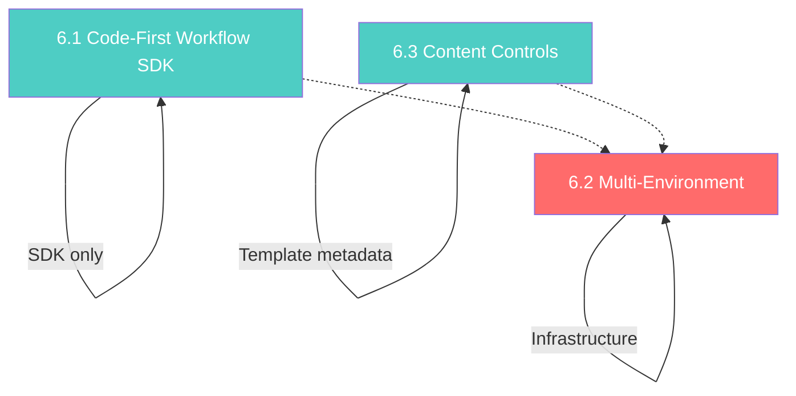

# Phase 6 — Advanced Platform: Detailed Design Document

> **Status:** Ready for Implementation
> **Dependencies:** Phase 5 Complete (Go SDK, JS/TS SDK, React SDK verified clean)
> **Duration:** 5 weeks (Weeks 21–26)
> **Feature Count:** 3 features (1 SDK DSL layer, 1 infrastructure-wide architecture change, 1 template extension)

---

## Table of Contents

- [Section 0: Concepts & Scope](#section-0-concepts--scope)
- [Section 1: Codebase Audit — Current State](#section-1-codebase-audit--current-state)
  - [1.1 Workflow SDK Surface](#11-workflow-sdk-surface)
  - [1.2 Application Model & Auth](#12-application-model--auth)
  - [1.3 Template Metadata](#13-template-metadata)
  - [1.4 Gaps](#14-gaps)
- [Section 2: Feature 6.1 — Code-First Workflow SDK](#section-2-feature-61--code-first-workflow-sdk)
  - [2.1 Design Philosophy](#21-design-philosophy)
  - [2.2 Go SDK: Fluent Builder API](#22-go-sdk-fluent-builder-api)
  - [2.3 Go SDK: Lifecycle Methods](#23-go-sdk-lifecycle-methods)
  - [2.4 JS/TS SDK: Fluent Builder API](#24-jsts-sdk-fluent-builder-api)
  - [2.5 JS/TS SDK: Lifecycle Methods](#25-jsts-sdk-lifecycle-methods)
  - [2.6 Validation & Error Handling](#26-validation--error-handling)
  - [2.7 File Inventory](#27-file-inventory)
- [Section 3: Feature 6.2 — Multi-Environment](#section-3-feature-62--multi-environment)
  - [3.1 Architecture Decision](#31-architecture-decision)
  - [3.2 Domain Model](#32-domain-model)
  - [3.3 Repository Layer](#33-repository-layer)
  - [3.4 Service Layer](#34-service-layer)
  - [3.5 API Endpoints](#35-api-endpoints)
  - [3.6 Auth Middleware Changes](#36-auth-middleware-changes)
  - [3.7 Repository Scoping (All Entities)](#37-repository-scoping-all-entities)
  - [3.8 Environment Promotion](#38-environment-promotion)
  - [3.9 Migration Strategy](#39-migration-strategy)
  - [3.10 SDK Changes](#310-sdk-changes)
  - [3.11 Config & Feature Gate](#311-config--feature-gate)
  - [3.12 File Inventory](#312-file-inventory)
- [Section 4: Feature 6.3 — Content Controls](#section-4-feature-63--content-controls)
  - [4.1 Design Philosophy](#41-design-philosophy)
  - [4.2 Control Schema](#42-control-schema)
  - [4.3 Backend: Template Extension](#43-backend-template-extension)
  - [4.4 Backend: Control Values API](#44-backend-control-values-api)
  - [4.5 Worker: Control Merging at Render Time](#45-worker-control-merging-at-render-time)
  - [4.6 SDK Updates](#46-sdk-updates)
  - [4.7 Dashboard UI Contract](#47-dashboard-ui-contract)
  - [4.8 File Inventory](#48-file-inventory)
- [Section 5: Wiring & Container Integration](#section-5-wiring--container-integration)
- [Section 6: Config Extensions](#section-6-config-extensions)
- [Section 7: Migration Checklist](#section-7-migration-checklist)
- [Section 8: Implementation Order](#section-8-implementation-order)
  - [8.1 Dependency Graph](#81-dependency-graph)
  - [8.2 Recommended Sequence](#82-recommended-sequence)
  - [8.3 Splitting into Parts](#83-splitting-into-parts)
- [Section 9: File Inventory (All Features)](#section-9-file-inventory-all-features)

---

## Section 0: Concepts & Scope

### Code-First Workflow SDK
Allows developers to define notification workflows programmatically using a builder/fluent API instead of constructing raw JSON payloads. The builder validates structure at construction time, serializes to the existing `CreateWorkflowParams` format, and calls the existing REST endpoints. This is a **pure SDK-side feature** — no backend changes needed.

### Multi-Environment
Introduces the concept of environments (Development, Staging, Production) within an application. Each environment has:
- Its own API key
- An isolated subset of users, templates, and notifications
- Shared workflow definitions (with per-environment status overrides)
- A promotion mechanism to copy templates/workflows from one environment to another

This is the **most invasive feature** in the entire implementation plan. Every repository query, every service method, and every handler gains an `environment_id` dimension.

### Content Controls
A structured schema layer on top of `Template.Metadata` that defines form fields for non-technical editors. Controls declare typed, labeled, constrained fields (text, URL, color, image, etc.) that map to template variables. The dashboard renders a form from these declarations; the worker merges control values into the template data at render time. This is **primarily a UI and SDK convention** — minimal backend changes.

---

## Section 1: Codebase Audit — Current State

### 1.1 Workflow SDK Surface

**Go SDK** (`sdk/go/freerangenotify/`):
- `WorkflowsClient` with 9 REST methods: `Create`, `Get`, `Update`, `Delete`, `List`, `Trigger`, `GetExecution`, `ListExecutions`, `CancelExecution`
- Types in `types.go`: `CreateWorkflowParams`, `Workflow`, `WorkflowStep`, `StepCondition`, `TriggerWorkflowParams`, `WorkflowExecution`
- No builder/fluent API exists

**JS/TS SDK** (`sdk/js/src/`):
- `WorkflowsClient` in `workflows.ts` with 9 methods mirroring Go SDK
- Types in `types.ts`: `CreateWorkflowParams`, `Workflow`, `WorkflowStep`, `StepCondition`, etc.
- No builder/fluent API exists

**Backend** (`internal/domain/workflow/`):
- Full domain model: `Workflow`, `Step`, `StepConfig`, `Condition`, `WorkflowExecution`, `StepResult`
- Step types: `channel`, `delay`, `digest`, `condition`
- Repository, service, and handler fully implemented
- Feature-gated in container via `cfg.Features.WorkflowEnabled`

### 1.2 Application Model & Auth

**Application** (`internal/domain/application/models.go`):
- Single `APIKey` per application
- `Settings` struct with rich config (rate limits, providers, throttle, etc.)
- No environment concept

**Auth middleware** (`internal/interfaces/http/middleware/auth.go`):
- Extracts `Authorization: Bearer <api_key>`
- Resolves to `Application` via `appService.ValidateAPIKey()`
- Sets `c.Locals("app_id")` — all downstream code scopes data by this

### 1.3 Template Metadata

**Template** (`internal/domain/template/models.go`):
- `Metadata map[string]interface{}` field already exists — unstructured, available for extension
- `Variables []string` — lists template variable names
- No `Controls` type or schema validation on metadata

### 1.4 Gaps

| Feature | What Exists | What's Missing |
|---------|-------------|----------------|
| Code-First Workflow SDK | REST CRUD + Trigger in both SDKs; full backend | Fluent builder DSL, step builders, validation, serialization to `CreateWorkflowParams` |
| Multi-Environment | Single `APIKey` per app, all data scoped by `app_id` only | `Environment` entity, per-env API keys, per-env data isolation, promotion API |
| Content Controls | `Template.Metadata map[string]interface{}` exists | Structured `TemplateControl` schema, control values API, worker merge logic |

---

## Section 2: Feature 6.1 — Code-First Workflow SDK

### 2.1 Design Philosophy

The builder is a **client-side DSL** that:

1. Constructs `WorkflowStep` objects via a fluent API
2. Validates step ordering, required fields, and condition references at build time
3. Serializes to `CreateWorkflowParams` / `UpdateWorkflowParams` — the existing REST types
4. Calls the existing `WorkflowsClient.Create()` / `Update()` — **no backend changes**

The builder pattern follows the same conventions used by Terraform providers, the AWS SDK, and gRPC protobuf builders.

### 2.2 Go SDK: Fluent Builder API

**New file:** `sdk/go/freerangenotify/workflow_builder.go`

```go
package freerangenotify

// ── Workflow Builder ──

// WorkflowBuilder constructs a workflow definition using a fluent API.
type WorkflowBuilder struct {
	name        string
	description string
	triggerID   string
	steps       []WorkflowStep
}

// NewWorkflow creates a new workflow builder.
//
//	wf := frn.NewWorkflow("welcome-onboarding").
//	    Description("Onboard new users with welcome + follow-up").
//	    TriggerID("user.signup").
//	    Step(frn.Email("Welcome Email").Template("welcome_email")).
//	    Step(frn.Delay("1h")).
//	    Step(frn.Condition("steps.0.read", frn.OpNotRead).
//	        OnTrue(frn.Noop()).
//	        OnFalse(frn.Email("Follow-up").Template("followup_email")),
//	    )
func NewWorkflow(name string) *WorkflowBuilder {
	return &WorkflowBuilder{name: name, triggerID: name}
}

// Description sets the workflow description.
func (b *WorkflowBuilder) Description(desc string) *WorkflowBuilder {
	b.description = desc
	return b
}

// TriggerID overrides the trigger identifier (defaults to name).
func (b *WorkflowBuilder) TriggerID(id string) *WorkflowBuilder {
	b.triggerID = id
	return b
}

// Step appends a step to the workflow.
func (b *WorkflowBuilder) Step(step StepBuilder) *WorkflowBuilder {
	built := step.Build()
	built.ID = fmt.Sprintf("step_%d", len(b.steps))
	b.steps = append(b.steps, built)
	return b
}

// Validate checks the workflow definition for structural errors.
func (b *WorkflowBuilder) Validate() error {
	if b.name == "" {
		return fmt.Errorf("workflow name is required")
	}
	if b.triggerID == "" {
		return fmt.Errorf("workflow trigger_id is required")
	}
	if len(b.steps) == 0 {
		return fmt.Errorf("workflow must have at least one step")
	}
	for i, s := range b.steps {
		if s.Type == "" {
			return fmt.Errorf("step %d: type is required", i)
		}
		if s.Type == "channel" && s.Channel == "" {
			return fmt.Errorf("step %d: channel step must specify a channel", i)
		}
		if s.Type == "delay" && s.DelayDuration == "" {
			return fmt.Errorf("step %d: delay step must specify a duration", i)
		}
		if s.Type == "digest" && s.DigestKey == "" {
			return fmt.Errorf("step %d: digest step must specify a digest key", i)
		}
	}
	return nil
}

// Build serializes the builder into CreateWorkflowParams.
// Returns an error if validation fails.
func (b *WorkflowBuilder) Build() (*CreateWorkflowParams, error) {
	if err := b.Validate(); err != nil {
		return nil, err
	}
	return &CreateWorkflowParams{
		Name:        b.name,
		Description: b.description,
		TriggerID:   b.triggerID,
		Steps:       b.steps,
	}, nil
}

// MustBuild is like Build but panics on validation error.
func (b *WorkflowBuilder) MustBuild() *CreateWorkflowParams {
	params, err := b.Build()
	if err != nil {
		panic(fmt.Sprintf("workflow build error: %v", err))
	}
	return params
}
```

**New file:** `sdk/go/freerangenotify/step_builders.go`

```go
package freerangenotify

// StepBuilder is the interface that all step builders implement.
type StepBuilder interface {
	Build() WorkflowStep
}

// ── Channel Step Builders ──

// ChannelStepBuilder creates a channel delivery step (email, sms, push, webhook, sse).
type ChannelStepBuilder struct {
	name       string
	channel    string
	templateID string
	provider   string
	skipIf     *StepCondition
	config     map[string]interface{}
}

// Email creates an email delivery step.
func Email(name string) *ChannelStepBuilder {
	return &ChannelStepBuilder{name: name, channel: "email"}
}

// SMS creates an SMS delivery step.
func SMS(name string) *ChannelStepBuilder {
	return &ChannelStepBuilder{name: name, channel: "sms"}
}

// Push creates a push notification delivery step.
func Push(name string) *ChannelStepBuilder {
	return &ChannelStepBuilder{name: name, channel: "push"}
}

// InApp creates an in-app (SSE) delivery step.
func InApp(name string) *ChannelStepBuilder {
	return &ChannelStepBuilder{name: name, channel: "sse"}
}

// Webhook creates a webhook delivery step.
func Webhook(name string) *ChannelStepBuilder {
	return &ChannelStepBuilder{name: name, channel: "webhook"}
}

// Slack creates a Slack delivery step.
func Slack(name string) *ChannelStepBuilder {
	return &ChannelStepBuilder{name: name, channel: "slack"}
}

// Discord creates a Discord delivery step.
func Discord(name string) *ChannelStepBuilder {
	return &ChannelStepBuilder{name: name, channel: "discord"}
}

// Template sets the template ID for this channel step.
func (b *ChannelStepBuilder) Template(templateID string) *ChannelStepBuilder {
	b.templateID = templateID
	return b
}

// Provider overrides the delivery provider for this step.
func (b *ChannelStepBuilder) Provider(provider string) *ChannelStepBuilder {
	b.provider = provider
	return b
}

// SkipIf attaches a skip condition to this step.
func (b *ChannelStepBuilder) SkipIf(cond *ConditionBuilder) *ChannelStepBuilder {
	built := cond.BuildCondition()
	b.skipIf = &built
	return b
}

// Config sets additional configuration for this step.
func (b *ChannelStepBuilder) Config(key string, value interface{}) *ChannelStepBuilder {
	if b.config == nil {
		b.config = make(map[string]interface{})
	}
	b.config[key] = value
	return b
}

// Build serializes the channel step builder into a WorkflowStep.
func (b *ChannelStepBuilder) Build() WorkflowStep {
	step := WorkflowStep{
		Name:       b.name,
		Type:       "channel",
		Channel:    b.channel,
		TemplateID: b.templateID,
	}
	if b.provider != "" {
		step.Config = map[string]interface{}{"provider": b.provider}
	}
	if b.config != nil {
		if step.Config == nil {
			step.Config = make(map[string]interface{})
		}
		for k, v := range b.config {
			step.Config[k] = v
		}
	}
	if b.skipIf != nil {
		step.Condition = b.skipIf
	}
	return step
}

// ── Delay Step ──

// DelayStepBuilder creates a time-delay step.
type DelayStepBuilder struct {
	duration string
}

// Delay creates a delay step with the given duration (e.g., "1h", "30m", "24h").
func Delay(duration string) *DelayStepBuilder {
	return &DelayStepBuilder{duration: duration}
}

// Build serializes the delay step builder into a WorkflowStep.
func (b *DelayStepBuilder) Build() WorkflowStep {
	return WorkflowStep{
		Name:          "delay",
		Type:          "delay",
		DelayDuration: b.duration,
	}
}

// ── Digest Step ──

// DigestStepBuilder creates a digest/batching step.
type DigestStepBuilder struct {
	key        string
	window     string
	maxBatch   int
	templateID string
}

// Digest creates a digest step that accumulates events by key.
func Digest(key string) *DigestStepBuilder {
	return &DigestStepBuilder{key: key}
}

// Window sets the digest window duration (e.g., "24h", "1h").
func (b *DigestStepBuilder) Window(window string) *DigestStepBuilder {
	b.window = window
	return b
}

// MaxBatch sets the maximum events per digest batch.
func (b *DigestStepBuilder) MaxBatch(max int) *DigestStepBuilder {
	b.maxBatch = max
	return b
}

// Template sets the template used to render the digest summary.
func (b *DigestStepBuilder) Template(templateID string) *DigestStepBuilder {
	b.templateID = templateID
	return b
}

// Build serializes the digest step builder into a WorkflowStep.
func (b *DigestStepBuilder) Build() WorkflowStep {
	step := WorkflowStep{
		Name:       "digest_" + b.key,
		Type:       "digest",
		DigestKey:  b.key,
		TemplateID: b.templateID,
	}
	if b.window != "" || b.maxBatch > 0 {
		step.Config = make(map[string]interface{})
		if b.window != "" {
			step.Config["window"] = b.window
		}
		if b.maxBatch > 0 {
			step.Config["max_batch"] = b.maxBatch
		}
	}
	return step
}

// ── Condition Step ──

// ConditionOperator defines comparison operators for conditions.
type ConditionOperator string

const (
	OpEquals   ConditionOperator = "eq"
	OpNotEqual ConditionOperator = "neq"
	OpContains ConditionOperator = "contains"
	OpGT       ConditionOperator = "gt"
	OpLT       ConditionOperator = "lt"
	OpExists   ConditionOperator = "exists"
	OpNotRead  ConditionOperator = "not_read"
)

// ConditionBuilder creates a conditional branching step.
type ConditionBuilder struct {
	field    string
	operator ConditionOperator
	value    interface{}
	onTrue   StepBuilder
	onFalse  StepBuilder
}

// Condition creates a condition step that branches based on a field comparison.
func Condition(field string, op ConditionOperator, value ...interface{}) *ConditionBuilder {
	var val interface{}
	if len(value) > 0 {
		val = value[0]
	}
	return &ConditionBuilder{field: field, operator: op, value: val}
}

// OnTrue sets the step to execute when the condition is true.
func (b *ConditionBuilder) OnTrue(step StepBuilder) *ConditionBuilder {
	b.onTrue = step
	return b
}

// OnFalse sets the step to execute when the condition is false.
func (b *ConditionBuilder) OnFalse(step StepBuilder) *ConditionBuilder {
	b.onFalse = step
	return b
}

// BuildCondition serializes to a StepCondition (used internally by SkipIf).
func (b *ConditionBuilder) BuildCondition() StepCondition {
	return StepCondition{
		Field:    b.field,
		Operator: string(b.operator),
		Value:    b.value,
	}
}

// Build serializes the condition builder into a WorkflowStep.
func (b *ConditionBuilder) Build() WorkflowStep {
	step := WorkflowStep{
		Name: "condition",
		Type: "condition",
		Condition: &StepCondition{
			Field:    b.field,
			Operator: string(b.operator),
			Value:    b.value,
		},
	}
	if b.onTrue != nil {
		onTrueStep := b.onTrue.Build()
		step.Config = map[string]interface{}{
			"on_true": onTrueStep,
		}
	}
	if b.onFalse != nil {
		onFalseStep := b.onFalse.Build()
		if step.Config == nil {
			step.Config = make(map[string]interface{})
		}
		step.Config["on_false"] = onFalseStep
	}
	return step
}

// ── Noop Step ──

// NoopStepBuilder creates a no-operation step (used as a branch target).
type NoopStepBuilder struct{}

// Noop creates a noop step.
func Noop() *NoopStepBuilder {
	return &NoopStepBuilder{}
}

// Build serializes the noop step builder into a WorkflowStep.
func (b *NoopStepBuilder) Build() WorkflowStep {
	return WorkflowStep{
		Name: "noop",
		Type: "noop",
	}
}
```

### 2.3 Go SDK: Lifecycle Methods

**Modify:** `sdk/go/freerangenotify/workflows.go`

Add convenience methods that accept the builder directly:

```go
// CreateFromBuilder validates and creates a workflow from a builder.
func (c *WorkflowsClient) CreateFromBuilder(ctx context.Context, wf *WorkflowBuilder) (*Workflow, error) {
	params, err := wf.Build()
	if err != nil {
		return nil, fmt.Errorf("workflow builder: %w", err)
	}
	return c.Create(ctx, *params)
}

// UpdateFromBuilder validates and updates a workflow from a builder.
func (c *WorkflowsClient) UpdateFromBuilder(ctx context.Context, id string, wf *WorkflowBuilder) (*Workflow, error) {
	params, err := wf.Build()
	if err != nil {
		return nil, fmt.Errorf("workflow builder: %w", err)
	}
	return c.Update(ctx, id, UpdateWorkflowParams{
		Name:        params.Name,
		Description: params.Description,
		Steps:       params.Steps,
	})
}
```

**Full usage example:**

```go
package main

import (
	"context"
	"log"

	frn "github.com/the-monkeys/freerangenotify/sdk/go/freerangenotify"
)

func main() {
	client, err := frn.New("http://localhost:8080/v1", "frn_xxx")
	if err != nil {
		log.Fatal(err)
	}

	wf := frn.NewWorkflow("welcome-onboarding").
		Description("Multi-step onboarding for new users").
		TriggerID("user.signup").
		Step(frn.InApp("Welcome In-App").Template("welcome_inapp")).
		Step(frn.Delay("1h")).
		Step(frn.Condition("steps.step_0.read", frn.OpNotRead).
			OnTrue(frn.Noop()).
			OnFalse(frn.Email("Follow-up Email").Template("welcome_email")),
		).
		Step(frn.Digest("project_updates").
			Window("24h").
			Template("daily_digest"),
		)

	// Validate without creating
	if err := wf.Validate(); err != nil {
		log.Fatal("Invalid workflow:", err)
	}

	// Create via API
	created, err := client.Workflows.CreateFromBuilder(context.Background(), wf)
	if err != nil {
		log.Fatal("Create failed:", err)
	}
	log.Printf("Created workflow: %s (version %d)\n", created.ID, created.Version)

	// Trigger
	exec, err := client.Workflows.Trigger(context.Background(), frn.TriggerWorkflowParams{
		TriggerID: "user.signup",
		UserID:    "user-123",
		Payload:   map[string]interface{}{"user_name": "Dave"},
	})
	if err != nil {
		log.Fatal("Trigger failed:", err)
	}
	log.Printf("Execution: %s (status: %s)\n", exec.ID, exec.Status)
}
```

### 2.4 JS/TS SDK: Fluent Builder API

**New file:** `sdk/js/src/workflow_builder.ts`

```typescript
import type {
  CreateWorkflowParams,
  WorkflowStep,
  StepCondition,
} from './types';

// ── Condition Operators ──

export type ConditionOperator = 'eq' | 'neq' | 'contains' | 'gt' | 'lt' | 'exists' | 'not_read';

// ── Step Builder Interface ──

export interface StepBuilder {
  build(): WorkflowStep;
}

// ── Workflow Builder ──

export class WorkflowBuilder {
  private name: string;
  private description = '';
  private triggerId: string;
  private steps: WorkflowStep[] = [];

  constructor(name: string) {
    this.name = name;
    this.triggerId = name;
  }

  /** Set workflow description. */
  desc(description: string): this {
    this.description = description;
    return this;
  }

  /** Override the trigger identifier (defaults to name). */
  trigger(triggerId: string): this {
    this.triggerId = triggerId;
    return this;
  }

  /** Append a step to the workflow. */
  step(builder: StepBuilder): this {
    const built = builder.build();
    built.id = `step_${this.steps.length}`;
    this.steps.push(built);
    return this;
  }

  // ── Convenience shorthand methods (append & return self) ──

  /** Shorthand: append an email step. */
  email(opts: { name?: string; template: string }): this {
    return this.step(channelStep('email', opts.name ?? 'email').template(opts.template));
  }

  /** Shorthand: append an SMS step. */
  sms(opts: { name?: string; template: string }): this {
    return this.step(channelStep('sms', opts.name ?? 'sms').template(opts.template));
  }

  /** Shorthand: append a push step. */
  push(opts: { name?: string; template: string }): this {
    return this.step(channelStep('push', opts.name ?? 'push').template(opts.template));
  }

  /** Shorthand: append an in-app (SSE) step. */
  inApp(opts: { name?: string; template: string }): this {
    return this.step(channelStep('sse', opts.name ?? 'in_app').template(opts.template));
  }

  /** Shorthand: append a delay step. */
  delay(duration: string): this {
    return this.step(delayStep(duration));
  }

  /** Shorthand: append a digest step. */
  digest(key: string, opts?: { window?: string; maxBatch?: number; template?: string }): this {
    let d = digestStep(key);
    if (opts?.window) d = d.window(opts.window);
    if (opts?.maxBatch) d = d.maxBatch(opts.maxBatch);
    if (opts?.template) d = d.template(opts.template);
    return this.step(d);
  }

  /** Validate the workflow definition. Throws on errors. */
  validate(): void {
    if (!this.name) throw new Error('Workflow name is required');
    if (!this.triggerId) throw new Error('Workflow trigger_id is required');
    if (this.steps.length === 0) throw new Error('Workflow must have at least one step');

    this.steps.forEach((s, i) => {
      if (!s.type) throw new Error(`Step ${i}: type is required`);
      if (s.type === 'channel' && !s.channel) throw new Error(`Step ${i}: channel step must specify a channel`);
      if (s.type === 'delay' && !s.delay_duration) throw new Error(`Step ${i}: delay step must specify a duration`);
      if (s.type === 'digest' && !s.digest_key) throw new Error(`Step ${i}: digest step must specify a digest key`);
    });
  }

  /** Build and validate into CreateWorkflowParams. */
  build(): CreateWorkflowParams {
    this.validate();
    return {
      name: this.name,
      description: this.description,
      trigger_id: this.triggerId,
      steps: this.steps,
    };
  }
}

// ── Factory function ──

/** Create a new workflow builder. */
export function workflow(name: string): WorkflowBuilder {
  return new WorkflowBuilder(name);
}

// ── Channel Step Builder ──

export class ChannelStepBuilder implements StepBuilder {
  private name: string;
  private channel: string;
  private templateId = '';
  private provider = '';
  private skipCondition?: StepCondition;
  private cfg: Record<string, unknown> = {};

  constructor(channel: string, name: string) {
    this.channel = channel;
    this.name = name;
  }

  template(templateId: string): this {
    this.templateId = templateId;
    return this;
  }

  withProvider(provider: string): this {
    this.provider = provider;
    return this;
  }

  skipIf(cond: ConditionStepBuilder): this {
    this.skipCondition = cond.buildCondition();
    return this;
  }

  config(key: string, value: unknown): this {
    this.cfg[key] = value;
    return this;
  }

  build(): WorkflowStep {
    const step: WorkflowStep = {
      name: this.name,
      type: 'channel',
      channel: this.channel,
      template_id: this.templateId,
    };
    if (this.provider) {
      step.config = { ...this.cfg, provider: this.provider };
    } else if (Object.keys(this.cfg).length > 0) {
      step.config = { ...this.cfg };
    }
    if (this.skipCondition) {
      step.condition = this.skipCondition;
    }
    return step;
  }
}

/** Create a channel delivery step. */
export function channelStep(channel: string, name: string): ChannelStepBuilder {
  return new ChannelStepBuilder(channel, name);
}

/** Create an email delivery step. */
export function emailStep(name: string): ChannelStepBuilder {
  return new ChannelStepBuilder('email', name);
}

/** Create an SMS delivery step. */
export function smsStep(name: string): ChannelStepBuilder {
  return new ChannelStepBuilder('sms', name);
}

/** Create a push notification delivery step. */
export function pushStep(name: string): ChannelStepBuilder {
  return new ChannelStepBuilder('push', name);
}

/** Create an in-app (SSE) delivery step. */
export function inAppStep(name: string): ChannelStepBuilder {
  return new ChannelStepBuilder('sse', name);
}

/** Create a webhook delivery step. */
export function webhookStep(name: string): ChannelStepBuilder {
  return new ChannelStepBuilder('webhook', name);
}

/** Create a Slack delivery step. */
export function slackStep(name: string): ChannelStepBuilder {
  return new ChannelStepBuilder('slack', name);
}

/** Create a Discord delivery step. */
export function discordStep(name: string): ChannelStepBuilder {
  return new ChannelStepBuilder('discord', name);
}

// ── Delay Step Builder ──

export class DelayStepBuilder implements StepBuilder {
  private duration: string;

  constructor(duration: string) {
    this.duration = duration;
  }

  build(): WorkflowStep {
    return {
      name: 'delay',
      type: 'delay',
      delay_duration: this.duration,
    };
  }
}

/** Create a delay step with the given duration (e.g., "1h", "30m"). */
export function delayStep(duration: string): DelayStepBuilder {
  return new DelayStepBuilder(duration);
}

// ── Digest Step Builder ──

export class DigestStepBuilder implements StepBuilder {
  private key: string;
  private _window = '';
  private _maxBatch = 0;
  private templateId = '';

  constructor(key: string) {
    this.key = key;
  }

  window(window: string): this {
    this._window = window;
    return this;
  }

  maxBatch(max: number): this {
    this._maxBatch = max;
    return this;
  }

  template(templateId: string): this {
    this.templateId = templateId;
    return this;
  }

  build(): WorkflowStep {
    const step: WorkflowStep = {
      name: `digest_${this.key}`,
      type: 'digest',
      digest_key: this.key,
      template_id: this.templateId,
    };
    if (this._window || this._maxBatch > 0) {
      step.config = {};
      if (this._window) step.config.window = this._window;
      if (this._maxBatch > 0) step.config.max_batch = this._maxBatch;
    }
    return step;
  }
}

/** Create a digest step that accumulates events by key. */
export function digestStep(key: string): DigestStepBuilder {
  return new DigestStepBuilder(key);
}

// ── Condition Step Builder ──

export class ConditionStepBuilder implements StepBuilder {
  private field: string;
  private operator: ConditionOperator;
  private value: unknown;
  private _onTrue?: StepBuilder;
  private _onFalse?: StepBuilder;

  constructor(field: string, operator: ConditionOperator, value?: unknown) {
    this.field = field;
    this.operator = operator;
    this.value = value;
  }

  onTrue(step: StepBuilder): this {
    this._onTrue = step;
    return this;
  }

  onFalse(step: StepBuilder): this {
    this._onFalse = step;
    return this;
  }

  buildCondition(): StepCondition {
    return {
      field: this.field,
      operator: this.operator,
      value: this.value,
    };
  }

  build(): WorkflowStep {
    const step: WorkflowStep = {
      name: 'condition',
      type: 'condition',
      condition: this.buildCondition(),
    };
    const cfg: Record<string, unknown> = {};
    if (this._onTrue) cfg.on_true = this._onTrue.build();
    if (this._onFalse) cfg.on_false = this._onFalse.build();
    if (Object.keys(cfg).length > 0) step.config = cfg;
    return step;
  }
}

/** Create a conditional branching step. */
export function condition(field: string, op: ConditionOperator, value?: unknown): ConditionStepBuilder {
  return new ConditionStepBuilder(field, op, value);
}

// ── Noop Step Builder ──

export class NoopStepBuilder implements StepBuilder {
  build(): WorkflowStep {
    return { name: 'noop', type: 'noop' };
  }
}

/** Create a no-operation step (used as a branch target). */
export function noop(): NoopStepBuilder {
  return new NoopStepBuilder();
}
```

### 2.5 JS/TS SDK: Lifecycle Methods

**Modify:** `sdk/js/src/workflows.ts`

Add convenience methods on `WorkflowsClient`:

```typescript
import type { WorkflowBuilder } from './workflow_builder';

/** Create a workflow from a builder. */
async createFromBuilder(builder: WorkflowBuilder): Promise<Workflow> {
    const params = builder.build();
    return this.create(params);
}

/** Update a workflow from a builder. */
async updateFromBuilder(id: string, builder: WorkflowBuilder): Promise<Workflow> {
    const params = builder.build();
    return this.update(id, {
        name: params.name,
        description: params.description,
        steps: params.steps,
    });
}
```

**Modify:** `sdk/js/src/index.ts`

Add re-exports for the builder:

```typescript
export {
    workflow,
    emailStep, smsStep, pushStep, inAppStep, webhookStep, slackStep, discordStep,
    delayStep, digestStep, condition, noop,
    WorkflowBuilder, ChannelStepBuilder, DelayStepBuilder, DigestStepBuilder,
    ConditionStepBuilder, NoopStepBuilder,
} from './workflow_builder';
export type { StepBuilder, ConditionOperator } from './workflow_builder';
```

**Full TypeScript usage example:**

```typescript
import { FreeRangeNotify, workflow, emailStep, delayStep, condition, noop } from '@freerangenotify/sdk';

const client = new FreeRangeNotify('frn_xxx', { baseURL: 'http://localhost:8080/v1' });

const wf = workflow('welcome-onboarding')
    .desc('Multi-step onboarding for new users')
    .trigger('user.signup')
    .inApp({ template: 'welcome_inapp' })
    .delay('1h')
    .step(condition('steps.step_0.read', 'not_read')
        .onTrue(noop())
        .onFalse(emailStep('Follow-up').template('welcome_email'))
    )
    .digest('project_updates', { window: '24h', template: 'daily_digest' });

// Validate without creating
wf.validate(); // throws on errors

// Create via API
const created = await client.workflows.createFromBuilder(wf);
console.log(`Created: ${created.id} (v${created.version})`);

// Trigger via existing method
const exec = await client.workflows.trigger({
    trigger_id: 'user.signup',
    user_id: 'user-123',
    payload: { user_name: 'Dave' },
});
```

### 2.6 Validation & Error Handling

The builder performs **structural validation only** — it does not call the API to check if templates or channels exist. The API server handles runtime validation on `Create`.

| Validation | Where | Action |
|---|---|---|
| Empty name | `Validate()` | Error: "workflow name is required" |
| Empty trigger_id | `Validate()` | Error: "trigger_id is required" |
| No steps | `Validate()` | Error: "must have at least one step" |
| Channel step without channel | `Validate()` | Error: "must specify a channel" |
| Delay step without duration | `Validate()` | Error: "must specify a duration" |
| Digest step without key | `Validate()` | Error: "must specify a digest key" |
| Template not found | API (server-side) | 404 from `POST /v1/workflows` |
| Duplicate trigger_id | API (server-side) | 409 from `POST /v1/workflows` |

### 2.7 File Inventory

| Action | File | Description |
|--------|------|-------------|
| **CREATE** | `sdk/go/freerangenotify/workflow_builder.go` | Go: WorkflowBuilder fluent API |
| **CREATE** | `sdk/go/freerangenotify/step_builders.go` | Go: Step builders (Email, Delay, Digest, Condition, Noop) |
| **MODIFY** | `sdk/go/freerangenotify/workflows.go` | Go: Add `CreateFromBuilder`, `UpdateFromBuilder` |
| **CREATE** | `sdk/js/src/workflow_builder.ts` | TS: WorkflowBuilder + all step builders |
| **MODIFY** | `sdk/js/src/workflows.ts` | TS: Add `createFromBuilder`, `updateFromBuilder` |
| **MODIFY** | `sdk/js/src/index.ts` | TS: Re-export builder functions and types |

**Backend changes: None.** The builder is a pure SDK-side façade.

---

## Section 3: Feature 6.2 — Multi-Environment

### 3.1 Architecture Decision

**Chosen approach: Environment as a child entity of Application.**

Each `Application` has one or more `Environment` records. Each environment has its own `APIKey`. The auth middleware resolves an API key to both an `app_id` and an `environment_id`. Every repository query is scoped by `environment_id` in addition to `app_id`.

**Alternatives rejected:**

| Approach | Why Rejected |
|---|---|
| Separate Application per environment | Duplicates app config, no shared workflows, no promotion mechanism |
| Environment as config file only | No API-level isolation, can't have per-env users/templates |
| Namespace prefix on all IDs | Fragile, doesn't allow cross-env queries for admin |

### 3.2 Domain Model

**New file:** `internal/domain/environment/models.go`

```go
package environment

import (
	"context"
	"time"
)

type Environment struct {
	ID        string    `json:"id" es:"id"`
	AppID     string    `json:"app_id" es:"app_id"`
	Name      string    `json:"name" es:"name" validate:"required,oneof=development staging production"`
	Slug      string    `json:"slug" es:"slug"`            // "dev", "stg", "prod"
	APIKey    string    `json:"api_key" es:"api_key"`
	IsDefault bool      `json:"is_default" es:"is_default"` // true for the "production" env
	CreatedAt time.Time `json:"created_at" es:"created_at"`
	UpdatedAt time.Time `json:"updated_at" es:"updated_at"`
}

type CreateRequest struct {
	AppID string `json:"app_id" validate:"required"`
	Name  string `json:"name" validate:"required,oneof=development staging production"`
}

type PromoteRequest struct {
	SourceEnvID string   `json:"source_env_id" validate:"required"`
	TargetEnvID string   `json:"target_env_id" validate:"required"`
	Resources   []string `json:"resources" validate:"required,min=1"` // "templates", "workflows"
}

type PromoteResult struct {
	TemplatesPromoted int `json:"templates_promoted"`
	WorkflowsPromoted int `json:"workflows_promoted"`
}

// Repository defines persistence operations for environments.
type Repository interface {
	Create(ctx context.Context, env *Environment) error
	GetByID(ctx context.Context, id string) (*Environment, error)
	GetByAPIKey(ctx context.Context, apiKey string) (*Environment, error)
	ListByApp(ctx context.Context, appID string) ([]Environment, error)
	Delete(ctx context.Context, id string) error
}

// Service defines business operations for environments.
type Service interface {
	Create(ctx context.Context, req CreateRequest) (*Environment, error)
	Get(ctx context.Context, id string) (*Environment, error)
	ListByApp(ctx context.Context, appID string) ([]Environment, error)
	Delete(ctx context.Context, id string) error
	Promote(ctx context.Context, appID string, req PromoteRequest) (*PromoteResult, error)
}
```

**New Elasticsearch index:** `frn_environments`

```json
{
  "mappings": {
    "properties": {
      "id":         { "type": "keyword" },
      "app_id":     { "type": "keyword" },
      "name":       { "type": "keyword" },
      "slug":       { "type": "keyword" },
      "api_key":    { "type": "keyword" },
      "is_default": { "type": "boolean" },
      "created_at": { "type": "date" },
      "updated_at": { "type": "date" }
    }
  }
}
```

### 3.3 Repository Layer

**New file:** `internal/infrastructure/repository/environment_repository.go`

```go
type EnvironmentRepository struct {
	base *BaseRepository
}

func NewEnvironmentRepository(db database.Manager, logger *zap.Logger) *EnvironmentRepository {
	return &EnvironmentRepository{
		base: NewBaseRepository(db, logger, "frn_environments"),
	}
}

func (r *EnvironmentRepository) Create(ctx context.Context, env *environment.Environment) error {
	return r.base.Index(ctx, env.ID, env)
}

func (r *EnvironmentRepository) GetByID(ctx context.Context, id string) (*environment.Environment, error) {
	var env environment.Environment
	if err := r.base.Get(ctx, id, &env); err != nil {
		return nil, err
	}
	return &env, nil
}

func (r *EnvironmentRepository) GetByAPIKey(ctx context.Context, apiKey string) (*environment.Environment, error) {
	query := map[string]interface{}{
		"query": map[string]interface{}{
			"term": map[string]interface{}{
				"api_key": apiKey,
			},
		},
	}
	var envs []environment.Environment
	if err := r.base.Search(ctx, query, &envs); err != nil {
		return nil, err
	}
	if len(envs) == 0 {
		return nil, ErrNotFound
	}
	return &envs[0], nil
}

func (r *EnvironmentRepository) ListByApp(ctx context.Context, appID string) ([]environment.Environment, error) {
	query := map[string]interface{}{
		"query": map[string]interface{}{
			"term": map[string]interface{}{
				"app_id": appID,
			},
		},
		"sort": []map[string]interface{}{
			{"created_at": "asc"},
		},
	}
	var envs []environment.Environment
	if err := r.base.Search(ctx, query, &envs); err != nil {
		return nil, err
	}
	return envs, nil
}

func (r *EnvironmentRepository) Delete(ctx context.Context, id string) error {
	return r.base.Delete(ctx, id)
}
```

### 3.4 Service Layer

**New file:** `internal/usecases/environment_service.go`

Key responsibilities:
- `Create`: Generate UUID + API key (`frn_<env_slug>_<random>`), validate one env per name per app, set `is_default` for production
- `Delete`: Prevent deleting the default (production) environment
- `Promote`: Copy templates and/or workflows from source env to target env (deep clone with new IDs, preserving content)

```go
type environmentService struct {
	envRepo    environment.Repository
	tmplRepo   template.Repository
	wfRepo     workflow.Repository
	logger     *zap.Logger
}

func (s *environmentService) Create(ctx context.Context, req environment.CreateRequest) (*environment.Environment, error) {
	// 1. Check no duplicate name for this app
	existing, _ := s.envRepo.ListByApp(ctx, req.AppID)
	for _, e := range existing {
		if e.Name == req.Name {
			return nil, pkg_errors.NewConflictError("environment already exists", nil)
		}
	}

	// 2. Generate env
	slug := slugFromName(req.Name) // "development" → "dev", "staging" → "stg", "production" → "prod"
	env := &environment.Environment{
		ID:        uuid.New().String(),
		AppID:     req.AppID,
		Name:      req.Name,
		Slug:      slug,
		APIKey:    fmt.Sprintf("frn_%s_%s", slug, generateRandomKey(24)),
		IsDefault: req.Name == "production",
		CreatedAt: time.Now().UTC(),
		UpdatedAt: time.Now().UTC(),
	}

	// 3. Persist
	if err := s.envRepo.Create(ctx, env); err != nil {
		return nil, err
	}
	return env, nil
}

func (s *environmentService) Promote(ctx context.Context, appID string, req environment.PromoteRequest) (*environment.PromoteResult, error) {
	// 1. Validate source and target belong to the same app
	// 2. For "templates": list all templates in source env, deep-clone to target with new IDs
	// 3. For "workflows": list all workflows in source env, deep-clone to target
	// 4. Return counts
}
```

### 3.5 API Endpoints

**New file:** `internal/interfaces/http/handlers/environment_handler.go`

| Method | Path | Auth | Description |
|--------|------|------|-------------|
| `POST` | `/v1/admin/apps/:id/environments` | JWT (admin) | Create an environment |
| `GET` | `/v1/admin/apps/:id/environments` | JWT (admin) | List environments for an app |
| `GET` | `/v1/admin/apps/:id/environments/:envId` | JWT (admin) | Get environment details |
| `DELETE` | `/v1/admin/apps/:id/environments/:envId` | JWT (admin) | Delete environment |
| `POST` | `/v1/admin/apps/:id/environments/promote` | JWT (admin) | Promote resources between environments |

All endpoints are **admin-only** (JWT auth). Regular API key users don't manage environments — they simply use the API key that was assigned to their environment.

### 3.6 Auth Middleware Changes

**Modify:** `internal/interfaces/http/middleware/auth.go`

When multi-environment is enabled, the `APIKeyAuth` middleware changes its resolution logic:

```go
func APIKeyAuth(appService application.Service, envService environment.Service, envEnabled bool) fiber.Handler {
	return func(c *fiber.Ctx) error {
		apiKey := extractBearerToken(c)
		if apiKey == "" {
			return pkg_errors.NewUnauthorizedError("missing API key", nil)
		}

		// Standard path: resolve by application API key
		app, err := appService.ValidateAPIKey(c.Context(), apiKey)
		if err == nil {
			c.Locals("app_id", app.AppID)
			c.Locals("app_name", app.AppName)
			c.Locals("app", app)
			if envEnabled {
				// App-level key → default (production) environment
				c.Locals("environment_id", "default")
			}
			return c.Next()
		}

		// Multi-env path: resolve by environment API key
		if envEnabled {
			env, envErr := envService.Get(c.Context(), apiKey)
			if envErr != nil {
				return pkg_errors.NewUnauthorizedError("invalid API key", nil)
			}
			// Fetch parent app
			parentApp, appErr := appService.GetByID(c.Context(), env.AppID)
			if appErr != nil {
				return pkg_errors.NewUnauthorizedError("invalid API key", nil)
			}
			c.Locals("app_id", parentApp.AppID)
			c.Locals("app_name", parentApp.AppName)
			c.Locals("app", parentApp)
			c.Locals("environment_id", env.ID)
			return c.Next()
		}

		return pkg_errors.NewUnauthorizedError("invalid API key", nil)
	}
}
```

**Key design point:** When `environment_id` is `"default"` (from the app-level key), repositories treat it as unscoped (backward compatible). When it's a UUID (from an env-specific key), repositories add `term: { environment_id: ... }` to all queries.

### 3.7 Repository Scoping (All Entities)

Every existing repository that queries by `app_id` must also accept and apply `environment_id`:

**Pattern (applied to notification, user, template repositories):**

```go
// Before (current):
func (r *NotificationRepository) ListByUser(ctx context.Context, appID, userID string, ...) { ... }

// After (with environment):
func (r *NotificationRepository) ListByUser(ctx context.Context, appID, environmentID, userID string, ...) {
	query := buildBaseQuery(appID, environmentID)
	query.AddTerm("user_id", userID)
	// ...
}

// Helper for all repositories:
func buildBaseQuery(appID, environmentID string) *QueryBuilder {
	q := NewQuery().Must(Term("app_id", appID))
	if environmentID != "" && environmentID != "default" {
		q.Must(Term("environment_id", environmentID))
	}
	return q
}
```

**Entities that gain `environment_id`:**

| Entity | Index | Impact |
|---|---|---|
| User | `frn_users` | New field + all queries scoped |
| Notification | `frn_notifications` | New field + all queries scoped |
| Template | `frn_templates` | New field + all queries scoped |
| Template Version | `frn_template_versions` | New field + all queries scoped |
| Workflow | `frn_workflows` | New field + all queries scoped |
| Workflow Execution | `frn_workflow_executions` | New field + all queries scoped |
| Topic | `frn_topics` | New field + all queries scoped |
| Topic Subscription | `frn_topic_subscriptions` | New field + all queries scoped |
| Audit Log | `frn_audit_logs` | New field + all queries scoped |
| Digest Rule | `frn_digest_rules` | New field + all queries scoped |

**Entities that do NOT get `environment_id`:**

| Entity | Reason |
|---|---|
| Application | Parent entity — environments belong to it |
| Environment | Self — no recursive scoping |
| App Membership (RBAC) | Cross-environment by design |

### 3.8 Environment Promotion

Promotion copies selected resources from one environment to another:

```
POST /v1/admin/apps/:id/environments/promote
{
    "source_env_id": "env-dev-uuid",
    "target_env_id": "env-prod-uuid",
    "resources": ["templates", "workflows"]
}
```

**Template promotion logic:**
1. List all templates in source env
2. For each template, check if a template with the same `name` exists in target env
3. If exists: update body/subject/metadata (preserve target's ID)
4. If not exists: deep-clone with new ID, set `environment_id` to target

**Workflow promotion logic:**
1. Clone workflow definitions (steps, conditions, etc.)
2. Template IDs within steps are **not** automatically remapped — the same template names must exist in the target environment (created via template promotion or manually)

### 3.9 Migration Strategy

**Backward compatibility is mandatory.** Existing single-key apps must keep working without changes.

**Migration steps:**

1. Add `environment_id` field to all existing ES documents (default: `""` or omitted)
2. When `cfg.Features.MultiEnvironmentEnabled` is `false`:
   - Middleware sets `environment_id = "default"` 
   - Repositories ignore `environment_id` (no filter applied)
   - All behavior is identical to current
3. When `cfg.Features.MultiEnvironmentEnabled` is `true`:
   - First app access creates default environments (dev, staging, prod) 
   - App's existing API key maps to the production environment
   - Repositories apply `environment_id` filter for non-default values

**No reindexing required** — Elasticsearch dynamic mapping handles the new `environment_id` keyword field automatically. Existing documents without the field are returned by queries that don't filter on it.

### 3.10 SDK Changes

**Go SDK** — Add environment info to client config:

```go
// sdk/go/freerangenotify/client.go

type ClientOptions struct {
	// Environment is informational — the API key already determines the environment.
	// This is used for logging and identification only.
	Environment string
}
```

**JS/TS SDK** — Same pattern:

```typescript
// sdk/js/src/index.ts

export interface FreeRangeNotifyOptions {
	baseURL?: string;
	environment?: string; // Informational only
}
```

The environment is determined entirely by the API key. The SDK option is for logging/debugging — it doesn't affect API behavior.

### 3.11 Config & Feature Gate

**Modify:** `internal/config/config.go`

```go
type FeaturesConfig struct {
	// ... existing fields ...
	MultiEnvironmentEnabled bool `mapstructure:"multi_environment_enabled" yaml:"multi_environment_enabled"`
}
```

**Config YAML:**

```yaml
features:
  multi_environment_enabled: false  # Default: off for backward compatibility
```

**Environment variable:** `FREERANGE_FEATURES_MULTI_ENVIRONMENT_ENABLED=true`

### 3.12 File Inventory

| Action | File | Description |
|--------|------|-------------|
| **CREATE** | `internal/domain/environment/models.go` | Domain model, repository & service interfaces |
| **CREATE** | `internal/infrastructure/repository/environment_repository.go` | ES-backed repository |
| **CREATE** | `internal/usecases/environment_service.go` | Service implementation (CRUD + promote) |
| **CREATE** | `internal/interfaces/http/handlers/environment_handler.go` | HTTP handlers |
| **MODIFY** | `internal/interfaces/http/middleware/auth.go` | Two-phase API key resolution (app → env) |
| **MODIFY** | `internal/interfaces/http/routes/routes.go` | Add admin environment routes |
| **MODIFY** | `internal/container/container.go` | Wire env service + handler, feature gate |
| **MODIFY** | `internal/config/config.go` | Add `MultiEnvironmentEnabled` to `FeaturesConfig` |
| **MODIFY** | `internal/infrastructure/repository/notification_repository.go` | Add `environment_id` scoping |
| **MODIFY** | `internal/infrastructure/repository/user_repository.go` | Add `environment_id` scoping |
| **MODIFY** | `internal/infrastructure/repository/template_repository.go` | Add `environment_id` scoping |
| **MODIFY** | `internal/infrastructure/repository/workflow_repository.go` | Add `environment_id` scoping |
| **MODIFY** | `internal/infrastructure/repository/topic_repository.go` | Add `environment_id` scoping |
| **MODIFY** | `internal/infrastructure/repository/audit_repository.go` | Add `environment_id` scoping |
| **MODIFY** | `internal/infrastructure/repository/digest_repository.go` | Add `environment_id` scoping |
| **MODIFY** | `internal/domain/notification/models.go` | Add `EnvironmentID` field |
| **MODIFY** | `internal/domain/user/models.go` | Add `EnvironmentID` field |
| **MODIFY** | `internal/domain/template/models.go` | Add `EnvironmentID` field |
| **MODIFY** | `internal/domain/workflow/models.go` | Add `EnvironmentID` field |
| **MODIFY** | All service files | Pass `environment_id` through |
| **MODIFY** | All handler files | Extract `environment_id` from `c.Locals()` |
| **MODIFY** | `cmd/migrate/main.go` | Create `frn_environments` index |

**Estimated touch: 20+ files.**

---

## Section 4: Feature 6.3 — Content Controls

### 4.1 Design Philosophy

Content controls are a **convention layer** — not a new entity. They:

1. Use the existing `Template.Metadata` field to store control definitions
2. Define typed, labeled form fields that map to template variables
3. Are rendered as a form by the dashboard UI
4. Are merged into template data by the worker at render time

The backend changes are minimal: a structured sub-type within metadata, a small API for saving control values, and worker merge logic.

### 4.2 Control Schema

**New types in `internal/domain/template/models.go`:**

```go
// TemplateControl defines a single editable field for non-technical users.
type TemplateControl struct {
	Key         string   `json:"key" es:"key"`                       // Variable name (e.g., "button_text")
	Label       string   `json:"label" es:"label"`                   // UI label (e.g., "Call to Action Text")
	Type        string   `json:"type" es:"type" validate:"required,oneof=text textarea url color image number boolean select"`
	Default     string   `json:"default,omitempty" es:"default"`     // Default value
	Placeholder string   `json:"placeholder,omitempty" es:"placeholder"`
	Required    bool     `json:"required,omitempty" es:"required"`
	Options     []string `json:"options,omitempty" es:"options"`     // For "select" type
	Group       string   `json:"group,omitempty" es:"group"`         // UI grouping (e.g., "Hero", "CTA", "Footer")
	HelpText    string   `json:"help_text,omitempty" es:"help_text"` // Tooltip/description
}

// ControlValues holds the user-edited values for template controls.
type ControlValues map[string]interface{}
```

**Control types:**

| Type | Description | Example Value |
|------|-------------|---------------|
| `text` | Single-line text | `"Get Started"` |
| `textarea` | Multi-line text | `"Welcome to our platform..."` |
| `url` | URL with validation | `"https://example.com/hero.jpg"` |
| `color` | Hex color | `"#6366f1"` |
| `image` | Image URL | `"https://cdn.example.com/logo.png"` |
| `number` | Numeric input | `42` |
| `boolean` | Toggle/checkbox | `true` |
| `select` | Dropdown from options | `"monthly"` |

### 4.3 Backend: Template Extension

**Modify:** `internal/domain/template/models.go`

Add `Controls` and `ControlValues` to the `Template` struct:

```go
type Template struct {
	ID            string                 `json:"id" es:"id"`
	AppID         string                 `json:"app_id" es:"app_id"`
	EnvironmentID string                 `json:"environment_id,omitempty" es:"environment_id"` // Phase 6.2
	Name          string                 `json:"name" es:"name"`
	// ... existing fields ...
	Controls      []TemplateControl      `json:"controls,omitempty" es:"controls"`              // NEW
	ControlValues ControlValues          `json:"control_values,omitempty" es:"control_values"`  // NEW
	Metadata      map[string]interface{} `json:"metadata,omitempty" es:"metadata"`
}
```

`Controls` defines the schema; `ControlValues` stores the current values. Both are stored on the template document. No new ES index is needed.

### 4.4 Backend: Control Values API

**Modify:** `internal/interfaces/http/handlers/template_handler.go`

Add two endpoints:

| Method | Path | Description |
|--------|------|-------------|
| `GET` | `/v1/templates/:id/controls` | Get control definitions + current values |
| `PUT` | `/v1/templates/:id/controls` | Update control values (validates against schema) |

```go
// GetControls returns the template's control definitions and current values.
func (h *TemplateHandler) GetControls(c *fiber.Ctx) error {
	tmpl, err := h.service.Get(c.Context(), c.Params("id"))
	if err != nil {
		return err
	}
	return c.JSON(fiber.Map{
		"controls":       tmpl.Controls,
		"control_values": tmpl.ControlValues,
	})
}

// UpdateControls validates and saves control values.
func (h *TemplateHandler) UpdateControls(c *fiber.Ctx) error {
	var values template.ControlValues
	if err := c.BodyParser(&values); err != nil {
		return pkg_errors.NewValidationError("invalid body", err)
	}

	tmpl, err := h.service.Get(c.Context(), c.Params("id"))
	if err != nil {
		return err
	}

	// Validate values against control schema
	if err := validateControlValues(tmpl.Controls, values); err != nil {
		return err
	}

	tmpl.ControlValues = values
	updated, err := h.service.Update(c.Context(), tmpl.ID, template.UpdateRequest{
		ControlValues: values,
	})
	if err != nil {
		return err
	}
	return c.JSON(updated)
}

func validateControlValues(controls []template.TemplateControl, values template.ControlValues) error {
	for _, ctrl := range controls {
		val, exists := values[ctrl.Key]
		if ctrl.Required && !exists {
			return pkg_errors.NewValidationError(
				fmt.Sprintf("control '%s' is required", ctrl.Key), nil,
			)
		}
		if exists {
			switch ctrl.Type {
			case "url":
				if s, ok := val.(string); ok && s != "" {
					if _, err := url.Parse(s); err != nil {
						return pkg_errors.NewValidationError(
							fmt.Sprintf("control '%s' must be a valid URL", ctrl.Key), err,
						)
					}
				}
			case "color":
				if s, ok := val.(string); ok && s != "" {
					if matched, _ := regexp.MatchString(`^#[0-9A-Fa-f]{6}$`, s); !matched {
						return pkg_errors.NewValidationError(
							fmt.Sprintf("control '%s' must be a hex color (#RRGGBB)", ctrl.Key), nil,
						)
					}
				}
			case "select":
				if s, ok := val.(string); ok && len(ctrl.Options) > 0 {
					found := false
					for _, opt := range ctrl.Options {
						if opt == s {
							found = true
							break
						}
					}
					if !found {
						return pkg_errors.NewValidationError(
							fmt.Sprintf("control '%s' must be one of: %v", ctrl.Key, ctrl.Options), nil,
						)
					}
				}
			}
		}
	}
	return nil
}
```

### 4.5 Worker: Control Merging at Render Time

**Modify:** `cmd/worker/processor.go`

When rendering a template, the worker merges control values into the template data **before** Go template execution. Control values have lower priority than user-provided payload variables (so payload can override controls).

```go
func (p *Processor) mergeTemplateData(tmpl *template.Template, payload map[string]interface{}) map[string]interface{} {
	merged := make(map[string]interface{})

	// 1. Apply control defaults
	for _, ctrl := range tmpl.Controls {
		if ctrl.Default != "" {
			merged[ctrl.Key] = ctrl.Default
		}
	}

	// 2. Apply control values (override defaults)
	for k, v := range tmpl.ControlValues {
		merged[k] = v
	}

	// 3. Apply user payload (highest priority)
	for k, v := range payload {
		merged[k] = v
	}

	return merged
}
```

This ensures the rendering pipeline stays simple:
1. Control defaults → base layer
2. Saved control values → editor override
3. API payload → runtime override

### 4.6 SDK Updates

**Go SDK types** — Add to `sdk/go/freerangenotify/types.go`:

```go
// TemplateControl defines a single editable field for non-technical users.
type TemplateControl struct {
	Key         string   `json:"key"`
	Label       string   `json:"label"`
	Type        string   `json:"type"`
	Default     string   `json:"default,omitempty"`
	Placeholder string   `json:"placeholder,omitempty"`
	Required    bool     `json:"required,omitempty"`
	Options     []string `json:"options,omitempty"`
	Group       string   `json:"group,omitempty"`
	HelpText    string   `json:"help_text,omitempty"`
}

type ControlValues map[string]interface{}

type ControlsResponse struct {
	Controls      []TemplateControl `json:"controls"`
	ControlValues ControlValues     `json:"control_values"`
}
```

**Go SDK methods** — Add to `sdk/go/freerangenotify/templates.go`:

```go
// GetControls returns the template's control definitions and current values.
func (c *TemplatesClient) GetControls(ctx context.Context, templateID string) (*ControlsResponse, error) {
	var resp ControlsResponse
	return &resp, c.client.do(ctx, "GET", "/templates/"+templateID+"/controls", nil, &resp)
}

// UpdateControls saves validated control values for a template.
func (c *TemplatesClient) UpdateControls(ctx context.Context, templateID string, values ControlValues) error {
	return c.client.do(ctx, "PUT", "/templates/"+templateID+"/controls", values, nil)
}
```

**JS/TS SDK types** — Add to `sdk/js/src/types.ts`:

```typescript
export interface TemplateControl {
	key: string;
	label: string;
	type: 'text' | 'textarea' | 'url' | 'color' | 'image' | 'number' | 'boolean' | 'select';
	default?: string;
	placeholder?: string;
	required?: boolean;
	options?: string[];
	group?: string;
	help_text?: string;
}

export type ControlValues = Record<string, unknown>;

export interface ControlsResponse {
	controls: TemplateControl[];
	control_values: ControlValues;
}
```

**JS/TS SDK methods** — Add to `sdk/js/src/templates.ts`:

```typescript
async getControls(templateId: string): Promise<ControlsResponse> {
	return this.http.request('GET', `/templates/${templateId}/controls`);
}

async updateControls(templateId: string, values: ControlValues): Promise<void> {
	await this.http.request('PUT', `/templates/${templateId}/controls`, values);
}
```

### 4.7 Dashboard UI Contract

The dashboard reads the control schema from the API and renders a dynamic form:

```typescript
// Dashboard pseudo-code:
const { controls, control_values } = await client.templates.getControls(templateId);

// Render form
controls.forEach(ctrl => {
    switch (ctrl.type) {
        case 'text':     renderTextInput(ctrl, control_values[ctrl.key]); break;
        case 'textarea': renderTextarea(ctrl, control_values[ctrl.key]); break;
        case 'url':      renderURLInput(ctrl, control_values[ctrl.key]); break;
        case 'color':    renderColorPicker(ctrl, control_values[ctrl.key]); break;
        case 'image':    renderImageURLInput(ctrl, control_values[ctrl.key]); break;
        case 'number':   renderNumberInput(ctrl, control_values[ctrl.key]); break;
        case 'boolean':  renderToggle(ctrl, control_values[ctrl.key]); break;
        case 'select':   renderDropdown(ctrl, control_values[ctrl.key]); break;
    }
});

// On save
await client.templates.updateControls(templateId, formValues);
```

The dashboard UI implementation is out of scope for this design — only the API contract matters here.

### 4.8 File Inventory

| Action | File | Description |
|--------|------|-------------|
| **MODIFY** | `internal/domain/template/models.go` | Add `TemplateControl`, `ControlValues`, extend `Template` struct |
| **MODIFY** | `internal/interfaces/http/handlers/template_handler.go` | Add `GetControls`, `UpdateControls` + validation |
| **MODIFY** | `internal/interfaces/http/routes/routes.go` | Add control routes under templates |
| **MODIFY** | `cmd/worker/processor.go` | Add `mergeTemplateData` for control value injection |
| **MODIFY** | `sdk/go/freerangenotify/types.go` | Add `TemplateControl`, `ControlValues`, `ControlsResponse` |
| **MODIFY** | `sdk/go/freerangenotify/templates.go` | Add `GetControls`, `UpdateControls` methods |
| **MODIFY** | `sdk/js/src/types.ts` | Add `TemplateControl`, `ControlValues`, `ControlsResponse` |
| **MODIFY** | `sdk/js/src/templates.ts` | Add `getControls`, `updateControls` methods |

---

## Section 5: Wiring & Container Integration

**Modify:** `internal/container/container.go`

```go
// Add fields:
type Container struct {
	// ... existing fields ...

	// Phase 6 (gated)
	EnvironmentService environment.Service
	EnvironmentHandler *handlers.EnvironmentHandler
}

// In Initialize():
if cfg.Features.MultiEnvironmentEnabled {
	envRepo := repository.NewEnvironmentRepository(c.DatabaseManager, c.Logger)
	c.EnvironmentService = usecases.NewEnvironmentService(
		envRepo,
		templateRepo,
		workflowRepo,
		c.Logger,
	)
	c.EnvironmentHandler = handlers.NewEnvironmentHandler(c.EnvironmentService, c.Validator, c.Logger)

	// Rewire auth middleware to use environment-aware resolution
}
```

Content Controls and Code-First SDK require **no container changes** — controls extend existing template handler, and the builder is SDK-only.

---

## Section 6: Config Extensions

**Modify:** `internal/config/config.go`

```go
type FeaturesConfig struct {
	// ... existing fields ...
	MultiEnvironmentEnabled bool `mapstructure:"multi_environment_enabled" yaml:"multi_environment_enabled"`
	ContentControlsEnabled  bool `mapstructure:"content_controls_enabled" yaml:"content_controls_enabled"`
}
```

**Config YAML additions:**

```yaml
features:
  multi_environment_enabled: false
  content_controls_enabled: true     # Safe to enable by default — it's additive
```

---

## Section 7: Migration Checklist

### Pre-Deployment

- [ ] Create `frn_environments` ES index via `cmd/migrate/main.go`
- [ ] Verify no existing templates break with new `Controls`/`ControlValues` fields (dynamic mapping)
- [ ] Run `go build ./...` and `go vet ./...`

### Deployment Order

1. **Deploy `cmd/migrate`** — Creates new ES index
2. **Deploy worker** — Has `mergeTemplateData` (backward compatible — no controls = no merge)
3. **Deploy server** — New endpoints available, env feature-gated
4. **Update SDKs** — Publish new npm/go versions
5. **Enable features** — Set `multi_environment_enabled: true` when ready

### Post-Deployment Verification

- [ ] `GET /v1/admin/apps/:id/environments` returns empty list (no envs created yet)
- [ ] Existing API keys still work (backward-compatible auth)
- [ ] `GET /v1/templates/:id/controls` returns `{ controls: [], control_values: {} }` for existing templates
- [ ] Workflow builder creates workflows identical to manual JSON

---

## Section 8: Implementation Order

### 8.1 Dependency Graph



**Dependencies:**
- **6.1 (Code-First SDK)** and **6.3 (Content Controls)** are independent of each other. Both are independent of 6.2.
- **6.2 (Multi-Environment)** is the most invasive and should be done last after 6.1 and 6.3 are stable.
- Multi-Environment touches every repository and handler. It's cleanest to implement after all other Phase 6 additions are in place.

### 8.2 Recommended Sequence

| Order | Feature | Duration | Risk |
|-------|---------|----------|------|
| 1 | **6.1 Code-First Workflow SDK** | 1 week | Low — SDK-only, no backend changes |
| 2 | **6.3 Content Controls** | 1 week | Low — Additive, small backend surface |
| 3 | **6.2 Multi-Environment** | 3 weeks | **High** — Touches 20+ files, migration concerns |

### 8.3 Splitting into Parts

**Part A: SDK-Safe (Features 6.1 + 6.3)** — 2 weeks
- Code-First Workflow Builder (Go + TS)
- Content Controls (backend + SDK + worker)
- Low risk, no migration, backward compatible

**Part B: Infrastructure (Feature 6.2)** — 3 weeks
- Environment domain model + repository + service
- Auth middleware rewrite
- Repository scoping for ALL entities
- Promotion API
- Migration strategy
- High risk, requires careful staging

---

## Section 9: File Inventory (All Features)

### New Files (8)

| File | Feature | Description |
|------|---------|-------------|
| `sdk/go/freerangenotify/workflow_builder.go` | 6.1 | Go workflow builder |
| `sdk/go/freerangenotify/step_builders.go` | 6.1 | Go step builder functions |
| `sdk/js/src/workflow_builder.ts` | 6.1 | TS workflow + step builders |
| `internal/domain/environment/models.go` | 6.2 | Environment domain model |
| `internal/infrastructure/repository/environment_repository.go` | 6.2 | Environment ES repository |
| `internal/usecases/environment_service.go` | 6.2 | Environment service (CRUD + promote) |
| `internal/interfaces/http/handlers/environment_handler.go` | 6.2 | Environment HTTP handlers |
| (none for 6.3 — all modifications) | | |

### Modified Files (20+)

| File | Feature(s) | Changes |
|------|-----------|---------|
| `sdk/go/freerangenotify/workflows.go` | 6.1 | Add `CreateFromBuilder`, `UpdateFromBuilder` |
| `sdk/go/freerangenotify/types.go` | 6.1, 6.3 | Add `ConditionOperator`, `TemplateControl`, `ControlValues` |
| `sdk/go/freerangenotify/templates.go` | 6.3 | Add `GetControls`, `UpdateControls` |
| `sdk/js/src/workflows.ts` | 6.1 | Add `createFromBuilder`, `updateFromBuilder` |
| `sdk/js/src/index.ts` | 6.1 | Re-export builder functions |
| `sdk/js/src/types.ts` | 6.3 | Add `TemplateControl`, `ControlValues`, `ControlsResponse` |
| `sdk/js/src/templates.ts` | 6.3 | Add `getControls`, `updateControls` |
| `internal/domain/template/models.go` | 6.3 | Add `TemplateControl`, `ControlValues`, extend `Template` |
| `internal/interfaces/http/handlers/template_handler.go` | 6.3 | Add control endpoints + validation |
| `internal/interfaces/http/routes/routes.go` | 6.2, 6.3 | Add environment + control routes |
| `cmd/worker/processor.go` | 6.3 | Add `mergeTemplateData` |
| `internal/interfaces/http/middleware/auth.go` | 6.2 | Environment-aware API key resolution |
| `internal/container/container.go` | 6.2 | Wire environment service + handler |
| `internal/config/config.go` | 6.2, 6.3 | Add feature flags |
| `internal/domain/notification/models.go` | 6.2 | Add `EnvironmentID` |
| `internal/domain/user/models.go` | 6.2 | Add `EnvironmentID` |
| `internal/domain/workflow/models.go` | 6.2 | Add `EnvironmentID` |
| `internal/infrastructure/repository/notification_repository.go` | 6.2 | Add environment scoping |
| `internal/infrastructure/repository/user_repository.go` | 6.2 | Add environment scoping |
| `internal/infrastructure/repository/template_repository.go` | 6.2 | Add environment scoping |
| `internal/infrastructure/repository/workflow_repository.go` | 6.2 | Add environment scoping |
| `internal/infrastructure/repository/topic_repository.go` | 6.2 | Add environment scoping |
| `internal/infrastructure/repository/audit_repository.go` | 6.2 | Add environment scoping |
| `internal/infrastructure/repository/digest_repository.go` | 6.2 | Add environment scoping |
| `cmd/migrate/main.go` | 6.2 | Create `frn_environments` index |
| All service files (`internal/usecases/`) | 6.2 | Pass `environment_id` through |
| All handler files (`internal/interfaces/http/handlers/`) | 6.2 | Extract `environment_id` from locals |

### Summary

| Feature | New Files | Modified Files | New ES Indices | Backend Changes | Risk |
|---------|-----------|----------------|----------------|-----------------|------|
| **6.1 Code-First SDK** | 3 | 3 | 0 | None | Low |
| **6.3 Content Controls** | 0 | 7 | 0 | Minimal (2 endpoints + worker merge) | Low |
| **6.2 Multi-Environment** | 4 | 20+ | 1 | Invasive (every repo + service + handler) | High |
| **Total** | **7** | **~30** | **1** | | |
