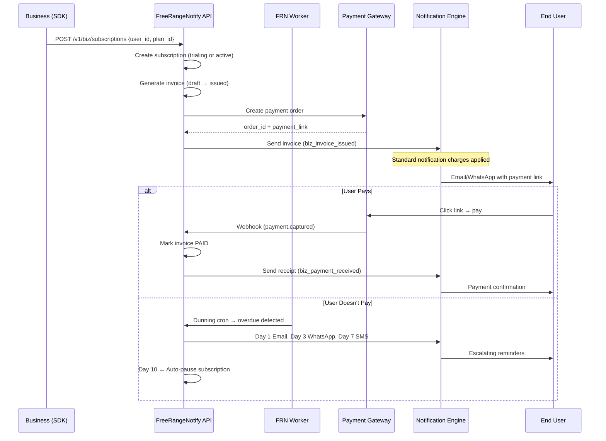

# Business Billing Module — Comprehensive Design Document

## 1. What Are We Building?

FreeRangeNotify is a notification delivery platform. Businesses already use it to send emails, SMS, WhatsApp messages, and push notifications to their customers.

This module adds **professional billing, invoicing, and subscription management** directly into FreeRangeNotify. A business (gym, SaaS company, coaching center, newspaper, freelancer) can create subscription plans, generate invoices, collect payments, send automated payment reminders, and track revenue — all from one platform.

The key insight: **billing naturally generates notifications**. Every invoice needs to be delivered. Every failed payment needs a reminder. Every receipt needs a confirmation. By combining billing with our delivery engine, businesses get something no standalone billing tool offers — intelligent, multi-channel payment collection with WhatsApp, Email, and SMS built in.

### Two Layers

**Layer 1 — Built-in Billing Engine**: For businesses that don't have a billing tool. They create plans, generate invoices, and FreeRangeNotify handles invoicing + payment collection + reminders. Features are on par with Zoho Books invoicing and Salesforce Revenue Cloud subscription management.

**Layer 2 — Third-Party Connectors**: For businesses that already use Razorpay Subscriptions, Stripe Billing, Zoho Books, or Salesforce. They connect their existing tool, and FreeRangeNotify handles the delivery + dunning layer (send invoice notifications, chase unpaid bills, confirm payments).

Both layers feed into the same notification delivery engine.

### Competitive Feature Comparison

| Feature | Zoho Books | Salesforce Revenue Cloud | FreeRangeNotify Billing |
|---------|-----------|--------------------------|------------------------|
| Invoicing & PDF | ✅ | ✅ | ✅ |
| Recurring Subscriptions | ✅ | ✅ | ✅ |
| Usage-Based Billing | ❌ | ✅ | ✅ |
| Estimates / Quotes | ✅ | ✅ (CPQ) | ✅ |
| Multi-Channel Invoice Delivery | ❌ (Email only) | ❌ (Email only) | ✅ Email + WhatsApp + SMS |
| Automated Multi-Channel Dunning | ❌ (Email only) | ❌ | ✅ Workflow engine |
| Smart Delivery (Presence-Aware) | ❌ | ❌ | ✅ |
| GST / E-Invoicing (India) | ✅ | Limited | ✅ |
| Payment Gateways (Razorpay/UPI) | ✅ | Limited in India | ✅ |
| Revenue Recognition | ❌ | ✅ (ASC 606) | ✅ (Simplified) |
| Customer Portal | ✅ | ✅ | ✅ |
| Expense Tracking | ✅ | ❌ | ✅ (Lightweight) |
| Contract Management | ❌ | ✅ | ✅ |
| Multi-Currency | ✅ | ✅ | ✅ |
| Credit Notes / Refunds | ✅ | ✅ | ✅ |
| Retainer / Advance Invoices | ✅ | ❌ | ✅ |
| Proration on Plan Changes | ❌ | ✅ | ✅ |
| Late Fees | ✅ | ❌ | ✅ |
| Third-Party Billing Connectors | ❌ | ❌ | ✅ |

---

## 2. Backward Compatibility Guarantees

This module is 100% additive. Existing users who don't enable it will see zero changes.

| Guarantee | How |
|-----------|-----|
| **No existing API changes** | All current `/v1/*` endpoints remain unchanged. New billing APIs are under `/v1/biz/*`. |
| **No existing DB changes** | Existing Elasticsearch indices are not modified. New indices are prefixed with `frn_biz_`. |
| **User model extension is additive** | New billing fields on the User struct are `omitempty` — they only appear in API responses when set. Existing SDK integrations that don't send these fields continue working exactly as before. |
| **Feature-gated** | The entire module is behind `FREERANGE_FEATURES_BIZ_BILLING_ENABLED`. When `false` (the default), no billing routes are registered, no billing middleware runs, and no billing indices are created. |
| **No middleware changes** | Existing `apiAuth`, `licenseCheck`, `DashboardRBAC` middleware remain unchanged. Billing module has its own `billingModuleCheck` middleware applied only to `/v1/biz/*` routes. |
| **Container changes are additive** | New handler/service fields are added to `container.Container`. All are `nil` when the feature is disabled. Existing nil-check pattern (e.g., `if c.WorkflowHandler != nil`) is used. |

---

## 3. Architecture Decision: Reuse Users, Scope at Application Level

### No Separate "Customer" Entity

FreeRangeNotify already manages **Users** (notification recipients) via `POST /v1/users`. These users already have:

| Billing Need | Existing User Field |
|-------------|-------------------|
| Name | `FullName` ✅ |
| Email | `Email` ✅ |
| Phone | `Phone` ✅ |
| App scoping | `AppID` ✅ |
| External ID (CRM reference) | `ExternalID` ✅ |
| WhatsApp delivery | `Phone` + `WhatsAppEnabled` ✅ |
| Channel preferences | `Preferences` ✅ |

**We reuse the existing User model.** Billing-specific fields (address, GSTIN, balance) are added as optional fields on the User struct. Subscriptions, invoices, and payments reference `user_id`.

This means:
- Businesses create users with `POST /v1/users` (no change)
- The same user can receive notifications AND be billed
- Dunning workflows already know the user's preferred channels
- No data duplication, no syncing between two entities

### User Model Extension (Backward Compatible)

New optional fields added to the existing [User struct](file:///c:/Users/Dave/the_monkeys/FreeRangeNotify/internal/domain/user/models.go#L9-L27):

```go
// Billing fields — only populated when biz billing module is active.
// All fields are omitempty so existing API responses are unchanged.
BillingAddress *BillingAddress         `json:"billing_address,omitempty" es:"billing_address"`
GSTIN          string                  `json:"gstin,omitempty" es:"gstin"`
BalancePaisa   int64                   `json:"balance_paisa,omitempty" es:"balance_paisa"`
BillingMeta    map[string]interface{}  `json:"billing_meta,omitempty" es:"billing_meta"`
```

```go
type BillingAddress struct {
    Line1   string `json:"line1,omitempty" es:"line1"`
    Line2   string `json:"line2,omitempty" es:"line2"`
    City    string `json:"city,omitempty" es:"city"`
    State   string `json:"state,omitempty" es:"state"`
    Pincode string `json:"pincode,omitempty" es:"pincode"`
    Country string `json:"country,omitempty" es:"country"`
}
```

### Why Application Level?

| Reason | Explanation |
|--------|-------------|
| **Consistency** | Notifications, users, templates are all scoped by `app_id` via API key. Billing follows the same pattern. |
| **Multi-product support** | One admin might run a gym app and a coaching app. Each has separate users, plans, and invoices. |
| **SDK integration** | The business's backend uses the app's API key to call billing APIs. Same as notifications. |
| **Data isolation** | App A's invoices cannot be seen by App B. Clean separation by design. |

### Auth Summary

| Access Path | Auth Method | Who Uses It |
|-------------|------------|-------------|
| **SDK / Backend** | API Key (`X-API-Key`) | Business server → CRUD on invoices, subscriptions, payments |
| **Dashboard UI** | JWT (login session) | Business owner → Analytics, settings, overview |
| **Customer Portal** | Signed Token (URL) | End customer → View invoices, pay bills |
| **Third-Party Webhooks** | HMAC Signature | Razorpay / Stripe / Zoho |

---

## 4. How FreeRangeNotify Makes Money from This Module

### A. Module Subscription Fee (Monthly, Configurable)

Businesses pay a separate monthly fee to unlock the Billing Module. This fee is independent of their notification plan.

| Billing Module Tier | Monthly Fee | Customers | Invoices/mo | Estimates | Contracts |
|---------------------|-------------|-----------|-------------|-----------|-----------|
| **Starter Billing** | ₹499/mo | 100 | 500 | 50 | ❌ |
| **Growth Billing** | ₹1,999/mo | 1,000 | 5,000 | 500 | 100 |
| **Scale Billing** | ₹4,999/mo | Unlimited | Unlimited | Unlimited | Unlimited |

**Pricing is stored in the database** using the existing [RateCard](file:///c:/Users/Dave/the_monkeys/FreeRangeNotify/internal/domain/billing/credits.go#L88-L97) versioning system. Admins can update prices, run promotional offers, or give time-limited discounts by creating a new rate card version — no code changes needed.

### B. Standard Notification Charges

Every invoice delivery, payment reminder, and receipt is a standard notification. The business pays normal rates from their existing plan. These rates are already defined in [rates.go](file:///c:/Users/Dave/the_monkeys/FreeRangeNotify/internal/domain/billing/rates.go#L23-L37).

---

## 5. Complete Feature List

### 5.1 Estimates & Quotes (Zoho Books + Salesforce CPQ)

Businesses create an estimate for their customer. The customer can accept or reject it. Accepted estimates convert into invoices with one click.

| Feature | Description |
|---------|-------------|
| Create estimate | Line items, terms, validity period, notes |
| Send estimate | Deliver via Email / WhatsApp / SMS with accept/reject link |
| Customer acceptance | Customer clicks "Accept" on the estimate link or portal |
| Convert to invoice | Accepted estimate → invoice with one API call |
| Estimate statuses | `draft`, `sent`, `accepted`, `rejected`, `expired`, `converted` |
| Estimate templates | Customizable PDF templates with business branding |
| Partial conversion | Convert only some line items from an estimate into an invoice |

### 5.2 Product & Plan Catalog

| Feature | Description |
|---------|-------------|
| Products | The item or service being sold. E.g., "Gym Membership", "SaaS Pro Plan". |
| Plans | Pricing for a product. E.g., "Monthly ₹499", "Yearly ₹4,999". |
| Billing cycles | Weekly, monthly, quarterly, half-yearly, yearly, or custom (N days). |
| Trial periods | Optional trial period (N days) before first charge. |
| Setup fees | Optional one-time setup fee on first subscription. |
| Plan addons | Optional add-ons (e.g., "Extra locker ₹100/mo") attached to a subscription. |
| Tiered pricing | Volume-based discounts. E.g., 1-100 units = ₹10/unit, 101-500 = ₹8/unit. (Salesforce) |
| Per-unit pricing | Charge per seat, per user, per API call. Quantity set at subscription creation. |
| Price lists | Multiple price lists for different customer segments (wholesale vs retail). (Zoho) |

### 5.3 Subscription Lifecycle

| Status | Meaning |
|--------|---------|
| `trialing` | Customer is in the free trial period. No invoice yet. |
| `active` | Customer is paying. Invoices generated on each renewal. |
| `past_due` | Payment failed or invoice overdue. Dunning begins. |
| `paused` | Business manually paused. No invoices generated. |
| `canceled` | Ended. Can be immediate or at end of current period. |
| `expired` | Trial ended without conversion. |
| `non_renewing` | Active but will not renew at period end. |

**Supported actions:**
- Create subscription (assign user + plan)
- Cancel (immediate or at period end)
- Pause / Resume
- Upgrade / Downgrade (with proration)
- Add / Remove addons mid-cycle
- Set to non-renewing
- Reactivate a canceled subscription
- Schedule future plan change

**Proration logic (Salesforce-style):**
When a customer upgrades mid-cycle, the system credits the unused portion of the old plan and charges the prorated amount of the new plan. Downgrade credits are applied to the next invoice.

### 5.4 Invoicing (Zoho Books-level)

| Feature | Description |
|---------|-------------|
| Auto-generate | Invoices created automatically on subscription renewal. |
| One-time invoices | Ad-hoc invoices for custom charges (equipment rental, consulting). |
| Recurring invoices | Standalone recurring invoices not tied to a subscription. |
| Line items | Itemized: description, HSN/SAC code, quantity, unit price, tax, amount. |
| Tax calculation | GST: CGST + SGST (intra-state) or IGST (inter-state). Configurable rates. |
| Discounts | Coupon code or manual discount (percentage or fixed). Line-item or invoice-level. |
| Credit notes | Issue credit notes for partial refunds or billing corrections. Applied to future invoices or refunded. |
| Retainer invoices | Advance payment / deposit invoices. Balance tracked per user. (Zoho) |
| Late fees | Automatic late fee (percentage or flat) added after grace period. |
| Sequential numbering | Auto-incrementing per app (e.g., INV-001). Configurable prefix. |
| Payment link | Secure payment link via Razorpay/Stripe embedded in every invoice. |
| PDF generation | Downloadable PDF with business branding (logo, colors, footer, terms). |
| E-invoicing (India) | IRN generation via NIC portal for businesses with turnover > ₹5 crore. QR code on invoice. |
| Multi-currency | Create invoices in foreign currencies with exchange rate. Settlement in INR. |
| Write-offs | Mark uncollectible invoices as written off. (Zoho) |
| Payment terms | Net 15, Net 30, Net 60, Due on Receipt, or custom terms. |
| Approval workflow | Optional multi-level approval before invoice is issued. |
| Attachments | Attach files (contracts, SOWs) to invoices using existing file attachment system. |

**Invoice statuses:** `draft` → `sent` / `issued` → `partially_paid` → `paid` / `overdue` → `void` / `written_off` / `uncollectible`

### 5.5 Payment Collection

| Feature | Description |
|---------|-------------|
| Payment gateways | Razorpay (already integrated), Stripe (future). UPI, cards, net banking, wallets. |
| Payment links | Secure URLs embedded in invoice notifications. Customer clicks and pays. |
| Manual payments | Record cash, bank transfer, or cheque payments manually. |
| Partial payments | Accept partial amounts. Invoice stays `partially_paid`. |
| Overpayments | Excess amount added to user's credit balance. |
| Payment receipts | Auto-send receipt notification after payment. |
| Refunds | Full or partial refunds via gateway or manual. |
| Payment allocation | Apply one payment to multiple invoices, or split across invoices. |
| Advance payments | Accept payments before invoice is generated. Applied when next invoice is issued. |

### 5.6 Automated Dunning (Payment Recovery) — Our Key Differentiator

When an invoice becomes overdue, the system triggers a configurable multi-channel reminder workflow using the existing [Workflow engine](file:///c:/Users/Dave/the_monkeys/FreeRangeNotify/internal/interfaces/http/routes/routes.go#L262-L283).

**Default dunning sequence:**

| Day | Action | Channel | Template |
|-----|--------|---------|----------|
| Day 0 | Invoice issued | Email | `biz_invoice_issued` |
| Day 1 | First reminder | Email | `biz_reminder_gentle` |
| Day 3 | Second reminder | WhatsApp | `biz_reminder_whatsapp` |
| Day 7 | Final warning | SMS | `biz_reminder_final` |
| Day 10 | Auto-action | System | Pause or cancel subscription |

**All dunning messages are standard notifications.** The business pays normal notification charges per message.

**Businesses can customize:** schedule, channel order, templates, auto-action, number of retries, grace period.

**Smart Delivery integration:** If the user is online (presence detected via Redis), the dunning notification is delivered instantly via SSE instead of waiting for the next scheduled step.

### 5.7 Coupons & Discounts

| Feature | Description |
|---------|-------------|
| Coupon types | Percentage discount, fixed amount discount, free trial extension |
| Validity period | Start/end dates. Auto-expires. |
| Usage limits | Max total uses, max per user, single-use codes |
| Plan restrictions | Apply only to specific plans or all plans |
| Stackable coupons | Option to allow multiple coupons on one invoice |
| Bulk coupon generation | Generate N unique codes with same rules (for marketing campaigns) |
| Referral codes | Track which user referred the new subscriber |

### 5.8 Tax Engine (India-Focused, Zoho Books Level)

| Feature | Description |
|---------|-------------|
| Business GSTIN | Stored per app. Printed on all invoices. |
| HSN / SAC codes | Configurable per product. Required for GST compliance. |
| Tax rates | Default 18% GST. Configurable per product (0%, 5%, 12%, 18%, 28%). |
| Intra vs Inter state | Auto-split CGST+SGST or IGST based on customer state vs business state. |
| Tax-inclusive pricing | Option to set plan prices as tax-inclusive. Tax is back-calculated. |
| Reverse charge | Flag for services under reverse charge mechanism. |
| E-invoicing | IRN generation via NIC portal. QR code added to PDF. |
| TDS tracking | Track TDS deducted by customers on payments. |
| Tax exemption | Mark specific users or products as tax-exempt. |
| Tax summary report | Monthly GST summary grouped by tax rate and type. |

### 5.9 Contracts & Agreements (Salesforce Revenue Cloud)

| Feature | Description |
|---------|-------------|
| Create contract | Terms, start/end date, auto-renew flag, value, linked subscription |
| Contract statuses | `draft`, `active`, `expired`, `terminated` |
| Amendments | Modify contract terms mid-cycle (change price, add services) |
| Renewal management | Auto-renew or manual renewal. Reminder notifications before expiry. |
| Contract-based invoicing | Invoice generation tied to contract milestones or schedule |
| Digital acceptance | Send contract via notification. User accepts via signed link. |

### 5.10 Usage-Based Billing / Metering (Salesforce Revenue Cloud)

For SaaS businesses that charge based on consumption (API calls, storage, active users).

| Feature | Description |
|---------|-------------|
| Usage meters | Define what to track: "API Calls", "Storage GB", "Active Users" |
| Report usage | `POST /v1/biz/usage` — Report usage events from business's backend |
| Aggregation | Sum, max, or last-value per billing period |
| Pricing tiers | Tiered usage pricing (first 1,000 API calls free, then ₹0.01/call) |
| Invoice integration | Usage charges calculated at end of billing period and added to invoice |
| Real-time usage view | Current period usage visible in dashboard and customer portal |

### 5.11 Expense Tracking (Zoho Books, Lightweight)

| Feature | Description |
|---------|-------------|
| Record expenses | Date, category, amount, vendor, notes, receipt attachment |
| Expense categories | Configurable (Travel, Software, Marketing, etc.) |
| Recurring expenses | Monthly subscriptions, rent, etc. |
| Billable expenses | Mark an expense as billable to a specific user. Added to next invoice. |
| Expense reports | Monthly summary by category. |

### 5.12 Revenue Recognition (Salesforce Revenue Cloud, Simplified)

For businesses that need to recognize revenue over the subscription period instead of when payment is received (accounting compliance).

| Feature | Description |
|---------|-------------|
| Recognition schedule | Spread revenue across the subscription period (monthly, milestone-based) |
| Deferred revenue | Track revenue not yet earned |
| Recognized revenue | Track revenue earned in each period |
| Reports | Revenue waterfall chart, deferred vs recognized over time |

### 5.13 Customer Self-Service Portal

A public, token-authenticated webpage where the business's customers can:

| Feature | Description |
|---------|-------------|
| View invoices | List all invoices with status and download PDF |
| Pay invoices | Click to pay outstanding invoices via Razorpay checkout |
| View estimates | Accept or reject pending estimates |
| Subscription details | See current plan, next billing date, usage |
| Cancel subscription | Request cancellation (if business allows it) |
| Update info | Change billing address, contact details |
| Payment history | View all past payments and receipts |
| Customer statement | Account statement showing all transactions (Zoho) |
| Usage dashboard | Current period usage for metered subscriptions |

Access via signed URL: `GET /v1/portal/:token` — no login required.

### 5.14 Revenue Analytics Dashboard

| Metric | Description | Inspired By |
|--------|-------------|-------------|
| MRR | Monthly Recurring Revenue | Salesforce |
| ARR | Annual Recurring Revenue | Salesforce |
| Net Revenue | Total revenue after refunds and credits | Both |
| Churn Rate | % of subscriptions canceled in last 30 days | Salesforce |
| Collection Rate | % of issued invoices paid | Zoho |
| Outstanding Amount | Total unpaid invoice amount | Zoho |
| Revenue Over Time | Line chart per month | Both |
| Revenue by Plan | Breakdown by plan type | Both |
| Top Customers | Ranked by lifetime revenue | Both |
| Aging Report | Outstanding invoices grouped by days overdue (0-30, 31-60, 61-90, 90+) | Zoho |
| Deferred Revenue | Revenue not yet recognized | Salesforce |
| Dunning Effectiveness | % of overdue invoices recovered by dunning notifications | Unique to FRN |

### 5.15 Third-Party Connectors (Layer 2)

| Connector | Inbound Events | What FreeRangeNotify Does |
|-----------|---------------|---------------------------|
| **Razorpay Subscriptions** | `subscription.charged`, `subscription.halted`, `invoice.paid`, `invoice.expired` | Send invoice notification, trigger dunning, send receipt |
| **Stripe Billing** | `invoice.payment_succeeded`, `invoice.payment_failed`, `customer.subscription.deleted` | Same |
| **Zoho Books** | Invoice and payment webhooks | Same |
| **Salesforce Revenue Cloud** | Platform events for billing changes | Same |
| **Custom Webhook** | Any JSON payload matching FRN schema | Map to notification workflow |

---

## 6. Full API Reference

All billing module endpoints use the prefix `/v1/biz/`. Existing `/v1/billing/` routes (FreeRangeNotify's own internal billing) are untouched.

### 6.1 Estimates (API Key Protected)

| Method | Path | Description |
|--------|------|-------------|
| `POST` | `/v1/biz/estimates` | Create estimate |
| `GET` | `/v1/biz/estimates` | List estimates (paginated, filterable) |
| `GET` | `/v1/biz/estimates/:id` | Get estimate |
| `PUT` | `/v1/biz/estimates/:id` | Update draft estimate |
| `DELETE` | `/v1/biz/estimates/:id` | Delete draft estimate |
| `POST` | `/v1/biz/estimates/:id/send` | Send estimate notification to user |
| `POST` | `/v1/biz/estimates/:id/convert` | Convert accepted estimate to invoice |
| `GET` | `/v1/biz/estimates/:id/pdf` | Download estimate PDF |

### 6.2 Products (API Key Protected)

| Method | Path | Description |
|--------|------|-------------|
| `POST` | `/v1/biz/products` | Create a product |
| `GET` | `/v1/biz/products` | List products |
| `GET` | `/v1/biz/products/:id` | Get product by ID |
| `PUT` | `/v1/biz/products/:id` | Update product |
| `DELETE` | `/v1/biz/products/:id` | Archive product |

### 6.3 Plans (API Key Protected)

| Method | Path | Description |
|--------|------|-------------|
| `POST` | `/v1/biz/plans` | Create a pricing plan |
| `GET` | `/v1/biz/plans` | List plans |
| `GET` | `/v1/biz/plans/:id` | Get plan by ID |
| `PUT` | `/v1/biz/plans/:id` | Update plan |
| `DELETE` | `/v1/biz/plans/:id` | Archive plan |
| `POST` | `/v1/biz/plans/:id/addons` | Add an addon to a plan |
| `DELETE` | `/v1/biz/plans/:id/addons/:addon_id` | Remove addon |

### 6.4 Subscriptions (API Key Protected)

| Method | Path | Description |
|--------|------|-------------|
| `POST` | `/v1/biz/subscriptions` | Create subscription (user_id + plan_id) |
| `GET` | `/v1/biz/subscriptions` | List subscriptions |
| `GET` | `/v1/biz/subscriptions/:id` | Get subscription details |
| `POST` | `/v1/biz/subscriptions/:id/cancel` | Cancel (`{"at": "immediate" or "period_end"}`) |
| `POST` | `/v1/biz/subscriptions/:id/pause` | Pause |
| `POST` | `/v1/biz/subscriptions/:id/resume` | Resume |
| `POST` | `/v1/biz/subscriptions/:id/change-plan` | Upgrade/downgrade with proration |
| `POST` | `/v1/biz/subscriptions/:id/addons` | Add addon mid-cycle |
| `DELETE` | `/v1/biz/subscriptions/:id/addons/:addon_id` | Remove addon mid-cycle |
| `POST` | `/v1/biz/subscriptions/:id/reactivate` | Reactivate canceled subscription |
| `POST` | `/v1/biz/subscriptions/:id/set-non-renewing` | Mark as non-renewing |

### 6.5 Invoices (API Key Protected)

| Method | Path | Description |
|--------|------|-------------|
| `POST` | `/v1/biz/invoices` | Create one-time or recurring invoice |
| `GET` | `/v1/biz/invoices` | List invoices (filterable by status, user, date range) |
| `GET` | `/v1/biz/invoices/:id` | Get invoice with line items |
| `PUT` | `/v1/biz/invoices/:id` | Update draft invoice |
| `POST` | `/v1/biz/invoices/:id/issue` | Issue draft → generates payment link, sends notification |
| `POST` | `/v1/biz/invoices/:id/void` | Void unpaid invoice |
| `POST` | `/v1/biz/invoices/:id/write-off` | Write off uncollectible invoice |
| `POST` | `/v1/biz/invoices/:id/send` | Re-send invoice notification |
| `GET` | `/v1/biz/invoices/:id/pdf` | Download PDF |
| `GET` | `/v1/biz/invoices/:id/payment-link` | Get payment link |
| `POST` | `/v1/biz/invoices/:id/apply-coupon` | Apply coupon to draft invoice |
| `POST` | `/v1/biz/invoices/:id/apply-credit` | Apply user credit balance to invoice |
| `POST` | `/v1/biz/invoices/:id/add-late-fee` | Manually add late fee |

### 6.6 Payments (API Key Protected)

| Method | Path | Description |
|--------|------|-------------|
| `POST` | `/v1/biz/payments` | Record manual payment (cash, bank transfer) |
| `GET` | `/v1/biz/payments` | List payments |
| `GET` | `/v1/biz/payments/:id` | Get payment details |
| `POST` | `/v1/biz/payments/:id/refund` | Initiate refund (full or partial) |
| `POST` | `/v1/biz/payments/:id/allocate` | Allocate payment to specific invoices |

### 6.7 Credit Notes (API Key Protected)

| Method | Path | Description |
|--------|------|-------------|
| `POST` | `/v1/biz/credit-notes` | Create credit note |
| `GET` | `/v1/biz/credit-notes` | List credit notes |
| `GET` | `/v1/biz/credit-notes/:id` | Get credit note |
| `POST` | `/v1/biz/credit-notes/:id/apply` | Apply credit note to an invoice |
| `POST` | `/v1/biz/credit-notes/:id/refund` | Refund credit note to customer |

### 6.8 Retainer Invoices (API Key Protected)

| Method | Path | Description |
|--------|------|-------------|
| `POST` | `/v1/biz/retainers` | Create retainer (advance payment) invoice |
| `GET` | `/v1/biz/retainers` | List retainers |
| `GET` | `/v1/biz/retainers/:id` | Get retainer |
| `POST` | `/v1/biz/retainers/:id/apply` | Apply retainer balance to an invoice |

### 6.9 Coupons (API Key Protected)

| Method | Path | Description |
|--------|------|-------------|
| `POST` | `/v1/biz/coupons` | Create coupon |
| `GET` | `/v1/biz/coupons` | List coupons |
| `GET` | `/v1/biz/coupons/:id` | Get coupon |
| `PUT` | `/v1/biz/coupons/:id` | Update coupon |
| `DELETE` | `/v1/biz/coupons/:id` | Delete coupon |
| `POST` | `/v1/biz/coupons/bulk-generate` | Generate N unique coupon codes |

### 6.10 Contracts (API Key Protected)

| Method | Path | Description |
|--------|------|-------------|
| `POST` | `/v1/biz/contracts` | Create contract |
| `GET` | `/v1/biz/contracts` | List contracts |
| `GET` | `/v1/biz/contracts/:id` | Get contract |
| `PUT` | `/v1/biz/contracts/:id` | Update contract |
| `POST` | `/v1/biz/contracts/:id/terminate` | Terminate contract |
| `POST` | `/v1/biz/contracts/:id/renew` | Renew contract |
| `POST` | `/v1/biz/contracts/:id/amend` | Create amendment |
| `POST` | `/v1/biz/contracts/:id/send` | Send contract for digital acceptance |

### 6.11 Usage Metering (API Key Protected)

| Method | Path | Description |
|--------|------|-------------|
| `POST` | `/v1/biz/usage-meters` | Create a usage meter |
| `GET` | `/v1/biz/usage-meters` | List meters |
| `POST` | `/v1/biz/usage` | Report usage events (batch) |
| `GET` | `/v1/biz/usage/summary` | Get current period usage for a user/subscription |

### 6.12 Expenses (API Key Protected)

| Method | Path | Description |
|--------|------|-------------|
| `POST` | `/v1/biz/expenses` | Record expense |
| `GET` | `/v1/biz/expenses` | List expenses (filterable by category, date, billable) |
| `GET` | `/v1/biz/expenses/:id` | Get expense |
| `PUT` | `/v1/biz/expenses/:id` | Update expense |
| `DELETE` | `/v1/biz/expenses/:id` | Delete expense |
| `POST` | `/v1/biz/expenses/:id/bill` | Attach billable expense to a user's next invoice |

### 6.13 User Billing Extensions (API Key Protected)

Added to existing `/v1/users` routes. No new route group needed.

| Method | Path | Description |
|--------|------|-------------|
| `PUT` | `/v1/users/:id/billing` | Update billing address, GSTIN |
| `GET` | `/v1/users/:id/billing` | Get billing info |
| `GET` | `/v1/users/:id/statement` | Account statement (all transactions) |
| `POST` | `/v1/users/:id/portal-link` | Generate customer portal link |
| `POST` | `/v1/users/:id/balance/adjust` | Adjust credit balance |

### 6.14 Configuration (API Key Protected)

| Method | Path | Description |
|--------|------|-------------|
| `GET` | `/v1/biz/config/tax` | Get tax configuration |
| `PUT` | `/v1/biz/config/tax` | Update tax configuration |
| `GET` | `/v1/biz/config/dunning` | Get dunning schedule |
| `PUT` | `/v1/biz/config/dunning` | Update dunning schedule |
| `GET` | `/v1/biz/config/branding` | Get invoice/portal branding |
| `PUT` | `/v1/biz/config/branding` | Update branding (logo, colors, footer) |
| `GET` | `/v1/biz/config/payment-terms` | Get default payment terms |
| `PUT` | `/v1/biz/config/payment-terms` | Update default payment terms |
| `GET` | `/v1/biz/config/late-fees` | Get late fee rules |
| `PUT` | `/v1/biz/config/late-fees` | Update late fee rules |
| `GET` | `/v1/biz/config/numbering` | Get invoice/estimate numbering config |
| `PUT` | `/v1/biz/config/numbering` | Update numbering prefix and sequence |

### 6.15 Analytics (JWT Protected — Dashboard Only)

| Method | Path | Description |
|--------|------|-------------|
| `GET` | `/v1/admin/biz/analytics/revenue` | MRR, ARR, net revenue, revenue over time |
| `GET` | `/v1/admin/biz/analytics/subscriptions` | Active, churned, trialing counts, churn rate |
| `GET` | `/v1/admin/biz/analytics/invoices` | Paid/unpaid/overdue breakdown, collection rate |
| `GET` | `/v1/admin/biz/analytics/aging` | Aging report (0-30, 31-60, 61-90, 90+ days) |
| `GET` | `/v1/admin/biz/analytics/customers` | Top customers, LTV |
| `GET` | `/v1/admin/biz/analytics/dunning` | Dunning effectiveness (recovered vs lost) |
| `GET` | `/v1/admin/biz/analytics/revenue-recognition` | Deferred vs recognized revenue |
| `GET` | `/v1/admin/biz/analytics/expenses` | Expense summary by category |
| `GET` | `/v1/admin/biz/analytics/tax-summary` | GST summary by rate and type |

### 6.16 Third-Party Connectors (JWT Protected — Dashboard Config)

| Method | Path | Description |
|--------|------|-------------|
| `POST` | `/v1/admin/biz/connectors` | Register connector |
| `GET` | `/v1/admin/biz/connectors` | List connectors |
| `GET` | `/v1/admin/biz/connectors/:id` | Get connector |
| `PUT` | `/v1/admin/biz/connectors/:id` | Update connector |
| `DELETE` | `/v1/admin/biz/connectors/:id` | Remove connector |
| `POST` | `/v1/admin/biz/connectors/:id/test` | Test with sample event |

### 6.17 Inbound Webhooks (Public, Signature-Verified)

| Method | Path | Description |
|--------|------|-------------|
| `POST` | `/v1/webhooks/billing/:connector_id` | Receive webhook from third-party billing tool |

### 6.18 Customer Portal (Public, Token-Authenticated)

| Method | Path | Description |
|--------|------|-------------|
| `GET` | `/v1/portal/:token` | Render portal page |
| `GET` | `/v1/portal/:token/invoices` | List user's invoices |
| `GET` | `/v1/portal/:token/invoices/:id/pdf` | Download invoice PDF |
| `POST` | `/v1/portal/:token/invoices/:id/pay` | Redirect to payment |
| `GET` | `/v1/portal/:token/estimates` | List pending estimates |
| `POST` | `/v1/portal/:token/estimates/:id/accept` | Accept estimate |
| `POST` | `/v1/portal/:token/estimates/:id/reject` | Reject estimate |
| `GET` | `/v1/portal/:token/subscription` | View subscription |
| `POST` | `/v1/portal/:token/subscription/cancel` | Request cancellation |
| `GET` | `/v1/portal/:token/statement` | Account statement |
| `GET` | `/v1/portal/:token/usage` | Current usage (metered subscriptions) |
| `PUT` | `/v1/portal/:token/billing-info` | Update billing address |
| `GET` | `/v1/portal/:token/contracts` | View contracts |
| `POST` | `/v1/portal/:token/contracts/:id/accept` | Accept contract |

---

## 7. Database Design (Elasticsearch Indices)

All indices prefixed with `frn_biz_`. Every document scoped by `app_id`. Existing indices are not modified.

### 7.1 `frn_biz_products`

```json
{
  "mappings": {
    "properties": {
      "id":          { "type": "keyword" },
      "app_id":      { "type": "keyword" },
      "name":        { "type": "text", "fields": { "keyword": { "type": "keyword" } } },
      "description": { "type": "text" },
      "hsn_code":    { "type": "keyword" },
      "tax_rate":    { "type": "integer" },
      "unit":        { "type": "keyword" },
      "active":      { "type": "boolean" },
      "metadata":    { "type": "object", "enabled": false },
      "created_at":  { "type": "date" },
      "updated_at":  { "type": "date" }
    }
  }
}
```

### 7.2 `frn_biz_plans`

```json
{
  "mappings": {
    "properties": {
      "id":              { "type": "keyword" },
      "app_id":          { "type": "keyword" },
      "product_id":      { "type": "keyword" },
      "name":            { "type": "text", "fields": { "keyword": { "type": "keyword" } } },
      "amount_paisa":    { "type": "long" },
      "currency":        { "type": "keyword" },
      "billing_cycle":   { "type": "keyword" },
      "cycle_days":      { "type": "integer" },
      "trial_days":      { "type": "integer" },
      "setup_fee_paisa": { "type": "long" },
      "tax_inclusive":    { "type": "boolean" },
      "pricing_model":   { "type": "keyword" },
      "tiers":           { "type": "nested", "properties": {
          "up_to":       { "type": "long" },
          "unit_paisa":  { "type": "long" },
          "flat_paisa":  { "type": "long" }
      }},
      "active":          { "type": "boolean" },
      "metadata":        { "type": "object", "enabled": false },
      "created_at":      { "type": "date" },
      "updated_at":      { "type": "date" }
    }
  }
}
```

### 7.3 `frn_biz_plan_addons`

```json
{
  "mappings": {
    "properties": {
      "id":           { "type": "keyword" },
      "app_id":       { "type": "keyword" },
      "plan_id":      { "type": "keyword" },
      "name":         { "type": "text", "fields": { "keyword": { "type": "keyword" } } },
      "amount_paisa": { "type": "long" },
      "billing_cycle": { "type": "keyword" },
      "active":       { "type": "boolean" },
      "created_at":   { "type": "date" },
      "updated_at":   { "type": "date" }
    }
  }
}
```

### 7.4 `frn_biz_subscriptions`

```json
{
  "mappings": {
    "properties": {
      "id":                   { "type": "keyword" },
      "app_id":               { "type": "keyword" },
      "user_id":              { "type": "keyword" },
      "plan_id":              { "type": "keyword" },
      "addon_ids":            { "type": "keyword" },
      "contract_id":          { "type": "keyword" },
      "status":               { "type": "keyword" },
      "quantity":             { "type": "integer" },
      "current_period_start": { "type": "date" },
      "current_period_end":   { "type": "date" },
      "trial_start":          { "type": "date" },
      "trial_end":            { "type": "date" },
      "canceled_at":          { "type": "date" },
      "cancel_at_period_end": { "type": "boolean" },
      "paused_at":            { "type": "date" },
      "non_renewing":         { "type": "boolean" },
      "dunning_workflow_id":  { "type": "keyword" },
      "metadata":             { "type": "object", "enabled": false },
      "created_at":           { "type": "date" },
      "updated_at":           { "type": "date" }
    }
  }
}
```

### 7.5 `frn_biz_estimates`

```json
{
  "mappings": {
    "properties": {
      "id":             { "type": "keyword" },
      "app_id":         { "type": "keyword" },
      "user_id":        { "type": "keyword" },
      "estimate_number": { "type": "keyword" },
      "status":         { "type": "keyword" },
      "line_items":     { "type": "nested", "properties": {
          "description":  { "type": "text" },
          "hsn_code":     { "type": "keyword" },
          "quantity":     { "type": "integer" },
          "unit_price":   { "type": "long" },
          "tax_rate":     { "type": "integer" },
          "amount_paisa": { "type": "long" }
      }},
      "subtotal_paisa": { "type": "long" },
      "tax_paisa":      { "type": "long" },
      "total_paisa":    { "type": "long" },
      "currency":       { "type": "keyword" },
      "valid_until":    { "type": "date" },
      "notes":          { "type": "text" },
      "terms":          { "type": "text" },
      "accepted_at":    { "type": "date" },
      "rejected_at":    { "type": "date" },
      "converted_invoice_id": { "type": "keyword" },
      "notification_id": { "type": "keyword" },
      "created_at":     { "type": "date" },
      "updated_at":     { "type": "date" }
    }
  }
}
```

### 7.6 `frn_biz_invoices`

```json
{
  "mappings": {
    "properties": {
      "id":                 { "type": "keyword" },
      "app_id":             { "type": "keyword" },
      "user_id":            { "type": "keyword" },
      "subscription_id":    { "type": "keyword" },
      "estimate_id":        { "type": "keyword" },
      "contract_id":        { "type": "keyword" },
      "invoice_number":     { "type": "keyword" },
      "invoice_type":       { "type": "keyword" },
      "status":             { "type": "keyword" },
      "line_items":         { "type": "nested", "properties": {
          "description":    { "type": "text" },
          "hsn_code":       { "type": "keyword" },
          "quantity":       { "type": "integer" },
          "unit_price":     { "type": "long" },
          "discount_paisa": { "type": "long" },
          "tax_rate":       { "type": "integer" },
          "amount_paisa":   { "type": "long" }
      }},
      "subtotal_paisa":     { "type": "long" },
      "discount_paisa":     { "type": "long" },
      "coupon_id":          { "type": "keyword" },
      "tax_amount_paisa":   { "type": "long" },
      "tax_breakdown":      { "type": "object", "properties": {
          "cgst_paisa":     { "type": "long" },
          "sgst_paisa":     { "type": "long" },
          "igst_paisa":     { "type": "long" }
      }},
      "late_fee_paisa":     { "type": "long" },
      "total_paisa":        { "type": "long" },
      "amount_paid_paisa":  { "type": "long" },
      "amount_due_paisa":   { "type": "long" },
      "credits_applied":    { "type": "long" },
      "currency":           { "type": "keyword" },
      "exchange_rate":      { "type": "float" },
      "payment_link":       { "type": "keyword" },
      "gateway_order_id":   { "type": "keyword" },
      "payment_terms":      { "type": "keyword" },
      "due_date":           { "type": "date" },
      "issued_at":          { "type": "date" },
      "paid_at":            { "type": "date" },
      "voided_at":          { "type": "date" },
      "written_off_at":     { "type": "date" },
      "e_invoice_irn":      { "type": "keyword" },
      "e_invoice_qr":       { "type": "text" },
      "attachments":        { "type": "keyword" },
      "notification_id":    { "type": "keyword" },
      "notes":              { "type": "text" },
      "metadata":           { "type": "object", "enabled": false },
      "created_at":         { "type": "date" },
      "updated_at":         { "type": "date" }
    }
  }
}
```

### 7.7 `frn_biz_payments`

```json
{
  "mappings": {
    "properties": {
      "id":                 { "type": "keyword" },
      "app_id":             { "type": "keyword" },
      "user_id":            { "type": "keyword" },
      "invoice_ids":        { "type": "keyword" },
      "amount_paisa":       { "type": "long" },
      "currency":           { "type": "keyword" },
      "method":             { "type": "keyword" },
      "gateway":            { "type": "keyword" },
      "gateway_payment_id": { "type": "keyword" },
      "status":             { "type": "keyword" },
      "refunded_amount":    { "type": "long" },
      "tds_amount":         { "type": "long" },
      "notes":              { "type": "text" },
      "metadata":           { "type": "object", "enabled": false },
      "created_at":         { "type": "date" },
      "updated_at":         { "type": "date" }
    }
  }
}
```

### 7.8 `frn_biz_credit_notes`

```json
{
  "mappings": {
    "properties": {
      "id":              { "type": "keyword" },
      "app_id":          { "type": "keyword" },
      "user_id":         { "type": "keyword" },
      "invoice_id":      { "type": "keyword" },
      "credit_note_number": { "type": "keyword" },
      "amount_paisa":    { "type": "long" },
      "balance_paisa":   { "type": "long" },
      "reason":          { "type": "text" },
      "status":          { "type": "keyword" },
      "created_at":      { "type": "date" }
    }
  }
}
```

### 7.9 `frn_biz_retainers`

```json
{
  "mappings": {
    "properties": {
      "id":              { "type": "keyword" },
      "app_id":          { "type": "keyword" },
      "user_id":         { "type": "keyword" },
      "amount_paisa":    { "type": "long" },
      "balance_paisa":   { "type": "long" },
      "status":          { "type": "keyword" },
      "created_at":      { "type": "date" },
      "updated_at":      { "type": "date" }
    }
  }
}
```

### 7.10 `frn_biz_coupons`

```json
{
  "mappings": {
    "properties": {
      "id":                    { "type": "keyword" },
      "app_id":                { "type": "keyword" },
      "code":                  { "type": "keyword" },
      "discount_type":         { "type": "keyword" },
      "discount_value":        { "type": "long" },
      "max_uses":              { "type": "integer" },
      "current_uses":          { "type": "integer" },
      "max_uses_per_user":     { "type": "integer" },
      "applicable_plan_ids":   { "type": "keyword" },
      "stackable":             { "type": "boolean" },
      "valid_from":            { "type": "date" },
      "valid_until":           { "type": "date" },
      "active":                { "type": "boolean" },
      "created_at":            { "type": "date" },
      "updated_at":            { "type": "date" }
    }
  }
}
```

### 7.11 `frn_biz_contracts`

```json
{
  "mappings": {
    "properties": {
      "id":                { "type": "keyword" },
      "app_id":            { "type": "keyword" },
      "user_id":           { "type": "keyword" },
      "subscription_id":   { "type": "keyword" },
      "contract_number":   { "type": "keyword" },
      "status":            { "type": "keyword" },
      "terms":             { "type": "text" },
      "value_paisa":       { "type": "long" },
      "start_date":        { "type": "date" },
      "end_date":          { "type": "date" },
      "auto_renew":        { "type": "boolean" },
      "accepted_at":       { "type": "date" },
      "terminated_at":     { "type": "date" },
      "amendments":        { "type": "nested", "properties": {
          "id":            { "type": "keyword" },
          "description":   { "type": "text" },
          "effective_date": { "type": "date" },
          "created_at":    { "type": "date" }
      }},
      "notification_id":   { "type": "keyword" },
      "metadata":          { "type": "object", "enabled": false },
      "created_at":        { "type": "date" },
      "updated_at":        { "type": "date" }
    }
  }
}
```

### 7.12 `frn_biz_usage_meters`

```json
{
  "mappings": {
    "properties": {
      "id":              { "type": "keyword" },
      "app_id":          { "type": "keyword" },
      "name":            { "type": "keyword" },
      "unit":            { "type": "keyword" },
      "aggregation":     { "type": "keyword" },
      "created_at":      { "type": "date" }
    }
  }
}
```

### 7.13 `frn_biz_usage_events`

```json
{
  "mappings": {
    "properties": {
      "id":              { "type": "keyword" },
      "app_id":          { "type": "keyword" },
      "user_id":         { "type": "keyword" },
      "subscription_id": { "type": "keyword" },
      "meter_id":        { "type": "keyword" },
      "quantity":        { "type": "long" },
      "timestamp":       { "type": "date" }
    }
  }
}
```

### 7.14 `frn_biz_expenses`

```json
{
  "mappings": {
    "properties": {
      "id":            { "type": "keyword" },
      "app_id":        { "type": "keyword" },
      "category":      { "type": "keyword" },
      "description":   { "type": "text" },
      "amount_paisa":  { "type": "long" },
      "vendor":        { "type": "text" },
      "date":          { "type": "date" },
      "billable":      { "type": "boolean" },
      "billed_to_user": { "type": "keyword" },
      "invoice_id":    { "type": "keyword" },
      "receipt_file_id": { "type": "keyword" },
      "recurring":     { "type": "boolean" },
      "recurrence_cycle": { "type": "keyword" },
      "metadata":      { "type": "object", "enabled": false },
      "created_at":    { "type": "date" },
      "updated_at":    { "type": "date" }
    }
  }
}
```

### 7.15 `frn_biz_revenue_schedules`

```json
{
  "mappings": {
    "properties": {
      "id":                { "type": "keyword" },
      "app_id":            { "type": "keyword" },
      "invoice_id":        { "type": "keyword" },
      "subscription_id":   { "type": "keyword" },
      "total_paisa":       { "type": "long" },
      "recognized_paisa":  { "type": "long" },
      "deferred_paisa":    { "type": "long" },
      "entries":           { "type": "nested", "properties": {
          "period":        { "type": "keyword" },
          "amount_paisa":  { "type": "long" },
          "recognized":    { "type": "boolean" }
      }},
      "created_at":        { "type": "date" }
    }
  }
}
```

### 7.16 `frn_biz_configs`

```json
{
  "mappings": {
    "properties": {
      "app_id":      { "type": "keyword" },
      "config_type": { "type": "keyword" },
      "data":        { "type": "object", "enabled": false },
      "updated_at":  { "type": "date" }
    }
  }
}
```

`config_type` values: `tax`, `dunning`, `branding`, `payment_terms`, `late_fees`, `numbering`, `expense_categories`

### 7.17 `frn_biz_connectors`

```json
{
  "mappings": {
    "properties": {
      "id":             { "type": "keyword" },
      "app_id":         { "type": "keyword" },
      "provider":       { "type": "keyword" },
      "webhook_secret": { "type": "keyword" },
      "event_mappings": { "type": "object", "enabled": false },
      "active":         { "type": "boolean" },
      "created_at":     { "type": "date" },
      "updated_at":     { "type": "date" }
    }
  }
}
```

### 7.18 `frn_biz_portal_tokens`

```json
{
  "mappings": {
    "properties": {
      "token":       { "type": "keyword" },
      "app_id":      { "type": "keyword" },
      "user_id":     { "type": "keyword" },
      "expires_at":  { "type": "date" },
      "created_at":  { "type": "date" }
    }
  }
}
```

### 7.19 `frn_biz_module_pricing`

Stores how much FreeRangeNotify charges businesses for using the billing module. Uses the existing rate card versioning pattern.

```json
{
  "mappings": {
    "properties": {
      "version":   { "type": "keyword" },
      "active":    { "type": "boolean" },
      "tiers":     { "type": "nested", "properties": {
          "tier_id":                { "type": "keyword" },
          "name":                   { "type": "keyword" },
          "monthly_fee_paisa":      { "type": "long" },
          "promo_fee_paisa":        { "type": "long" },
          "promo_start":            { "type": "date" },
          "promo_end":              { "type": "date" },
          "max_customers":          { "type": "integer" },
          "max_invoices_per_month": { "type": "integer" }
      }},
      "created_at": { "type": "date" },
      "updated_at": { "type": "date" }
    }
  }
}
```

**Total new indices: 19** (no existing indices modified)

---

## 8. Auth & RBAC Requirements

### 8.1 New Permission

Add to the existing RBAC system in [auth/models.go](file:///c:/Users/Dave/the_monkeys/FreeRangeNotify/internal/domain/auth/models.go#L196-L212):

```go
PermManageBilling Permission = "manage_billing"
```

| Role | `manage_billing` | What they can do |
|------|-----------------|------------------|
| **Owner** | ✅ | Full billing access |
| **Admin** | ✅ | Full billing access |
| **Editor** | ✅ | Create invoices, record payments, manage subscriptions |
| **Viewer** | ❌ | Read-only access to billing data |

### 8.2 Feature Gate Middleware

```go
func BillingModuleCheck(checker BillingModuleChecker, logger *zap.Logger) fiber.Handler
```

Pattern matches [LicenseCheck](file:///c:/Users/Dave/the_monkeys/FreeRangeNotify/internal/interfaces/http/middleware/license_check.go#L12-L62). Returns `402 billing_module_required` when the feature is not active.

### 8.3 Portal Token Auth

```go
func PortalTokenAuth(tokenRepo PortalTokenRepository, logger *zap.Logger) fiber.Handler
```

Validates signed token from URL. Sets `app_id` and `user_id` in `c.Locals()`.

---

## 9. Notification Integration Templates

Seeded when the billing module is activated for an app:

| Template Name | Channels | Trigger |
|---------------|----------|---------|
| `biz_invoice_issued` | Email, WhatsApp | Invoice is issued |
| `biz_estimate_sent` | Email, WhatsApp | Estimate is sent |
| `biz_reminder_gentle` | Email | Dunning Day 1 |
| `biz_reminder_whatsapp` | WhatsApp | Dunning Day 3 |
| `biz_reminder_final` | SMS | Dunning Day 7 |
| `biz_payment_received` | Email, WhatsApp | Payment captured |
| `biz_receipt` | Email | Payment receipt with PDF |
| `biz_subscription_activated` | Email | New subscription |
| `biz_subscription_canceled` | Email | Subscription canceled |
| `biz_subscription_paused` | Email | Subscription paused |
| `biz_trial_ending` | Email, WhatsApp | 3 days before trial ends |
| `biz_contract_sent` | Email | Contract sent for acceptance |
| `biz_contract_expiring` | Email, WhatsApp | 7 days before contract expires |
| `biz_credit_note_issued` | Email | Credit note issued |
| `biz_refund_processed` | Email | Refund processed |
| `biz_usage_threshold` | Email, WhatsApp | Usage approaching limit |

---

## 10. UI Pages (Dashboard)

| Page | Route | Description |
|------|-------|-------------|
| **Billing Overview** | `/billing` | MRR, active subs, outstanding, recent activity |
| **Products** | `/billing/products` | Product catalog management |
| **Plans** | `/billing/plans` | Plan catalog with pricing tiers |
| **Subscriptions** | `/billing/subscriptions` | List with filters, lifecycle actions |
| **Subscription Detail** | `/billing/subscriptions/:id` | Timeline, invoices, usage |
| **Estimates** | `/billing/estimates` | List, create, send, convert |
| **Invoices** | `/billing/invoices` | List with status filters, create |
| **Invoice Detail** | `/billing/invoices/:id` | Line items, tax, status, actions |
| **Payments** | `/billing/payments` | Payment log, record manual, refund |
| **Credit Notes** | `/billing/credit-notes` | List, create, apply |
| **Contracts** | `/billing/contracts` | Contract management |
| **Expenses** | `/billing/expenses` | Expense tracking |
| **Coupons** | `/billing/coupons` | Coupon management |
| **Revenue Analytics** | `/billing/analytics` | MRR, churn, aging, dunning effectiveness |
| **Tax Settings** | `/billing/settings/tax` | GSTIN, HSN, rates, e-invoicing |
| **Dunning Settings** | `/billing/settings/dunning` | Schedule, channels, templates, auto-actions |
| **Branding** | `/billing/settings/branding` | Logo, colors for invoices and portal |
| **Payment Terms** | `/billing/settings/terms` | Default terms, late fee rules |
| **Connectors** | `/billing/connectors` | Third-party tool connections |

---

## 11. Implementation Phases

| Phase | Scope | Weeks |
|-------|-------|-------|
| **Phase 1** | Foundation: Domain models, ES indices, Products, Plans, Config | 3 |
| **Phase 2** | Subscriptions & Invoicing: Lifecycle, auto-invoicing, PDF, payment links | 3 |
| **Phase 3** | Payments & Tax: Gateway handling, manual payments, GST engine | 2 |
| **Phase 4** | Dunning & Notifications: Workflow integration, templates, smart delivery | 2 |
| **Phase 5** | Estimates, Coupons, Proration, Credit Notes, Retainers | 2 |
| **Phase 6** | Customer Portal: Token auth, portal pages, self-service | 1 |
| **Phase 7** | Contracts & Usage Metering: Contract lifecycle, usage billing | 2 |
| **Phase 8** | Expenses & Revenue Recognition | 1 |
| **Phase 9** | Dashboard UI: All billing pages, analytics charts | 3 |
| **Phase 10** | Third-Party Connectors: Razorpay, Stripe, Zoho adapters | 2 |
| **Phase 11** | E-invoicing, Multi-currency, Advanced Features | 2 |
| **Phase 12** | Polish: Edge cases, rate limiting, audit logging, security review | 2 |
| **Total** | | **~25 weeks** |

---

## 12. Testing Strategy

### Unit Tests
| Component | What to Test |
|-----------|-------------|
| Tax service | GST calculation (intra/inter-state), tax-inclusive, e-invoice IRN |
| Proration service | Upgrade/downgrade credit and charge calculations |
| Invoice service | Line items, discounts, late fees, numbering, write-offs |
| Coupon service | Validity, usage limits, plan restrictions, stacking |
| Dunning service | Workflow creation, schedule parsing, auto-actions |
| Subscription service | All lifecycle transitions, addon mid-cycle, reactivation |
| Usage metering | Aggregation (sum, max, last), tiered pricing calculation |
| Revenue recognition | Deferred/recognized split, schedule generation |
| Estimate service | Status transitions, partial conversion, expiry |
| Contract service | Amendments, renewals, auto-renew logic |
| Connector service | Event parsing for Razorpay, Stripe, Zoho payloads |

### Integration Tests
| Scenario | Steps |
|----------|-------|
| End-to-end subscription | Create user → create plan → subscribe → verify invoice → pay → verify status |
| Dunning workflow | Create overdue invoice → verify workflow → verify reminders → verify auto-pause |
| Estimate-to-invoice | Create estimate → send → accept → convert → verify invoice |
| Proration | Subscribe → upgrade mid-cycle → verify credit note + new invoice |
| Usage billing | Create meter → report usage → end period → verify invoice includes usage charges |
| Connector | Register Razorpay connector → POST webhook → verify notification sent |
| Portal | Generate token → access portal → view invoices → pay → verify update |

### E2E Tests (Playwright)
| Test | Description |
|------|-------------|
| `billing-products.spec.ts` | Create product and plan from dashboard |
| `billing-subscriptions.spec.ts` | Create, pause, cancel subscription |
| `billing-invoices.spec.ts` | Create invoice, issue, download PDF |
| `billing-estimates.spec.ts` | Create estimate, send, convert |
| `billing-analytics.spec.ts` | Verify MRR chart renders correctly |
| `billing-portal.spec.ts` | Access portal, view invoices, pay |

### API Contract Tests
| Test | Expected |
|------|----------|
| Billing API without module enabled | `402 billing_module_required` |
| Create subscription with invalid plan_id | `404 plan_not_found` |
| Viewer creating invoice via dashboard | `403` RBAC error |
| Expired portal token | `401 portal_token_expired` |
| Duplicate coupon code | `409 coupon_code_exists` |
| Void an already-paid invoice | `400 invoice_already_paid` |

---

## 13. Configuration & Feature Flags

New environment variables (all optional, module disabled by default):

```env
# ── Business Billing Module ──────────────────────────────────
FREERANGE_FEATURES_BIZ_BILLING_ENABLED=false
FREERANGE_BIZ_BILLING_DEFAULT_CURRENCY=INR
FREERANGE_BIZ_BILLING_INVOICE_PREFIX=INV
FREERANGE_BIZ_BILLING_ESTIMATE_PREFIX=EST
FREERANGE_BIZ_BILLING_PORTAL_BASE_URL=https://portal.yourdomain.com
FREERANGE_BIZ_BILLING_E_INVOICING_ENABLED=false
FREERANGE_BIZ_BILLING_NIC_API_URL=https://einv-apisandbox.nic.in
FREERANGE_BIZ_BILLING_NIC_API_KEY=
```

---

## 14. Payment Flow


