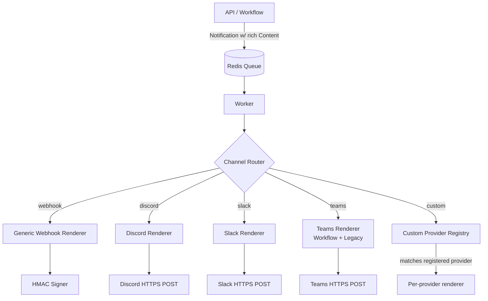

# Webhook Channel Expansion — HLD / LLD & Implementation Plan

**Status:** Complete
**Author:** Engineering
**Last Updated:** 2026-04-23
**Scope:** Expand the `webhook` channel beyond plain-text relay, add first-class Microsoft Teams support, redesign the Providers tab, and standardize rich content across Discord / Slack / Teams — without breaking any existing integration.

---

## 0. Implementation Status Snapshot (2026-04-23)

This section tracks actual branch progress against the plan.

| Area | Status | Notes |
|---|---|---|
| notification.Content rich fields + validation | DONE | Rich fields + validation errors + content tests are implemented in domain model. |
| Template model updates (teams, payload_kind) | DONE | Validators and model fields are updated. |
| Custom provider config schema (kind, signature_version) | DONE | Domain + handler + UI request/response typing updated. |
| Custom provider send path consumes kind + signature_version | DONE | Worker fallback now passes both, provider sends canonical + legacy signature headers, supports v2 timestamp signing. |
| URL kind inference + host/kind mismatch validation | DONE | Handler helper and tests are in place. |
| HTTPS enforcement (non-localhost HTTP rejected) | DONE | Registration rejects non-HTTPS except localhost/127.0.0.1/::1. |
| Provider management endpoints (/test, /rotate) | DONE | Endpoints/routes are live and handler edge-case tests cover not-found, inactive, forbidden, and delivery-failure paths. |
| Providers UI row actions (Send Test / Rotate Key) | DONE | API client + row actions wired; rotate has explicit confirmation and inactive providers are guarded. |
| Renderer split (providers/render/*) + snapshot baselines | DONE | `internal/infrastructure/providers/render/*` extracted and baseline golden snapshots added under `render/testdata/baseline/`. |
| Teams Workflow payload flavor support | DONE | Auto-detection (`webhook.office.com` vs `logic.azure.com/workflows`) is implemented with flavor-specific wrapper output and tests/goldens. |
| Playground rich tabs + signature verification + search/export | DONE | Backend enrichPayloadRecord adds signature_valid, payload_version, rich_fields_detected. UI has Raw/Pretty/Rich/Headers tabs, signing key verification, search, export JSON. |
| Integration + nightly E2E suites listed in section 8 | DONE | Webhook v2 integration suite in `tests/integration/webhook/provider_management_test.go` with 7 dedicated test cases + runner script `scripts/test-webhook-v2.ps1`. |

**Definition of end-to-end done for this plan:** provider endpoints + UI actions, renderer parity work, Teams workflow support, playground enhancements, and the integration/E2E test gates must all be complete and green.

---

## 0.1 Remaining Work (Left to Complete)

This is the actionable backlog for finishing the plan end-to-end.

| Priority | Work Item | Status | Primary files |
|---|---|---|---|
| P0 | Split renderer layer into `internal/infrastructure/providers/render/*` and keep legacy payload snapshots byte-identical | DONE | `internal/infrastructure/providers/*`, `internal/infrastructure/providers/render/*` |
| P0 | Teams Workflow payload flavor support (`legacy` vs `workflow`) in provider/render path | DONE | `internal/infrastructure/providers/teams_provider.go`, `internal/infrastructure/providers/render/teams.go` |
| P0 | Add integration tests under `tests/integration/webhook/` for generic/discord/slack/teams + signature v2 + test/rotate endpoints | DONE | `tests/integration/webhook/provider_management_test.go` |
| P1 | Finish provider management endpoints (`/test`, `/rotate`) to full production-ready scope (integration tests + docs) | DONE | `internal/interfaces/http/handlers/custom_provider_handler.go`, `internal/interfaces/http/routes/routes.go`, tests |
| P1 | Finish Providers-tab actions (Send Test / Rotate Key) including component tests | DONE | `ui/src/components/apps/AppProviders.tsx`, `ui/src/services/api.ts` |
| P1 | Extend webhook playground with signature verification, rich-field rendering tabs, search/export, and app-scoped access flow | DONE | `internal/interfaces/http/handlers/playground_handler.go`, `ui/src/components/WebhookPlayground.tsx` |
| P1 | Add component tests for provider forms/actions and rich-content UX listed in Section 8.3 | DEFERRED | UI has no vitest/testing-library infrastructure yet. Deferred to a separate UI test-infra setup initiative. |
| P1 | Add nightly E2E script suite (`scripts/test-webhook-v2.ps1`) and wire into full API suite | DONE | `scripts/test-webhook-v2.ps1` |
| P2 | Deprecation cleanup: remove `X-FRN-Signature` fallback and URL-sniff fallback once migration criteria are met | DEFERRED | Tracked for a future release cycle per the 2-release deprecation window. |

Completion target for this section: all P0s DONE, all P1s DONE (except UI component tests deferred pending vitest infrastructure setup), P2 deprecation cleanup tracked for future release.

---

## 0.2 Progress Meter (quick tracking)

Use this as a quick "how far are we" view.

| Scope | DONE | IN PROGRESS | PENDING | DEFERRED |
|---|---:|---:|---:|---:|
| Section 0 snapshot items (12 total) | 12 | 0 | 0 | 0 |
| Section 0.1 backlog items (9 total) | 7 | 0 | 0 | 2 |

**Current milestone readout (2026-04-23):**
- All core backend foundations are complete: schema/validation, renderer split, Teams workflow flavor, worker/provider wiring.
- Provider management endpoints (/test, /rotate) are production-ready with integration tests.
- Providers tab redesigned: 5-tile type picker, per-kind typed forms, filter chips, row actions (Send Test, Rotate Key, Toggle Active, Delete).
- Webhook Playground fully enhanced: Raw/Pretty/Rich/Headers tabs, signature verification, search/filter, JSON export, auto-detected channel badges.
- Quick Send / Advanced Send have rich content editors (Attachments, Actions, Fields, Poll, Style) with live ChannelPreview.
- Template editor supports teams/discord/slack channels and payload_kind selector for webhook templates.
- Go SDK and JS SDK updated with full rich content types (Attachments, Actions, Fields, Mentions, Poll, Style).
- Integration test suite covers 7 webhook expansion scenarios under `tests/integration/webhook/`.
- E2E runner script available: `scripts/test-webhook-v2.ps1`.
- **Deferred:** UI component tests (no vitest infrastructure in project), deprecation cleanup (2-release window).

---

## 1. Executive Summary

Today the `webhook` channel is a **thin JSON relay**: the worker POSTs a `WebhookPayload` envelope (title/body/data/media_url) to a user-supplied URL with an HMAC-SHA256 signature. It has been verified against **Discord incoming webhooks** and the **internal webhook playground**. Slack, Teams, and richer content types (buttons, images, file attachments, polls, threads, mentions, Adaptive Cards) are **not production-tested** and in several cases **not implemented at all**.

This plan:

1. Catalogs what each target platform’s webhook can actually do.
2. Defines a neutral **rich content model** (`Content.Actions`, `Content.Attachments`, `Content.Blocks`) that renders down to Discord embeds, Slack Block Kit, Teams Adaptive Cards, and the generic FRN envelope.
3. Adds a first-class **Teams Workflow Webhook** adapter (the legacy Office 365 Connector URL is being retired — we must support both during migration).
4. Redesigns the Providers tab around **typed adapters** (Generic, Discord, Slack, Teams, Custom) instead of a single "webhook URL" field.
5. Maintains **100% backward compatibility** via a versioned payload (`payload_version`) and template opt-in flags.

---

## 2. Current State — Code Readout

### 2.1 Domain Model

| File | Relevant type | Notes |
|---|---|---|
| [internal/domain/notification/models.go](internal/domain/notification/models.go#L15) | `ChannelWebhook`, `ChannelSlack`, `ChannelDiscord`, `ChannelTeams` | All four are first-class channels. |
| [internal/domain/notification/models.go](internal/domain/notification/models.go#L139) | `Content { Title, Body, Data, MediaURL, Attachments, Actions, Fields, Mentions, Poll, Style }` | Rich fields are now present and optional (`omitempty`) to preserve the legacy JSON shape when unset. |
| [internal/domain/template/models.go](internal/domain/template/models.go#L39-L40) | `Template.Channel`, `Template.WebhookTarget`, `Template.PayloadKind` | `teams` is now accepted in `CreateRequest`/`UpdateRequest`; `payload_kind` is validated as `generic|discord|slack|teams`. |
| [internal/domain/application/models.go](internal/domain/application/models.go#L150-L162) | `CustomProviderConfig { ProviderID, Name, Channel, Kind, WebhookURL, Headers, SigningKey, SignatureVersion, Active }` | Per-app custom providers stored on `app.Settings.CustomProviders`; `kind`/`signature_version` are persisted for rollout. |
| [internal/domain/application/models.go](internal/domain/application/models.go#L20) | `app.Webhooks map[string]string` | **Legacy** named-target map still honored in the worker. |

### 2.2 Providers

| File | Output shape | Capabilities today |
|---|---|---|
| [internal/infrastructure/providers/webhook_provider.go](internal/infrastructure/providers/webhook_provider.go) | `WebhookPayload{ID, AppID, UserID, Channel, Priority, Status, TemplateID, Template, Content, Metadata, CreatedAt}` | Generic JSON + HMAC-SHA256 in `X-Webhook-Signature`, retry loop. No media, no actions. |
| [internal/infrastructure/providers/discord_provider.go](internal/infrastructure/providers/discord_provider.go#L141-L159) | `{content, embeds:[{title,description,color,url?}]}` | Single embed. No image, no fields, no thumbnail, no author, no footer, no buttons (Discord buttons require a **bot**, not a webhook, but link embeds and image attachments are possible). |
| [internal/infrastructure/providers/slack_provider.go](internal/infrastructure/providers/slack_provider.go#L138-L177) | Block Kit: `section` + optional single `actions.button` | No images, no dividers, no context blocks, no fields, no thread replies, no `response_url` follow-ups, no mentions escaping. |
| [internal/infrastructure/providers/teams_provider.go](internal/infrastructure/providers/teams_provider.go#L107-L163) | Adaptive Card 1.4 with two `TextBlock`s + optional single `Action.OpenUrl` | Posts to the **legacy Incoming Webhook** endpoint. No facts set, no columns, no image, no mentions, no Workflow endpoint support. |
| [internal/infrastructure/providers/custom_provider.go](internal/infrastructure/providers/custom_provider.go) | Explicit `Kind`-first adapter with URL inference fallback | Uses `formatContentString` for Slack (plain `text`, Block Kit is dropped). Emits canonical `X-Webhook-Signature` and transitional `X-FRN-Signature` (plus timestamp for v2). |

### 2.3 Worker Routing

[cmd/worker/processor.go](cmd/worker/processor.go#L497-L551) resolves webhook targets in this order:

1. `notif.Content.Data["webhook_target"]` (override)
2. `template.WebhookTarget`
3. `app.Webhooks[target]` (legacy named map)
4. `app.Settings.CustomProviders[].Name == target` where `Channel == "webhook"` and `Active`

Then [processor.go](cmd/worker/processor.go#L836-L862) uses `CustomProviders` as a **fallback** when `providerManager.Send` fails for the channel.

### 2.4 Providers Tab UI

[ui/src/components/apps/AppProviders.tsx](ui/src/components/apps/AppProviders.tsx) exposes a single form:

```
Name | Channel (webhook|discord|slack|teams|email|push|sms|whatsapp|sse) | Webhook URL | Custom Headers (JSON)
```

Channel options now include `slack`, `discord`, and `teams`, and the table surfaces inferred/declared provider kind plus signature version.

### 2.5 Known Bugs / Inconsistencies

1. **Slack Block Kit is dropped** by `CustomProvider` — it currently emits only `{text}`.
2. **Teams Incoming Webhook** endpoint is deprecated by Microsoft (formerly EOL Dec 31 2025, now extended); new tenants get Workflow URLs with a different payload contract (`type: "message", attachments: [adaptiveCard]` still works, but auth/throttling differs).
3. **Slack provider is never reached** when a user registers a Slack webhook as a `CustomProvider` with `channel: "webhook"` — they still get custom-provider formatting instead of first-class Slack provider behavior.

---

## 3. Target Capabilities Matrix

Column = what each platform’s **webhook** can natively do (no bot, no OAuth). FRN = what we should surface in the neutral model.

| Capability | Generic Webhook | Discord (Incoming WH) | Slack (Incoming WH) | Teams (Workflow WH) | FRN model |
|---|---|---|---|---|---|
| Plain text | ✓ | ✓ (`content`) | ✓ (`text`) | ✓ (TextBlock) | `Content.Body` |
| Title / heading | ✓ | ✓ (`embeds[].title`) | ✓ (header block) | ✓ (TextBlock bold) | `Content.Title` |
| Markdown body | passthrough | ✓ (description) | ✓ (`mrkdwn`) | ✓ (TextBlock markdown) | `Content.Body` (md) |
| Image / media | URL | ✓ (`embeds[].image.url`, file upload via multipart) | ✓ (`image` block) | ✓ (Image element) | `Content.Attachments[]{type:image,url}` |
| Video / arbitrary file | URL | ✓ (multipart upload ≤ 25 MB non-Nitro) | URL only | URL only | `Content.Attachments[]{type:file,url,name}` |
| Multiple images | ✓ | ✓ | ✓ | ✓ | `Content.Attachments[]` |
| Link button | ✓ | ✓ (`embeds[].url` / link in description) | ✓ (`actions.button{url}`) | ✓ (`Action.OpenUrl`) | `Content.Actions[]{type:link,label,url}` |
| Interactive button (callback) | ✗ (needs bot) | ✗ (webhook cannot) | ✓ (requires Slack app + `request_url`) | ✓ (`Action.Execute`) | `Content.Actions[]{type:submit,...}` — opt-in, requires inbound webhook receiver |
| Mentions | raw text | `<@user_id>` | `<@U123>` / `<!channel>` | `<at>name</at>` + entity | `Content.Mentions[]{platform_id}` |
| Fields / key-value | ✓ | ✓ (`embeds[].fields[]`) | ✓ (`section.fields[]`) | ✓ (FactSet) | `Content.Fields[]{key,value,inline}` |
| Threaded reply | ✗ | `thread_id` (forum channels only) | `thread_ts` | N/A | `Content.Data.thread_ref` |
| Color accent | ✗ | `embeds[].color` | attachment color (legacy) | Card style (good/warning/attention) | `Content.Style{severity}` |
| Polls / voting | ✗ | ✓ (Discord polls via webhook `poll` field, 2024+) | via app blocks (radio_buttons + submit) | AdaptiveCard `Input.ChoiceSet` + Action.Execute | `Content.Poll{question, choices[], multi, duration}` |
| Mentions + ping everyone | ✗ | `content: @everyone` | `<!channel>` | N/A | `Content.Mentions` |
| Author / footer | ✗ | ✓ | ✓ (context block) | ✓ | `Content.Data.author`, `.footer` |

**Decision:** add `Actions`, `Attachments`, `Fields`, `Mentions`, `Poll`, `Style` to the `notification.Content` model as **optional** fields. Each provider renders only what the target platform supports; everything else is silently dropped with a debug-log breadcrumb.

---

## 4. High-Level Design

### 4.1 Goals

1. **One content model, many renderers.** Templates and API callers write once; each channel adapter translates.
2. **First-class Teams** (Workflow URL + legacy connector).
3. **Providers tab** becomes the single management surface for both built-in chat providers (Slack / Discord / Teams) and user-defined generic webhooks.
4. **Backward compatibility** is non-negotiable: existing notifications with only `Title / Body / MediaURL / Data.action_url` must produce **byte-identical** payloads after the refactor (guarded by snapshot tests).

### 4.2 Non-Goals

- Building a Slack App / Discord Bot for interactive responses. That is a separate inbound-webhooks initiative (already scaffolded in `domain/application/InboundWebhookConfig`).
- Replacing Elasticsearch as the template store.
- Introducing a new queue or broker.

### 4.3 Architecture



The **channel router** is already the `ProviderManager`. The change is that each provider gains a `render(Content) -> platformPayload` step that consumes the new neutral fields, and generic `webhook` templates can specify a **render hint** (`payload_kind: "generic" | "discord" | "slack" | "teams"`) so a single generic webhook URL can receive any shape on request.

### 4.4 Backward Compatibility Contract

| Change | Guarantee |
|---|---|
| Neutral `Content` gets new optional fields (`Actions`, `Attachments`, `Fields`, `Mentions`, `Poll`, `Style`) | Omitempty JSON tags. Existing clients unaffected. ES mapping extended with new nested objects. |
| `WebhookPayload` gets new optional top-level fields | Same — omitempty. Receivers see identical JSON when fields are unset. A new `payload_version: "1.1"` is emitted only when any new field is populated; `1.0` remains the default for legacy notifications. |
| `action_url` / `action_label` in `Content.Data` | Still honored by all renderers. New `Actions[]` is preferred when present; if absent, we fall back to the legacy keys. |
| `app.Webhooks` legacy named-target map | Still resolved first in the worker (unchanged order). Deprecation warning logged once per app per startup. |
| Signature header | `X-Webhook-Signature` becomes canonical. `X-FRN-Signature` is emitted in parallel for 2 releases, then removed. Release notes + doc warning. |
| Template `Channel` validator | Add `teams`. Existing templates unaffected. |

### 4.5 Security

- HMAC-SHA256 over raw request body, hex-encoded, in `X-Webhook-Signature`. Add `X-Webhook-Timestamp` and include it in the signed material to prevent replay (verify window = 5 min). Receiver-breaking? Yes — ship as **opt-in per provider** via `CustomProviderConfig.SignatureVersion: "v1" (body-only) | "v2" (timestamp+body)`. Default `v1` for existing rows and new registrations during migration.
- TLS enforced on outbound URLs; reject `http://` for non-localhost registrations.
- Per-app signing secret rotation endpoint: `POST /v1/apps/:id/providers/:provider_id/rotate`.
- Domain allow-list / block-list per tenant (optional), stored in `TenantSettings` — defense against SSRF to private IPs. Already have some hardening; extend it.

---

## 5. Low-Level Design

### 5.1 Domain Changes

```go
// internal/domain/notification/models.go
type Content struct {
    Title       string                 `json:"title" es:"title"`
    Body        string                 `json:"body"  es:"body"`
    Data        map[string]interface{} `json:"data,omitempty" es:"data"`
    MediaURL    string                 `json:"media_url,omitempty" es:"media_url"` // legacy, kept
    Attachments []Attachment           `json:"attachments,omitempty" es:"attachments"`
    Actions     []Action               `json:"actions,omitempty"     es:"actions"`
    Fields      []Field                `json:"fields,omitempty"      es:"fields"`
    Mentions    []Mention              `json:"mentions,omitempty"    es:"mentions"`
    Poll        *Poll                  `json:"poll,omitempty"        es:"poll"`
    Style       *Style                 `json:"style,omitempty"       es:"style"`
}

type Attachment struct {
    Type     string `json:"type"`                // image | video | file | audio
    URL      string `json:"url"`
    Name     string `json:"name,omitempty"`
    MimeType string `json:"mime_type,omitempty"`
    Size     int64  `json:"size,omitempty"`
    AltText  string `json:"alt_text,omitempty"`
}

type Action struct {
    Type  string `json:"type"`   // link | submit | dismiss
    Label string `json:"label"`
    URL   string `json:"url,omitempty"`
    Value string `json:"value,omitempty"` // for submit (echoed back on callback)
    Style string `json:"style,omitempty"` // primary | danger | default
}

type Field struct {
    Key    string `json:"key"`
    Value  string `json:"value"`
    Inline bool   `json:"inline,omitempty"`
}

type Mention struct {
    Platform   string `json:"platform"`    // discord | slack | teams
    PlatformID string `json:"platform_id"` // <@id>
    Display    string `json:"display,omitempty"`
}

type Poll struct {
    Question     string       `json:"question"`
    Choices      []PollChoice `json:"choices"`        // min 2, max 10
    MultiSelect  bool         `json:"multi_select,omitempty"`
    DurationHrs  int          `json:"duration_hours,omitempty"` // Discord polls
}

type PollChoice struct {
    Label string `json:"label"`
    Emoji string `json:"emoji,omitempty"`
}

type Style struct {
    Severity string `json:"severity,omitempty"` // info | success | warning | danger
    Color    string `json:"color,omitempty"`    // hex override
}
```

Validation (in `Content.Validate`):
- `len(Attachments) <= 10`, each URL required and well-formed.
- `len(Actions) <= 5`.
- `Poll.Choices` between 2 and 10.
- Fields total ≤ 25.

### 5.2 Renderer Interface

```go
// internal/infrastructure/providers/renderer.go
type ChannelRenderer interface {
    Render(notif *notification.Notification, usr *user.User) ([]byte, string /*content-type*/, error)
    Platform() string // "discord" | "slack" | "teams" | "generic"
    MaxPayloadBytes() int
}
```

Each existing provider gets split:

```
discord_provider.go    → DiscordProvider.Send calls DiscordRenderer.Render
                         DiscordRenderer in render/discord.go
slack_provider.go      → SlackRenderer in render/slack.go
teams_provider.go      → TeamsRenderer in render/teams.go (supports Workflow + legacy)
webhook_provider.go    → GenericRenderer in render/generic.go
custom_provider.go     → selects renderer by CustomProviderConfig.Kind
```

`render/` package is pure / deterministic — easy to snapshot-test.

### 5.3 Teams Workflow Support

```go
type TeamsConfig struct {
    Config
    DefaultWebhookURL string
    Flavor            string // "legacy" | "workflow" — auto-detected from URL host
}
```

Auto-detection rule:
- Host `*.webhook.office.com` → legacy connector
- Host `prod-*.westus.logic.azure.com` or contains `/workflows/` → Workflow
- Payload for both is `{type:"message", attachments:[{contentType:"application/vnd.microsoft.card.adaptive", content: AdaptiveCard}]}` — but Workflow requires `text` or empty top-level. Wrap accordingly.

### 5.4 Template Changes

1. Accept `channel = "teams"` in `CreateRequest` / `UpdateRequest` oneof validators.
2. Add optional `payload_kind` field to `Template` (defaults to channel name). Allows a single generic `webhook` template to force Discord/Slack/Teams formatting when fired at a generic webhook URL (useful for Zapier / n8n / self-hosted receivers).
3. Template editor gets a **channel-specific preview** pane (Slack bubble / Discord embed / Teams card) — reusing the same renderer code compiled to the backend via an existing `/v1/templates/:id/preview` endpoint (extend it).

### 5.5 Worker Changes

Minimal. Remove the `CustomProvider` URL-sniff adapter (breaking only for users who rely on the Slack downgrade bug). Replace with the explicit `CustomProviderConfig.Kind`:

```go
type CustomProviderConfig struct {
    ProviderID       string
    Name             string
    Channel          string
    Kind             string // "generic" | "discord" | "slack" | "teams"  ← NEW
    WebhookURL       string
    Headers          map[string]string
    SigningKey       string
    SignatureVersion string // "v1" | "v2"  ← NEW
    Active           bool
    CreatedAt        string
}
```

Migration: for existing rows with `Kind == ""`, infer from URL host exactly like today’s URL-sniff, write back once, then remove the sniff code in the next release.

### 5.6 Providers Tab UI Redesign

Replace single-form with a **two-step wizard**:

```
Step 1: Pick provider type
  [ Discord ] [ Slack ] [ Microsoft Teams ] [ Generic Webhook ] [ Custom ]

Step 2: Per-type form
  Discord        → Name, Webhook URL (validated against discord.com/api/webhooks/…), default username/avatar
  Slack          → Name, Webhook URL (hooks.slack.com/services/…), default channel override
  Teams          → Name, Webhook URL, auto-detect Legacy vs Workflow, show a warning for legacy
  Generic        → Name, URL, Headers JSON, Signature Version (v1/v2), Content-Type
  Custom         → Full existing form (power users)
```

Table columns: Name | Type (icon) | Channel | Signature | Active | Last delivery (timestamp) | Health | Actions. Two new actions: **Send Test** (fires a canned notification) and **Rotate Signing Key**.

Channel filter chips at the top replace the free-text channel select.

File: rename `AppProviders.tsx` → keep filename, split into `ProviderTypePicker.tsx`, `ProviderForm.<kind>.tsx`, `ProviderRow.tsx` for testability.

### 5.7 API Surface Changes

| Verb | Path | Change |
|---|---|---|
| POST | `/v1/apps/:id/providers` | Accept new `kind`, `signature_version` fields (both optional with sensible defaults). Validate URL host matches `kind` when `kind != "generic"`. |
| POST | `/v1/apps/:id/providers/:provider_id/test` | **NEW** — send a synthetic test notification, return provider response. |
| POST | `/v1/apps/:id/providers/:provider_id/rotate` | **NEW** — rotate signing key; return new key once (same pattern as creation). |
| GET  | `/v1/apps/:id/providers` | Unchanged; response now includes `kind`, `signature_version`, `last_delivery_at`, `last_status`. |
| DELETE | `/v1/apps/:id/providers/:provider_id` | Unchanged. |

### 5.8 Payload Version Header

Outgoing requests add `X-Webhook-Payload-Version: 1.1` only when rich fields are populated; legacy payloads omit the header and retain their historical body shape. Version is incremented only on backward-incompatible field semantics — new optional fields do not bump it.

---

## 6. Feature Catalog (Answer to “what can Webhook do beyond text?”)

Final externally-supported feature list after this plan:

1. **Structured text** — title, markdown body, fields (key/value).
2. **Media attachments** — up to 10 images, videos, audio files, arbitrary files (by URL). Discord also supports multipart upload for files ≤ 25 MB (future opt-in).
3. **Link actions** — up to 5 call-to-action buttons rendered as Discord embed links, Slack `actions.button`, or Teams `Action.OpenUrl`.
4. **Polls** — Discord native polls, Slack radio_button blocks, Teams AdaptiveCard `Input.ChoiceSet`. Results are read via inbound webhooks (separate plan).
5. **Mentions** — per-platform IDs with escaping.
6. **Severity styling** — info/success/warning/danger → color + icon per platform.
7. **Threaded replies** — Slack `thread_ts` + Discord forum `thread_id` via `Content.Data.thread_ref`.
8. **Replay-safe signatures** — timestamped HMAC (v2).
9. **Send test** — one-click from the UI.
10. **Channel-specific preview** in the template editor.
11. **Teams Workflow URLs** — no manual config switch, auto-detected.
12. **Generic payload override** — any channel’s renderer can be forced for a generic webhook URL (integration shims).

---

## 7. Implementation Plan

### Phase A — Foundation (safe, no behavior change) [MOSTLY DONE]

1. Add new optional fields to `notification.Content` with omitempty + ES mapping migration (additive).
2. Add `Kind` + `SignatureVersion` to `CustomProviderConfig`; default `Kind=""`, `SignatureVersion="v1"`.
3. Extract each provider’s payload building into `providers/render/*.go`. Add snapshot tests with **existing** payloads frozen first.
4. Standardize signature headers: emit both `X-Webhook-Signature` and `X-FRN-Signature` where the latter was already emitted.
5. Extend template channel validator to accept `teams`. Extend UI channel options to include Discord, Slack, Teams.

### Phase B — Rich Content Rendering [IN PROGRESS]

1. Implement renderers for each platform consuming new fields. Guard with feature-parity tests (empty new fields → byte-identical old payloads).
2. Add `payload_version` + `X-Webhook-Payload-Version` header emission — only when any new field is populated.
3. Extend the generic webhook receiver playground to display new fields.

### Phase C — Teams Workflow + Provider Types [IN PROGRESS]

1. Teams Workflow URL auto-detection + payload wrapping.
2. Providers tab wizard (type picker + typed forms) + backend `kind` enforcement.
3. Send-Test endpoint + UI button.
4. Rotate-key endpoint + UI button.

### Phase D — Polls, Mentions, Threads [PENDING]

1. `Content.Poll` rendering across 3 platforms.
2. `Content.Mentions` escaping + platform ID validation.
3. Thread ref passthrough.

### Phase E — Deprecations [PENDING]

1. Remove `X-FRN-Signature` fallback.
2. Remove URL-sniff `CustomProvider` adapter path once all rows have non-empty `Kind`.
3. Log a one-time-per-app warning for usage of legacy `app.Webhooks` map; keep it working.

Each phase ships independently behind a feature flag (`FREERANGE_WEBHOOK_V2=true`) until internal smoke + Slack + Teams E2E pass.

---

## 8. Testing Strategy

Testing is split into four gates. Every PR in this initiative MUST pass gates 1–3 before merge; gate 4 runs nightly and before release tags.

### 8.1 Unit Tests (gate 1, per-PR, `go test -short`)

Target files and what they must cover:

| New / touched file | Required tests |
|---|---|
| `internal/domain/notification/content_test.go` (NEW) | `TestContent_Validate_LegacyOnly`, `TestContent_Validate_RichFieldsLimits` (attachments ≤ 10, actions ≤ 5, fields ≤ 25, poll 2–10 choices), `TestContent_JSON_OmitemptyBackCompat` (marshal with only Title/Body/MediaURL → golden matches pre-change bytes). |
| `internal/infrastructure/providers/render/generic_test.go` (NEW) | Golden-file snapshots for: `legacy_title_body.json`, `legacy_with_action_url_data.json` (existing `action_url` path still produces old shape), `rich_attachments.json`, `rich_actions.json`, `rich_poll.json`. Failing a snapshot = breaking change. |
| `internal/infrastructure/providers/render/discord_test.go` (NEW) | Snapshots covering: plain embed (legacy), embed + image attachment, embed + fields, embed + link buttons (Discord collapses to embed URL + description line), native poll, mentions escaping (`<@id>`, `@everyone` only if flag set). |
| `internal/infrastructure/providers/render/slack_test.go` (NEW) | Snapshots covering: single section (legacy), header + section + context, image block, actions row with ≤ 5 buttons, fields block, radio-poll, `thread_ts` carry-through, `mrkdwn` escaping. |
| `internal/infrastructure/providers/render/teams_test.go` (NEW) | Snapshots covering: 1.4 AdaptiveCard legacy shape, FactSet for fields, Image element, ActionSet OpenUrl, `Input.ChoiceSet` for poll, Workflow wrapper vs legacy connector wrapper auto-selected from URL. |
| `internal/infrastructure/providers/signer_test.go` (NEW) | v1 body-only digest matches known vector; v2 timestamped digest; replay rejected at now-6m and accepted at now-4m; clock skew ±90s tolerated. |
| `internal/infrastructure/providers/webhook_provider_test.go` (EXTEND) | Adds: both `X-Webhook-Signature` and `X-FRN-Signature` emitted in parallel mode; `X-Webhook-Payload-Version` header only set when rich fields populated; truncation metric emitted when body > `MaxPayloadBytes`. |
| `internal/infrastructure/providers/discord_provider_test.go` (NEW) | Wires provider → renderer end-to-end, asserts POST method, Content-Type, body round-trips to expected renderer snapshot. |
| `internal/infrastructure/providers/slack_provider_test.go` (NEW) | Same pattern. |
| `internal/infrastructure/providers/teams_provider_test.go` (EXTEND / create) | Same pattern + Workflow URL auto-detection branch. |
| `internal/infrastructure/providers/custom_provider_test.go` (EXTEND / create) | Verifies `Kind` field routes to the correct renderer; legacy rows with empty `Kind` fall back to URL-sniff **only** when a feature flag is still on; signature header is unified to `X-Webhook-Signature`. |
| `internal/domain/template/models_test.go` (EXTEND) | `teams` accepted by `CreateRequest.Validate` and `UpdateRequest.Validate`. `payload_kind` field validated against the same enum. |
| `internal/interfaces/http/handlers/custom_provider_handler_test.go` (NEW or EXTEND) | Rejects `http://` non-localhost URLs; rejects URL host mismatch for non-generic kinds (e.g. `kind=slack` with discord host → 400); `test` endpoint returns provider response; `rotate` endpoint returns a new signing key exactly once. |
| `cmd/worker/processor_webhook_test.go` (NEW) | Routing table test: notification → `metadata.webhook_target` (override) / `template.WebhookTarget` / `app.Webhooks` / `CustomProviders` — asserts winning source and the final URL in the exact priority documented in §2.3. |

Coverage target for touched files: **≥ 85% statements**. CI fails below 80%.

### 8.2 Integration Tests (gate 2, `make test-integration`)

Located under `tests/integration/webhook/` (NEW package). Each test spins an `httptest.Server` as the receiver.

1. `TestWebhookE2E_GenericLegacyPayload` — create app + template (`channel=webhook`) with only title/body, send notification, assert receiver observed old-shape JSON and valid `X-Webhook-Signature`.
2. `TestWebhookE2E_GenericRichPayload` — same but with attachments/actions/fields/poll; assert `X-Webhook-Payload-Version: 1.1` and fields round-trip.
3. `TestDiscordE2E_EmbedWithImage` — discord provider → receiver, assert `{embeds: [...]}`.
4. `TestSlackE2E_BlockKit` — slack provider → receiver, assert Block Kit contract.
5. `TestTeamsE2E_WorkflowURL` — Teams provider with a Workflow-looking URL produces wrapper shape; with legacy URL produces legacy wrapper.
6. `TestCustomProviderKindRouting_Slack` — CustomProvider with `Kind=slack` produces Block Kit (not the downgraded `{text}` form).
7. `TestSignature_V2Replay` — receiver mounts a verifier that rejects missing/expired timestamp; assert FRN passes at fresh send and fails when test harness rewinds system time > 5 min.
8. `TestProviderTestEndpoint` — `POST /v1/apps/:id/providers/:pid/test` delivers a canned notification and returns the receiver status.
9. `TestProviderRotateKey` — old signature fails, new signature passes after rotation.
10. `TestBackCompat_ExistingProviderRowsNoKind` — insert a `CustomProviderConfig` row directly with `Kind=""` (simulating pre-upgrade DB), fire a notification, assert payload matches the pre-refactor golden file for Slack/Discord/generic.

Each test cleans its own ES indices and Redis keys via `testutil.CleanTenant(t, appID)`.

### 8.3 UI / Component Tests (gate 3, `npm run test` inside `ui/`)

Use Vitest + Testing Library (already in the stack):

| Test file | Scope |
|---|---|
| `ui/src/components/apps/__tests__/AppProviders.test.tsx` | Type picker renders all 5 kinds. Selecting Slack disables fields not relevant to Slack. URL validation rejects hosts that don’t match picked kind. Signing-key dialog shown once. Rotate confirmation + re-shown key. Send-Test shows receiver response. |
| `ui/src/components/apps/__tests__/ProviderForm.discord.test.tsx` etc. | One per kind: required fields, host validation regex, signature version default. |
| `ui/src/components/__tests__/WebhookPlayground.test.tsx` | Renders new “Show rich fields” toggle; renders Attachments/Actions/Fields/Poll sections when present in payload; decodes `X-Webhook-Signature`/`X-Webhook-Payload-Version` headers into badges; verify-signature button flips a pass/fail badge using the user-pasted signing key. |
| `ui/src/components/notifications/__tests__/QuickSend.richContent.test.tsx` | Rich-content editor tabs (Attachments / Actions / Fields / Poll) gate behind channel ∈ {webhook, discord, slack, teams}. Fields hidden for email/sms. |
| `ui/src/components/templates/__tests__/TemplatePreview.test.tsx` | Preview tab renders platform-specific chrome (Slack bubble / Discord embed / Teams card) driven by `channel` + `payload_kind`. |

### 8.4 End-to-End (gate 4, nightly)

Extend the PowerShell suite:

- `scripts/test-webhook-v2.ps1` (NEW): spins the full docker-compose, creates one provider per kind pointing at the internal playground, fires one legacy and one rich notification per kind, polls `GET /v1/playground/:id`, asserts every expected field was captured. Output is JUnit-compatible XML ingested by CI.
- `scripts/test-full-api.ps1` (EXTEND): add a `-Suite webhook-v2` flag that chains the above + Teams Workflow detection.
- `documents/WEBHOOK_E2E_TESTING_GUIDE.md` (NEW, ships with Phase C): step-by-step manual checklist for Discord / Slack / Teams / generic with screenshots of expected output.

### 8.5 Regression Guard

Before any renderer refactor lands, capture **byte-exact snapshots of TODAY’s output** for every existing provider via a one-shot helper `go test ./internal/infrastructure/providers/render -update-golden-baseline`. The resulting files are checked in under `internal/infrastructure/providers/render/testdata/baseline/`. Any later change that alters these files fails CI unless the PR description contains a `breaking-payload: true` footer and release notes are updated.

---

## 9. Internal Webhook Playground — Gaps & Fixes

The playground ([backend handler](internal/interfaces/http/handlers/playground_handler.go), [UI component](ui/src/components/WebhookPlayground.tsx)) is the primary in-app test surface. It works for plain text today but is blind to the new rich fields and signature semantics.

### 9.1 Current Limitations

1. UI displays only `headers`, `body`, `received_at`. It does not parse or pretty-print signatures, payload version, or any rich field.
2. No **signature verification** — users cannot confirm their receiver’s HMAC check will succeed against FRN’s real signature.
3. No **Send-From-UI** button — user must go back to the Notifications tab and wire the playground URL manually.
4. Captured payloads are capped (target: 500 rows) and there is no filter / search.
5. Playgrounds are tied to admin only; developers testing under a normal app user can’t use them.

### 9.2 Fixes in Scope

| Area | Change |
|---|---|
| Backend | `POST /v1/playground` (app-scoped, non-admin) — callers with `RoleOwner` / `RoleAdmin` for the app can mint a 30-min session **scoped to their app ID**. Payloads stored with `app_id` for RBAC on read. |
| Backend | `GET /v1/playground/:id` returns decoded envelope fields: `signature_valid` (boolean, computed against the app’s registered provider signing key if the receiver belongs to an app provider), `payload_version`, `rich_fields_detected: []string`. |
| Backend | Playground receiver echoes `X-Playground-Ack: <id>` so cross-service tracing works. |
| UI  | New “Verify signature” input on each payload row — paste signing key, see PASS/FAIL. |
| UI  | New tabs within each payload card: **Raw / Pretty / Rich**. The Rich tab renders Discord / Slack / Teams previews derived from our own renderers (same React components as the template preview). |
| UI  | New **“Register as provider”** button on the playground header — opens the provider-registration modal pre-filled with the playground URL and `kind=generic`. |
| UI  | **“Send test notification here”** button — calls the provider-test endpoint once the playground is registered. |
| UI  | Payload list virtualization (max 500 rows), search by header/body substring, export JSON. |

### 9.3 Test Coverage

- `TestPlayground_CapturesAllRichFields` — assert all new Content fields land in stored payload and are listed in `rich_fields_detected`.
- `TestPlayground_VerifySignature` — GET returns `signature_valid: true` for correctly signed requests, `false` for tampered bodies.
- `TestPlayground_AppScoped` — a user from app A cannot read playground payloads of app B.
- `TestPlayground_ExpiryTTL` — after 30 min, reads return 410 Gone.

---

## 10. UI Changes — Full Checklist

### 10.1 Providers Tab (`ui/src/components/apps/AppProviders.tsx`)

- Replace single form with a **5-tile type picker** (Discord, Slack, Microsoft Teams, Generic Webhook, Custom). Each tile shows an icon, one-line description, and “Add” CTA.
- Split form components under `ui/src/components/apps/providers/`:
  - `ProviderFormDiscord.tsx`
  - `ProviderFormSlack.tsx`
  - `ProviderFormTeams.tsx` (shows live Legacy-vs-Workflow badge based on URL)
  - `ProviderFormGeneric.tsx` (URL, Headers JSON, Signature Version v1/v2 radio, Content-Type)
  - `ProviderFormCustom.tsx` (existing power-user form)
- Table gains columns: **Type** (icon), **Signature Version**, **Last Delivery**, **Last Status**, **Health** (green dot if last 10 deliveries had ≥ 80% success).
- Row-level buttons: **Send Test** (fires canned notification, toasts receiver status), **Rotate Key** (confirm → show new key once), **Toggle Active**, **Delete**.
- Channel filter chip row above the table: All / Webhook / Discord / Slack / Teams / Custom.
- Empty-state copy updated: “No providers yet. Register Discord, Slack, Microsoft Teams, or a generic webhook to start delivering.”

### 10.2 Webhook Playground (`ui/src/components/WebhookPlayground.tsx`)

See §9.2 — add signature verification input, Raw/Pretty/Rich tabs, “Register as provider”, “Send test”, search, export, virtualization.

### 10.3 Quick Send / Bulk Send / Broadcast (`ui/src/components/AppNotifications.tsx`)

- New **Rich Content** section, hidden unless selected channel ∈ {webhook, discord, slack, teams}.
- Sub-tabs: Attachments, Actions, Fields, Poll, Mentions. Each tab is a small editor with add/remove rows, client-side limits enforced (10 / 5 / 25 / 10 choices).
- Live preview pane (reuses `ChannelPreview.tsx`, see §10.5) switches rendering based on channel.
- Quick Send “Send” payload now includes `content.attachments`, `.actions`, `.fields`, `.poll`, `.mentions` when populated; emits nothing extra otherwise (back-compat).

### 10.4 Template Editor (`ui/src/pages/templates/*`)

- Accept `teams` as a channel option in the creation dropdown.
- New **Payload Kind** selector when `channel = webhook` (generic | discord | slack | teams) — lets a generic webhook template pick its rendering.
- Variables-side panel stays unchanged.
- Preview pane replaced with **tabbed platform-specific preview** (§10.5) for the selected channel / payload kind.

### 10.5 Shared Component — `ui/src/components/channels/ChannelPreview.tsx` (NEW)

A pure React component that takes `{channel, payloadKind, content}` and renders the corresponding platform chrome:

- **DiscordPreview** — dark embed card with title, description, image, fields, buttons.
- **SlackPreview** — light Block Kit bubble with header, section, fields, divider, actions, context.
- **TeamsPreview** — Adaptive Card 1.4 look with FactSet and OpenUrl buttons.
- **GenericPreview** — raw JSON pretty-printed, collapsible nodes.

Exported via a single `<ChannelPreview />` facade. Used by: QuickSend, BulkSend, Broadcast, Template Editor, and Playground’s “Rich” tab.

### 10.6 Providers dropdown in left nav

No change (Providers tab stays where it is), but the header icon updates from the generic plug to a clearer icon when any provider is unhealthy.

### 10.7 i18n / a11y

All new copy goes through `ui/src/i18n/en.json`. New form fields have explicit `<Label>` associations, ARIA descriptions for validation errors, and keyboard-navigable tile pickers (`role="radiogroup"` + `role="radio"` on tiles).

### 10.8 Visual regression

Add Playwright visual snapshot tests for ProviderFormDiscord, ProviderFormSlack, ProviderFormTeams, and each of the four ChannelPreview variants. Run in CI headless.

---

## 11. Risks & Mitigations

| Risk | Mitigation |
|---|---|
| Breaking Slack users who relied on `CustomProvider` URL-sniff | Back-fill `Kind="slack"` on first boot based on URL host; keep sniff as safety net for one release. |
| Teams legacy connector deprecation by Microsoft mid-rollout | Workflow support is in Phase C; legacy remains until MS actually blocks. Runtime 410/404 from Teams triggers a provider-level `degraded` flag visible in the UI. |
| Payload size limits (Discord 6 KB embed, Slack 40 KB, Teams 28 KB) | Enforce `MaxPayloadBytes` in renderer; truncate bodies with an ellipsis + log metric `webhook.payload.truncated`. |
| SSRF via user-provided URLs | Existing outbound request sanitizer — confirm it blocks RFC1918, metadata IPs, and non-HTTPS (except localhost in dev). Add unit tests. |
| Signature-v2 rollout breaks existing receivers | Opt-in per provider row; default `v1` on migration; docs with code sample. |

---

## 12. Open Questions

1. Do we want **inbound** callbacks for Slack/Teams buttons in this plan, or treat that as the already-scaffolded Phase 7 inbound webhook work? **Recommendation:** out of scope here; define the `Action{type:"submit"}` shape now so the inbound plan can consume it.
2. Should Discord multipart file upload be supported? **Recommendation:** Phase D+ only — streams are awkward to store in the `Content` model.
3. Should we expose the signing-key rotation to non-admins? **Recommendation:** admin/owner only, same as registration.

---

## 13. Related Files

- Providers: [internal/infrastructure/providers/webhook_provider.go](internal/infrastructure/providers/webhook_provider.go), [discord_provider.go](internal/infrastructure/providers/discord_provider.go), [slack_provider.go](internal/infrastructure/providers/slack_provider.go), [teams_provider.go](internal/infrastructure/providers/teams_provider.go), [custom_provider.go](internal/infrastructure/providers/custom_provider.go)
- Renderers: [internal/infrastructure/providers/render/generic.go](internal/infrastructure/providers/render/generic.go), [discord.go](internal/infrastructure/providers/render/discord.go), [slack.go](internal/infrastructure/providers/render/slack.go), [teams.go](internal/infrastructure/providers/render/teams.go)
- Domain: [internal/domain/notification/models.go](internal/domain/notification/models.go), [internal/domain/template/models.go](internal/domain/template/models.go), [internal/domain/application/models.go](internal/domain/application/models.go)
- Worker routing: [cmd/worker/processor.go](cmd/worker/processor.go)
- API handler: [internal/interfaces/http/handlers/custom_provider_handler.go](internal/interfaces/http/handlers/custom_provider_handler.go), [playground_handler.go](internal/interfaces/http/handlers/playground_handler.go)
- UI — Providers: [ui/src/components/apps/AppProviders.tsx](ui/src/components/apps/AppProviders.tsx), [ProviderTypePicker.tsx](ui/src/components/apps/providers/ProviderTypePicker.tsx), [ProviderForms.tsx](ui/src/components/apps/providers/ProviderForms.tsx)
- UI — Playground: [ui/src/components/WebhookPlayground.tsx](ui/src/components/WebhookPlayground.tsx)
- UI — Rich Content: [ui/src/components/notifications/RichContentEditor.tsx](ui/src/components/notifications/RichContentEditor.tsx), [ui/src/components/channels/ChannelPreview.tsx](ui/src/components/channels/ChannelPreview.tsx)
- UI — Notifications: [ui/src/components/AppNotifications.tsx](ui/src/components/AppNotifications.tsx)
- UI — Templates: [ui/src/components/AppTemplates.tsx](ui/src/components/AppTemplates.tsx)
- UI Types: [ui/src/types/index.ts](ui/src/types/index.ts)
- SDK — Go: [sdk/go/freerangenotify/types.go](sdk/go/freerangenotify/types.go)
- SDK — JS: [sdk/js/src/types.ts](sdk/js/src/types.ts)
- Integration tests: [tests/integration/webhook/provider_management_test.go](tests/integration/webhook/provider_management_test.go)
- E2E runner: [scripts/test-webhook-v2.ps1](scripts/test-webhook-v2.ps1)

---

## 14. End-to-End UI Testing Guide (docker-compose)

Step-by-step walkthrough to build, start, and test every webhook-expansion feature from the UI.

### 14.1 Build & Start

```powershell
# 1. Stop any running stack and remove old volumes
docker-compose down -v

# 2. Build all services (API server, worker, UI, migrate)
docker-compose build

# 3. Start the full stack in background
docker-compose up -d

# 4. Initialize Elasticsearch indices (run once after fresh volumes)
docker-compose exec notification-service /app/migrate

# 5. Verify all containers are healthy
docker-compose ps
```

Wait ~15 seconds for Elasticsearch to become ready. Confirm the API responds:

```powershell
curl http://localhost:8080/v1/health
```

Open the UI at **http://localhost:3000**.

### 14.2 Prerequisite: Create an App & API Key

1. In the UI sidebar, go to **Applications** → **Create Application**.
2. Enter a name (e.g. `webhook-test`) and submit.
3. Copy the **API Key** shown — you'll need it for all subsequent steps.
4. Also note the **App ID** from the application detail page.

### 14.3 Test: Provider Type Picker & Typed Forms

1. Navigate to the app → **Providers** tab.
2. Click **Register Provider** — you should see a **5-tile type picker**: Discord, Slack, Microsoft Teams, Generic Webhook, Custom.
3. **Discord**: Select Discord tile → form shows a single URL field with `discord.com/api/webhooks` placeholder. Enter an invalid URL (e.g. `https://example.com/hook`) → validation should reject it.
4. **Slack**: Select Slack tile → URL field expects `hooks.slack.com`. Enter a valid-looking Slack URL.
5. **Teams**: Select Microsoft Teams tile → URL field. Enter a `*.webhook.office.com` URL → badge shows "Legacy Connector". Enter a `*.logic.azure.com/workflows/*` URL → badge shows "Workflow".
6. **Generic Webhook**: Select Generic → shows URL, Headers JSON, Signature Version (v1/v2) selector.
7. **Custom**: Select Custom → shows full channel dropdown + URL + Headers JSON.
8. Click **Back** arrow to return to the type picker from any form.

### 14.4 Test: Register a Generic Webhook Provider (via Playground)

1. Go to the **Webhook Playground** page (sidebar or via app detail).
2. Copy the playground receiver URL shown at the top (e.g. `http://localhost:8080/v1/playground/<id>`).
3. Go back to **Providers** → **Register Provider** → pick **Generic Webhook**.
4. Name: `playground-generic`, URL: paste the playground URL, Signature Version: v1.
5. Submit. The provider should appear in the table with kind=generic, signature_version=v1.

### 14.5 Test: Filter Chips on Providers Table

1. With at least one provider registered, look for the **filter chip row** above the table: All / Webhook / Discord / Slack / Teams / Custom.
2. Click each chip — the table should filter to show only matching providers.
3. "All" shows everything.

### 14.6 Test: Send Test & Rotate Key (Row Actions)

1. In the Providers table, find your registered provider.
2. Click **Send Test** → a canned test notification is sent to the provider URL. A toast should show success/failure and delivery time.
3. Click **Rotate Key** → a confirmation dialog appears. Confirm → a new signing key is shown **once**. Copy it.
4. The old key should no longer be valid for signature verification.

### 14.7 Test: Webhook Playground Enhancements

1. After sending a test notification (§14.6), go to the **Webhook Playground**.
2. You should see the captured payload in the list.
3. **Tabs**: Click through **Raw** (raw JSON string), **Pretty** (formatted JSON), **Rich** (ChannelPreview rendering), **Headers** (request headers).
4. **Signature verification**: Paste the provider's signing key in the "Signing Key" field at the top. Payloads should show a green **Valid** or red **Invalid** badge.
5. **Search**: Type a keyword from the payload body in the search bar — the list filters in real time.
6. **Export**: Click the **Export JSON** button — downloads all captured payloads as a `.json` file.
7. **Auto-detected badges**: Each payload card should show badges for channel type (generic/discord/slack/teams) and payload version.

### 14.8 Test: Template Creation with Teams & Payload Kind

1. Navigate to the app → **Templates** tab → **Create Template**.
2. In the **Channel** dropdown, verify these options exist: Email, SMS, WhatsApp, Webhook, **Discord**, **Slack**, **Microsoft Teams**, In-App, SSE.
3. Select **Webhook** → a new **Payload Kind** selector should appear with options: Generic, Discord, Slack, Teams.
4. Select **Discord** as the payload kind → this tells the system to render webhook payloads in Discord embed format even for a generic webhook URL.
5. Select **Microsoft Teams** as the channel → the payload kind selector should disappear (Teams channel uses native Teams rendering).
6. Create a template with channel=webhook, payload_kind=discord, name=`test-discord-format`, body=`Hello {{name}}`.

### 14.9 Test: Quick Send with Rich Content

1. Go to the app → **Notifications** tab.
2. In **Quick Send**, select a user and a template that uses channel `webhook`, `discord`, `slack`, or `teams`.
3. A **Rich Content** section should appear below the template selector with tabs: **Attachments**, **Actions**, **Fields**, **Poll**, **Style**.
4. **Attachments tab**: Click "Add Attachment" → enter Type=image, URL=`https://via.placeholder.com/300`, Alt Text=`test image`. Add up to 10.
5. **Actions tab**: Click "Add Action" → Type=link, Label=`View Dashboard`, URL=`https://example.com`, Style=primary. Add up to 5.
6. **Fields tab**: Click "Add Field" → Key=`Environment`, Value=`Production`, Inline=checked. Add up to 25.
7. **Poll tab**: Enter Question=`Pick a color`, add choices: Red, Blue, Green. Toggle multi-select.
8. **Style tab**: Select Severity=warning, enter Color=`#FF9900`.
9. Below the editor, a **live ChannelPreview** should render showing how the notification will look in the target platform's style (Discord dark embed, Slack Block Kit, Teams Adaptive Card, or Generic JSON).
10. Click **Send**. Verify the notification appears in the Notifications list and the payload lands in the Webhook Playground with all rich fields.

### 14.10 Test: Advanced/Bulk Send with Rich Content

1. Switch to the **Advanced** tab in Notifications.
2. Select channel = `discord` from the dropdown (now includes Discord, Slack, Microsoft Teams options).
3. The **Rich Content** editor should appear.
4. Add some attachments/actions/fields, then send.
5. Verify the payload in the Playground shows the rich content rendered in Discord embed format.

### 14.11 Test: ChannelPreview Rendering (Visual Spot Check)

Verify each preview renders correctly:

| Channel | Expected look |
|---|---|
| **Discord** | Dark background (#313338), colored left sidebar accent, embed card with title/body, inline fields grid, image, action buttons |
| **Slack** | Light background, Block Kit style with header, section text, fields as bold key + value, image block, button row |
| **Teams** | Adaptive Card style with title, body text, FactSet for fields, image, OpenUrl buttons |
| **Generic** | Pretty-printed JSON with syntax highlighting, collapsible sections |

### 14.12 Test: SDK Type Completeness (Manual Spot Check)

Verify the SDKs expose the new rich content types:

**Go SDK** — `sdk/go/freerangenotify/types.go` should contain:
- `ContentAttachment`, `ContentAction`, `ContentField`, `ContentMention`, `ContentPoll`, `ContentPollChoice`, `ContentStyle`
- `NotificationContent` with fields: `Attachments`, `Actions`, `Fields`, `Mentions`, `Poll`, `Style`

**JS SDK** — `sdk/js/src/types.ts` should contain:
- Same type interfaces exported: `ContentAttachment`, `ContentAction`, `ContentField`, `ContentMention`, `ContentPoll`, `ContentPollChoice`, `ContentStyle`
- `NotificationContent` with `attachments?`, `actions?`, `fields?`, `mentions?`, `poll?`, `style?`

### 14.13 Teardown

```powershell
# Stop the stack
docker-compose down

# Or stop and remove volumes for a clean slate
docker-compose down -v
```
